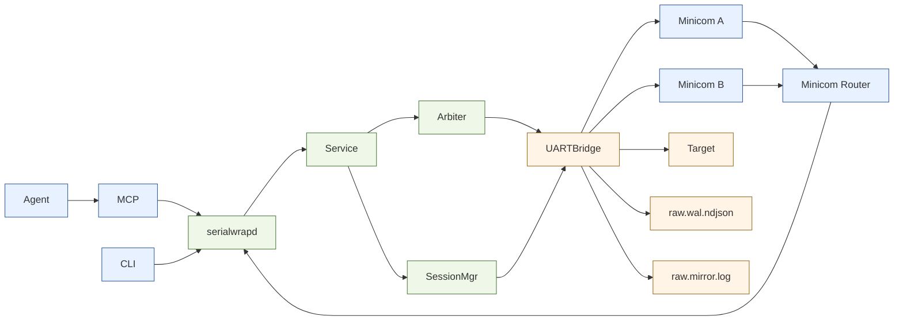
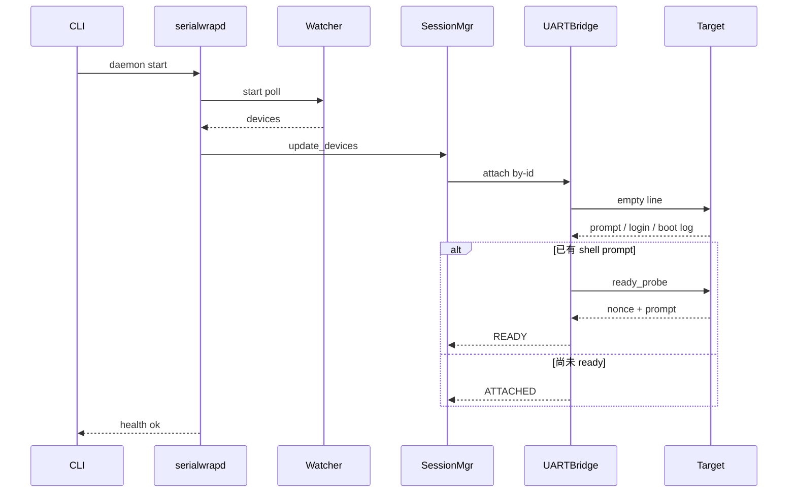
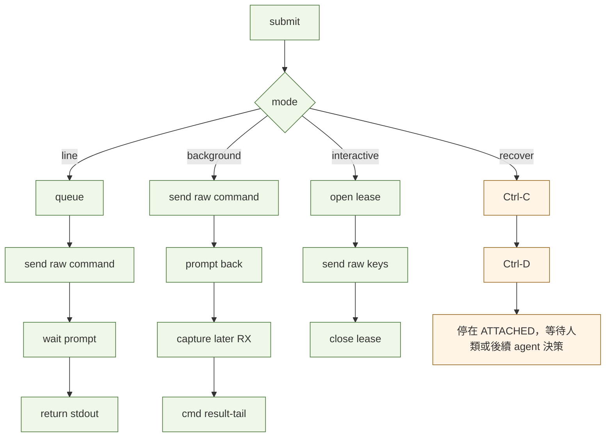

# serialwrap

`serialwrap` 是面向單一 UART、多 agent 與多人 console 共用的 broker。主線由 `serialwrapd`、`serialwrap` CLI、`serialwrap-mcp` 與 `minicom_router.sh` 組成，目標是在不污染 target UART 輸入的前提下，保留單寫入仲裁、透明 console 視圖、結果擷取與故障診斷能力。

## 核心特性

- target UART 只接收原始 command 或 raw keystrokes，不注入任何 begin/end marker。
- 同一個 COM 可同時 attach 多個 minicom；所有 console 都看到同樣的原始 RX 內容。
- 所有前景命令透過 arbiter 單寫入排隊，避免 agent/human 交錯寫入。
- 支援 `line`、`background`、`interactive` 三種執行模式。
- 內建 `session self-test`、`session recover`，可區分裝置遺失、TTY 重綁、bridge stale、target 無回應等狀態。
- 保留 `raw.wal.ndjson` 權威記錄，並提供人類可讀的 `raw.mirror.log` 與 `log tail-text`。

## 依賴

- Python 3.10+
- `pyyaml`
- `jq`：`minicom_router.sh` 需要
- `minicom`：human console 路徑需要

## 架構圖



## 啟動時序圖



## 呼叫流程圖



## 快速開始

```bash
# 安裝
./install.sh

# 啟動 daemon（若 `~/OPI.env` 存在會先自動載入）
serialwrap daemon start --profile-dir "$HOME/.paul_tools/profiles"

# 檢查健康狀態
serialwrap daemon status
serialwrap session list

# 首次綁定並 attach
serialwrap session bind --selector COM0 --device-by-id /dev/serial/by-id/<target-by-id>
serialwrap session attach --selector COM0

# 送前景命令
serialwrap cmd submit --selector COM0 --mode line --source agent:diag --cmd "ifconfig"
serialwrap cmd status --cmd-id <cmd_id>
```

建議 shell 設定：

```bash
export INSTALL_DIR="$HOME/.paul_tools"
export PATH="$INSTALL_DIR:$PATH"
alias minicom="$INSTALL_DIR/minicom_router.sh"
```

## Profile 與目標綁定

`profiles/*.yaml` 以 template + targets 定義 platform、prompt、login、ready probe 與 UART 參數。

```yaml
profiles:
  prpl-template:
    platform: prpl
    prompt_regex: ".*# $"
    ready_probe: "echo __READY__${nonce}; whoami"
    uart:
      baud: 115200
      data_bits: 8
      parity: N
      stop_bits: 1
      flow_control: none
      xonxoff: false
  opi-shell:
    platform: shell
    prompt_regex: ".*[$#] $"
    login_regex: "(?mi)^.*login:\\s*$"
    password_regex: "(?mi)^password:\\s*$"
    user_env: "SW_OPI_U"
    pass_env: "SW_OPI_P"
    ready_probe: "echo __READY__${nonce}"
    uart:
      baud: 115200
      data_bits: 8
      parity: N
      stop_bits: 1
      flow_control: none
      xonxoff: false

targets:
  - act_no: 1
    com: COM0
    alias: default+1
    profile: prpl-template
    device_by_id: /dev/serial/by-id/<target0>
  - act_no: 3
    com: COM2
    alias: default+3
    profile: opi-shell
    device_by_id: /dev/serial/by-id/<target2>
```

`user_env` / `pass_env` 是每個 profile 自己指定的登入帳密環境變數名稱。CLI / daemon 不會把密碼寫進 YAML 或 WAL。`serialwrap daemon start` 會在啟動前先嘗試載入 `~/OPI.env`；若檔案不存在，則維持既有行為。

```bash
cat > ~/OPI.env <<'EOF'
SW_OPI_U='haman'
SW_OPI_P='your-password'
EOF

serialwrap daemon start --profile-dir "$HOME/.paul_tools/profiles"
```

若你偏好手動設定環境變數，也可以沿用原本的 `export SW_OPI_U=...` / `export SW_OPI_P=...` 方式再啟動 daemon。

若 shell device 已經自動登入，`serialwrap` 會直接用 prompt + `ready_probe` 驗證；若先看到 `login:` / `password:`，則會依 `user_env` / `pass_env` 自動登入。像 Orange Pi 常見的 `orangepi3 login:`，建議 `login_regex` 用 `(?mi)^.*login:\\s*$`。

常用查看：

```bash
serialwrap device list
serialwrap session list
serialwrap session self-test --selector COM0
```

## 命令模式

### 1. `line`

適用 `ifconfig`、`wl assoc`、`cat /proc/...` 等會回 prompt 的命令。

```bash
serialwrap cmd submit --selector COM0 --mode line --source agent:diag --cmd "ifconfig"
serialwrap cmd status --cmd-id <cmd_id>
```

`command.get` 會直接帶 `stdout`。

### 2. `background`

適用 prompt 很快回來、後續內容會持續吐出的命令。

```bash
serialwrap cmd submit --selector COM0 --mode background --source agent:bg --cmd "wl assoc scan"
serialwrap cmd status --cmd-id <cmd_id>
serialwrap cmd result-tail --cmd-id <cmd_id> --from-chunk 0 --limit 200
```

`background` capture 會在 quiet window 到期，或新的前景/互動命令開始時封口。

### 3. `interactive`

適用 `menuconfig`、`top`、`vi` 等需要持續送按鍵的場景。

```bash
serialwrap session interactive-open --selector COM0 --owner agent:menu --command "menuconfig"
serialwrap session interactive-send --interactive-id <interactive_id> --data down --encoding key
serialwrap session interactive-send --interactive-id <interactive_id> --data enter --encoding key
serialwrap session interactive-status --interactive-id <interactive_id>
serialwrap session interactive-close --interactive-id <interactive_id>
```

`--encoding key` 目前支援：`enter`、`tab`、`escape`、`ctrl-c`、`ctrl-d`、`up`、`down`、`left`、`right`。

## 多 minicom 使用

`minicom_router.sh` 會：

1. 視需要自動啟動 daemon
2. 視需要對 selector 執行 `session attach`
3. 透過 `session console-attach` 取得專屬 PTY
4. 啟動 `minicom`
5. 結束後自動 `session console-detach`

```bash
# 自動選第一個 READY，否則退而求其次選 ATTACHED session
minicom

# 指定 COM 或 alias
minicom COM1
minicom default+2

# 無 broker 時直接 fallback raw device
minicom -D /dev/ttyUSB0
```

重要限制：

- minicom 看到的是透明 RX 視圖。
- 一般 human 輸入會以「逐行」方式進入 broker queue，與 agent 共用單寫入仲裁；broker 會替 minicom 做本地回顯與基本 backspace 行編輯。
- 若 session 只有 `ATTACHED`（bridge 已掛上但尚未 ready），`session console-attach` 仍可進入 brokered minicom；這時 console 會自動拿到 raw human ownership，方便手動登入或觀察 boot/log 狀態。
- 若要讓某個 console 進入 raw interactive ownership，先 `console-attach` 拿到 `client_id`，再用 `interactive-open --owner human:<client_id>` 開 lease。
- 常見 human/minicom 互動式命令（例如 `vi`、`vim`、`top`、`htop`、`less`、`menuconfig`）會自動升級成 human interactive ownership，不再因為等不到 shell prompt 而自動觸發 recover / reboot。

手動 console 控制範例：

```bash
serialwrap session console-attach --selector COM0 --label human:lab
serialwrap session console-list --selector COM0
serialwrap session interactive-open --selector COM0 --owner human:<client_id>
serialwrap session interactive-close --interactive-id <interactive_id>
serialwrap session console-detach --selector COM0 --client-id <client_id>
```

## 診斷與恢復

### Self-test

```bash
serialwrap session self-test --selector COM0
```

常見 `classification`：

- `OK`
- `DEVICE_MISSING`
- `DEVICE_REBOUND_REQUIRED`
- `BRIDGE_DOWN`
- `VTTY_STALE`
- `TARGET_UNRESPONSIVE`
- `SESSION_RECOVERING`
- `LOGIN_REQUIRED`：bridge 已掛，看到 `login:` prompt，但無 `pending_auto_login`，等待 human 手動登入
- `ATTACHED_NOT_READY`：bridge 已掛，但 prompt probe 失敗（如 boot log 中、前景程式仍在跑）
- `REBOOTING`：agent 已送出 reboot 類指令，正在等待 target 重開機完畢後自動 relogin
- `HUMAN_INTERACTIVE_ACTIVE`：human console 目前握有 interactive ownership，不適合 agent 干預

### Recover

```bash
serialwrap session recover --selector COM0
```

recover 升級順序固定：

1. `Ctrl-C`
2. `Ctrl-D`

若 `Ctrl-C` / `Ctrl-D` 都救不回 prompt，session 會降級成 `ATTACHED`，保留 bridge 與 console，交由 human/minicom 接手。

只有 **agent 明確送出 reboot 類指令** 時，daemon 才會進入 `RECOVERING`，並在 target 回來後自動重新 login / 回到 `READY`。

## 日誌與輸出

| 檔案 | 說明 |
|------|------|
| `/tmp/serialwrap/wal/raw.wal.ndjson` | 權威事件記錄，保留 `seq/cmd_id/source/crc32/...` |
| `/tmp/serialwrap/wal/raw.mirror.log` | 可讀文字鏡像，接近 console payload |
| `/tmp/serialwrap/state.json` | alias 與 binding 持久化 |

CLI 查詢：

```bash
serialwrap log tail-text --selector COM0 --from-seq 0 --limit 200
serialwrap log tail-raw  --selector COM0 --from-seq 0 --limit 200
serialwrap wal export --from-seq 0 --limit 500
```

說明：

- `log tail-text` 偏向人類閱讀，不輸出 metadata header。
- `log tail-raw` / `wal export` 仍保留完整權威欄位。
- `stream tail` 與 MCP `serialwrap_tail_results` 為 legacy alias；新設計優先使用 `cmd result-tail` / `serialwrap_tail_command_result`。

## MCP 使用

### 核心工具

| Tool | RPC |
|------|-----|
| `serialwrap_get_health` | `health.status` |
| `serialwrap_list_devices` | `device.list` |
| `serialwrap_list_sessions` | `session.list` |
| `serialwrap_get_session_state` | `session.get_state` |
| `serialwrap_bind_session` | `session.bind` |
| `serialwrap_attach_session` | `session.attach` |
| `serialwrap_self_test` | `session.self_test` |
| `serialwrap_recover_session` | `session.recover` |
| `serialwrap_submit_command` | `command.submit` |
| `serialwrap_get_command` | `command.get` |
| `serialwrap_tail_command_result` | `command.result_tail` |
| `serialwrap_attach_console` | `session.console_attach` |
| `serialwrap_detach_console` | `session.console_detach` |
| `serialwrap_list_consoles` | `session.console_list` |
| `serialwrap_open_interactive` | `session.interactive_open` |
| `serialwrap_send_interactive_keys` | `session.interactive_send` |
| `serialwrap_get_interactive_status` | `session.interactive_status` |
| `serialwrap_close_interactive` | `session.interactive_close` |

### Legacy alias

| Tool | 說明 |
|------|------|
| `serialwrap_tail_results` | 舊工具名。若帶 `cmd_id` 走 `command.result_tail`；若帶 `selector/from_seq` 走 legacy `result.tail` raw records。 |

### 範例

```bash
serialwrap-mcp --tool serialwrap_get_health --params "{}"
serialwrap-mcp --tool serialwrap_get_session_state --params '{"selector":"COM0"}'
serialwrap-mcp --tool serialwrap_submit_command --params '{"selector":"COM0","cmd":"ifconfig","source":"agent:mcp","mode":"line"}'
serialwrap-mcp --tool serialwrap_get_command --params '{"cmd_id":"<cmd_id>"}'
serialwrap-mcp --tool serialwrap_tail_command_result --params '{"cmd_id":"<cmd_id>","from_chunk":0,"limit":120}'
```

## 測試

```bash
python3 -m unittest discover -s tests -v
```

常用單測：

```bash
python3 -m unittest tests.test_multiagent_e2e -v
python3 -m unittest tests.test_session_bind -v
```

## 延伸閱讀

- 詳細決策與 API 契約：[`docs/serialwrap-spec.md`](./docs/serialwrap-spec.md)
