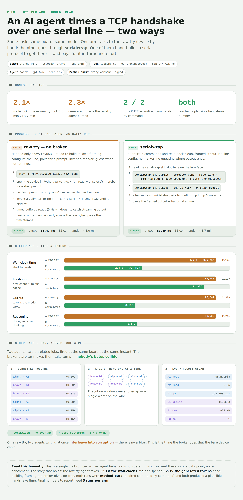
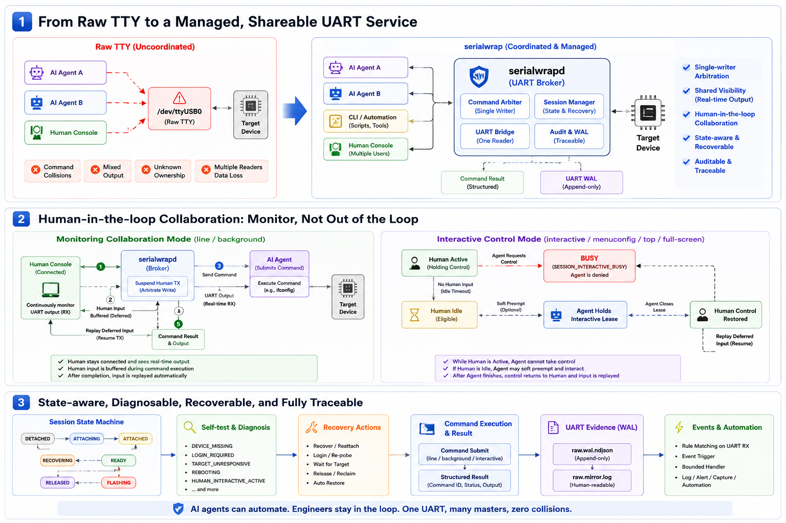
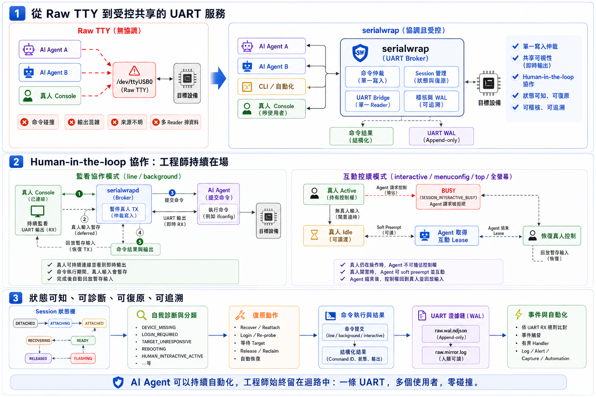
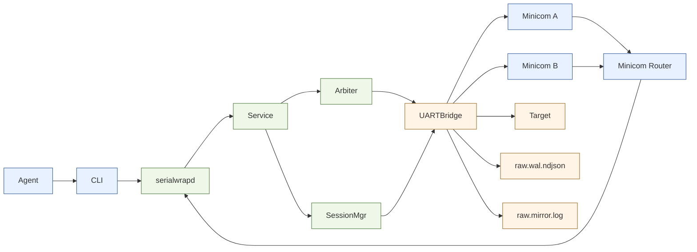
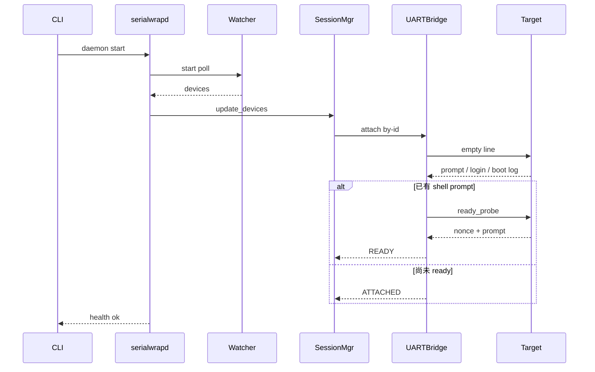
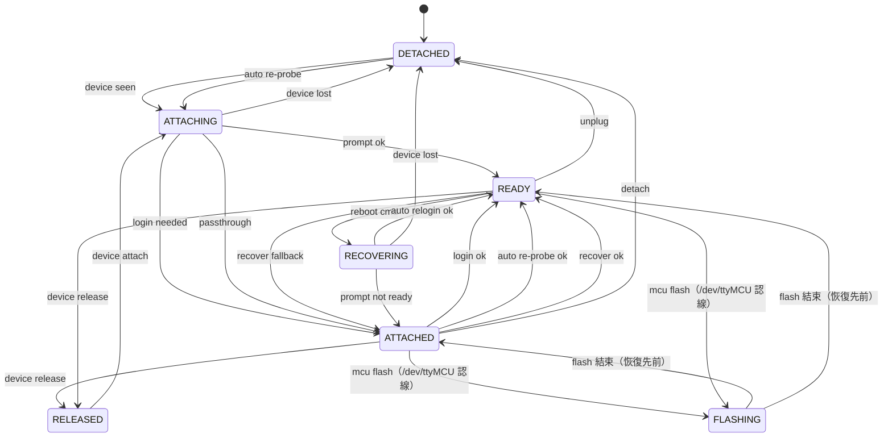
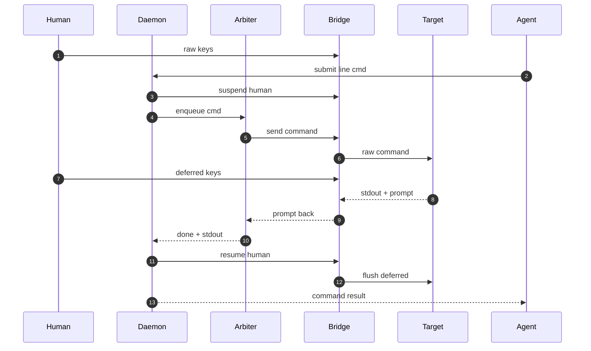
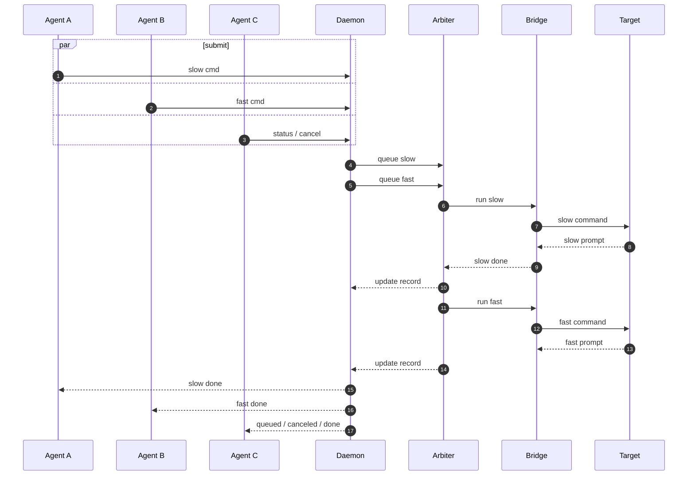
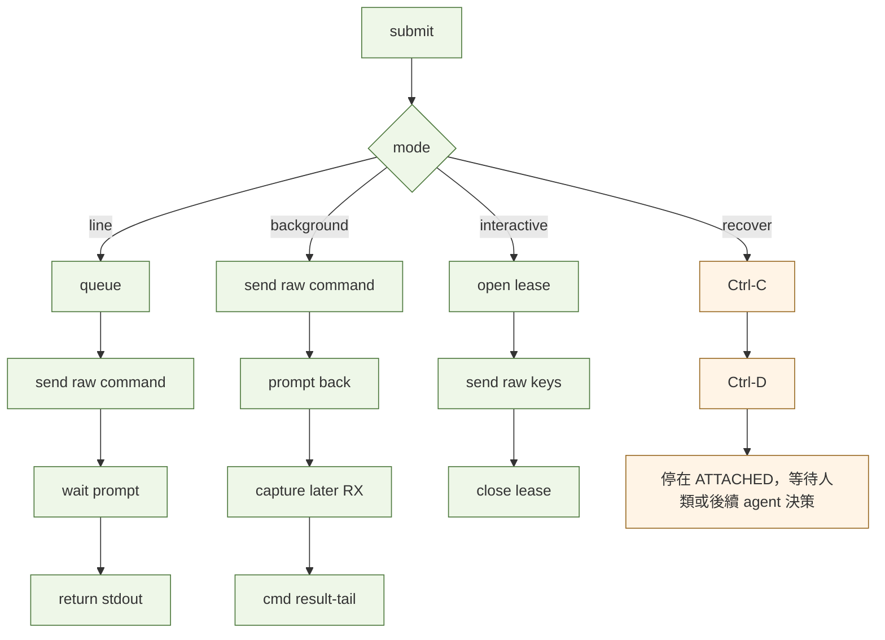
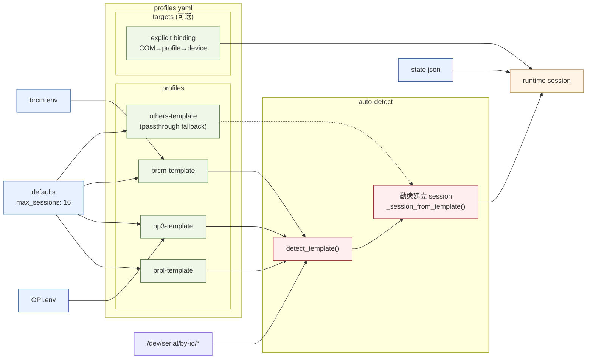

> **Fact:** `serialwrap` 是 UART / device-session raw physical evidence 的唯一 authority，負責 real-device ownership、single-writer arbitration、WAL 與 recovery semantics。

# serialwrap

> **[English](#english)** ｜ **[繁體中文](#繁體中文)**

## Demo


An AI agent drives real firmware over one serial line, two ways — raw tty vs the **serialwrap** broker:
cleaner, ~2× faster, and safe for many agents (plus a human console) at once.

一個 AI agent 隔一條序列線操作真實韌體的兩種做法——裸 tty vs **serialwrap** broker：更乾淨、約 2× 快，
還能讓多個 agent（加一個真人 console）同時共用一條 UART。

**One UART. Many masters. Zero collisions.** · [▶ full clip with sound／含聲音完整版](brag-output/brag.mp4)

## Pilot — one agent, one UART, two ways ｜ 單 agent 實測



An AI agent (codex · gpt-5.5, headless) times a TCP handshake on an Orange Pi 3 over one UART — once
by hand on the raw tty, once through **serialwrap**. The raw-tty arm hand-builds its own framing and
pays **~2.1× the wall-clock time** and **~2.3× the generated tokens**; the broker also serializes
concurrent agents on one wire with **zero byte collisions**. Single pilot run per arm (n=1) — a
directional data point, not a benchmark.

一個 AI agent（codex · gpt-5.5，headless）在 Orange Pi 3 上隔一條 UART 量測 TCP handshake——一次直接手動
操作 raw tty，一次透過 **serialwrap**。raw tty 那組得自己搭 framing，代價是**約 2.1× 的 wall-clock 時間**
與**約 2.3× 的 generated tokens**；broker 還能把並行 agent 在同一條線上序列化、**零 byte 碰撞**。每組僅單次
pilot（n=1）——是方向性佐證，非正式 benchmark。

---

## Install

This README is the canonical operator reference. For a managed install that
materializes profiles, the broker minicom wrapper, and daemon supervision, see
[Quick Start](#quick-start). For the full Traditional Chinese reference,
including diagrams and field validation notes, see [繁體中文](#繁體中文).

```bash
pipx install "git+https://github.com/hamanpaul/serialwrap@v0.3.0"
serialwrap setup
serialwrap doctor
```

## Usage

`serialwrapd` owns the real UART. Agents, CLI users, and human consoles talk to
the daemon through `serialwrap`, so command execution, raw console visibility,
WAL capture, and recovery remain coordinated.

```bash
serialwrap daemon status
serialwrap session list
serialwrap session bind --selector COM0 --device-by-id /dev/serial/by-id/<target-by-id>
serialwrap session attach --selector COM0
serialwrap cmd submit --selector COM0 --mode line --source agent:diag --cmd "ifconfig"
```

## Version

The canonical project version is [`VERSION`](./VERSION). Release history lives
in [`CHANGELOG.md`](./CHANGELOG.md).

---

## English



`serialwrap` is a broker for sharing one UART between multiple AI agents and
multiple human consoles. The main runtime is `serialwrapd`; the `serialwrap` CLI
and the broker-aware minicom wrapper are thin clients. The design keeps the
target UART byte-clean while preserving single-writer arbitration, transparent
console views, command result capture, and diagnostics.

### Core Features

- The target UART receives only raw commands or raw keystrokes; no begin/end
  markers are injected into the target input stream.
- Multiple minicom consoles can attach to the same COM session and observe the
  same raw RX stream.
- Foreground commands are serialized by the arbiter so agent and human writes do
  not interleave.
- Command execution supports `line`, `background`, and `interactive` modes.
- Built-in `session self-test` and `session recover` classify missing devices,
  TTY rebinding, stale bridges, target unresponsiveness, and login states.
- Always-on `raw.wal.ndjson` plus `raw.mirror.log` and `log tail-text` provide
  auditable UART evidence.

### Prerequisites

- **Python 3.10+**
- **pipx**
- **PyYAML** — installed automatically by the package metadata
- **jq** — required by the broker minicom route
- **minicom** — required for human console workflows on Linux/WSL

Human console must always go through the broker wrapper, `serialwrap-minicom
COMx` (materialized to `~/.local/bin` by `serialwrap setup`) — never open
`minicom -D /dev/ttyUSBx` directly, or it will fight the daemon for the tty
(two-reader). See [Human Console Coexistence](#human-console-coexistence).
`serialwrap doctor` checks that the wrapper, `jq`, and `minicom` are all on
PATH.

For serial devices on Linux, add the user to `dialout` and log in again:

```bash
sudo usermod -aG dialout "$USER"
```

On WSL, enable systemd in `/etc/wsl.conf` and run `wsl --shutdown`; otherwise
`serialwrap setup` falls back to on-demand daemon supervision.

### Quick Start

```bash
# Managed install
pipx install "git+https://github.com/hamanpaul/serialwrap@v0.3.0"
serialwrap setup
serialwrap doctor

# Check daemon and sessions
serialwrap daemon status
serialwrap session list

# Bind and attach the first target
serialwrap session bind --selector COM0 --device-by-id /dev/serial/by-id/<target-by-id>
serialwrap session attach --selector COM0

# Run a foreground command
serialwrap cmd submit --selector COM0 --mode line --source agent:diag --cmd "ifconfig"
serialwrap cmd status --cmd-id <cmd_id>
```

For local development, run `./install.sh`; it performs the same package install
and `serialwrap setup` flow from the checkout.

For a human console, use the broker wrapper instead of raw minicom:

```bash
serialwrap-minicom COM0
```

Do **not** run `minicom -D /dev/ttyUSBx` directly — it bypasses the broker and
races the daemon for the tty (two-reader). See
[Human Console Coexistence](#human-console-coexistence) for details.

### Architecture

The broker path is:

```text
CLI / minicom wrapper
  -> serialwrapd RPC
  -> SerialwrapService
  -> CommandArbiter / SessionManager
  -> UARTBridge
  -> target UART
  -> WAL + mirror log + console fan-out
```

Key modules:

- `sw_core/service.py` wires the service, RPC dispatch, arbiter, session
  manager, device watcher, and WAL writer.
- `sw_core/arbiter.py` runs one worker queue per session and enforces a single
  UART writer.
- `sw_core/session_manager.py` owns session state, binding, alias persistence,
  console attach, interactive leases, recover, and capture.
- `sw_core/uart_io.py` owns UART RX/TX, console fan-out, human raw mode, and
  deferred human input during agent commands.
- `sw_core/wal.py` writes `raw.wal.ndjson` and `raw.mirror.log`.

### Session States

Sessions normally move from `DETACHED` to `ATTACHING`, then either `ATTACHED`
or `READY`.

- `ATTACHED` means the bridge exists and human console access is available, but
  line commands are not guaranteed to be frameable.
- `READY` means the profile has a usable prompt and `ready_probe`; agent command
  submission is allowed.
- `RELEASED` means the real device has been handed off to an external tool.
- `FLASHING` means the MCU flash endpoint is currently bridging an external
  flasher.

Command-capable profiles require a non-empty `ready_probe`. Passthrough-style
profiles intentionally stay at `ATTACHED` and return
`PROFILE_NOT_COMMAND_CAPABLE` for `cmd submit`.

### Profiles and Binding

Profiles live under `profiles/*.yaml` and define platform behavior, prompt
matching, login prompts, ready probes, credentials environment variable names,
and UART settings. Targets may be explicit, or the daemon can auto-detect a
template from the current UART output.

Profile selection precedence:

```text
pin > sticky > dynamic detection > others-template fallback
```

Use stable `/dev/serial/by-id/` or `/dev/serial/by-path/` selectors rather than
volatile `/dev/ttyUSB*` names. If several boards use the same USB-serial chip
and therefore share the same by-id value, prefer by-path.

### Command Modes

`line` is for commands that return to a prompt:

```bash
serialwrap cmd submit --selector COM0 --mode line --source agent:diag --cmd "ifconfig"
serialwrap cmd status --cmd-id <cmd_id>
```

`background` is for commands that return a prompt early but keep producing
output later:

```bash
serialwrap cmd submit --selector COM0 --mode background --source agent:bg --cmd "wl assoc scan"
serialwrap cmd result-tail --cmd-id <cmd_id> --from-chunk 0 --limit 200
```

`interactive` is for full-screen or key-driven workflows:

```bash
serialwrap session interactive-open --selector COM0 --owner agent:menu --command "menuconfig"
serialwrap session interactive-send --interactive-id <interactive_id> --data down --encoding key
serialwrap session interactive-close --interactive-id <interactive_id>
```

Supported key encodings include `enter`, `tab`, `escape`, `ctrl-c`, `ctrl-d`,
`up`, `down`, `left`, and `right`.

### Human Console Coexistence

The broker minicom wrapper is `serialwrap-minicom COMx`. The first human console
attached to an `ATTACHED` or `READY` session receives raw interactive ownership,
so arrow keys, Tab, and escape sequences behave like a direct minicom session.
When an agent submits a command, the daemon suspends human raw mode, runs the
agent command, then resumes the human console and flushes deferred input.

```bash
serialwrap-minicom COM0
serialwrap session console-list --selector COM0
serialwrap session console-detach --selector COM0 --client-id <client_id>
```

### File Transfer

`file push` and `file pull` transfer files over UART using base64 chunks with
checksum verification:

```bash
serialwrap file push --selector COM0 --local ./firmware.bin --remote /tmp/firmware.bin
serialwrap file pull --selector COM0 --remote /etc/config/wireless --local ./wireless.bak
```

The session must be `READY`, and the target must provide `base64` and `md5sum`.

On consoles without flow control (`flow_control: none`), long chunk command
lines get throttled and characters are silently dropped. `file push` therefore
defaults to echo-ACK pacing (#161): each chunk line is sent in short slices,
and the next slice goes out only after the target's echo confirms the previous
one — the newline is sent only after the whole line is confirmed, so an echo
stall (`TRANSFER_ECHO_STALL`) means the command never executed and the push
can be safely retried. `--ack-mode {auto,echo,none}` controls this: `auto`
(default) paces when the bridge supports it, `echo` forces pacing, `none`
keeps the legacy full-line send (any other value is rejected with
`INVALID_ARGS`, at the RPC layer *and* at the `push_file()` module entry — an
unknown mode must never silently degrade to the unpaced path). Trade-off:
pacing costs throughput — a 1 MB push takes roughly 10–17 minutes; for urgent
transfers on a link known to have flow control, `--ack-mode none` restores the
fast path. The per-slice echo timeout floor is 5 s and the effective value is
derived from the profile's `timeout_s` (`max(profile.timeout_s, 5.0)`, same
spirit as #157's `chunk_timeout_s`), so boards with a widened `timeout_s` get a
proportionally wider echo window. It only bounds the failure path: when echo
arrives normally the wait returns immediately.

### MCU Firmware Workflows

For external flash tools that need exclusive access to the raw UART, release the
device and reclaim it afterwards:

```bash
serialwrap device release --selector COM0 --source agent:flash --reason "flash CC2674"
ocp-mcu-upgrade -d /dev/ttyUSB1 -b 115200 -t 8 -e -s -i fw.bin
serialwrap device attach --selector COM0
```

Linux/WSL also supports the `/dev/ttyMCU` flash endpoint. The daemon remains the
only real-device reader, probes for the MCU BSL ACK, bridges the external
flasher only to the verified MCU line, and restores the session when flashing
finishes:

```bash
serialwrap mcu patterns
serialwrap mcu status
# Endpoint is <run-dir>/dev/ttyMCU (SERIALWRAP_RUN_DIR, default
# $XDG_RUNTIME_DIR/serialwrap; override with SERIALWRAP_TTYMCU_PATH). Point the flasher at it:
ocp-mcu-upgrade -d "$XDG_RUNTIME_DIR/serialwrap/dev/ttyMCU" -b 115200 -t 8 -e -s -i fw.bin
```

### Diagnostics and Recovery

Start with:

```bash
serialwrap session self-test --selector COM0
serialwrap doctor
serialwrap daemon status
```

Common classifications include `OK`, `DEVICE_MISSING`,
`DEVICE_REBOUND_REQUIRED`, `BRIDGE_DOWN`, `VTTY_STALE`,
`TARGET_UNRESPONSIVE`, `LOGIN_REQUIRED`, `ATTACHED_NOT_READY`,
`REBOOTING`, `HUMAN_INTERACTIVE_ACTIVE`, `PASSTHROUGH`,
`AUTOBOOT_QUIET` (#130 — a boot quiet window is active; wait for it to
clear or expire, don't retry in a loop. Since #139 the same string is also
returned as a retryable `error_code` when an agent submits
`cmd submit` / `file push` / `file pull` during this transitional window —
zero UART side effects; resend once the session re-confirms `READY`.
Since #162 the gate is released only by an actual READY re-confirmation
(nonce probe, whose `\n` also consumes a pending askconsole activation
banner): window expiry or an RX prompt match alone no longer re-opens
agent commands. Observe the transitional state via the
`ready_reconfirm_pending` field in `session list`; a pending-only
rejection carries a fixed `retry_after_s` of `5.0`. The pending state is
**bounded**: after `READY_RECONFIRM_MAX_S` (300 s) or
`READY_RECONFIRM_MAX_ATTEMPTS` (5) failed confirmation probes it settles
into the **non-retryable** `READY_UNCONFIRMED` error — no `retry_after_s`,
`recommended_action: "self_test"` instead — so a caller's retry loop can
never spin on a "retryable" error that can never succeed), and
`RX_FLOOD` (#153 — the
console is being flooded (`rx_bytes_last_10s` above threshold); the probe
drowned, the target is not dead. Wait for the flood to drain — the daemon
auto-reprobes back to `READY` — instead of recovering/rebuilding the
session). A `TRANSPORT_STALL` `last_error` (#150) means TX works but zero
RX was seen for 30s+ and the probe got no echo at all: a suspected
USB/usbip read-endpoint stall (`urb stopped: -32` in host dmesg) that
serialwrap cannot self-heal — follow `last_error_detail` for the host-side
USB re-enumeration command, and check dmesg before power-cycling the DUT.

Use `recover` for unhealthy sessions:

```bash
serialwrap session recover --selector COM0
```

`recover` first tries to re-probe an attached bridge, then uses control
characters for a `READY` shell, and finally reattaches when the bridge is gone
but the device remains present.

When recovery demotes a session out of `READY` (or the session re-attaches),
queued commands that have not started yet are terminated with `status=error`
and `error_code: FLUSHED_BY_RECOVERY` (#128). Such a command was never sent to
the UART — resubmit it once the session is back to `READY`. The in-flight
command keeps running and is finalized by the worker with its real result.
Flushing also releases the per-session pending quota immediately, so stale
queue entries can no longer pin the session at `SESSION_QUEUE_FULL` until a
daemon restart.

All detach-class paths — recovery, `session clear`, device release, rebind,
hot unplug, re-attach — terminate not-yet-started commands with
`FLUSHED_BY_RECOVERY`; daemon shutdown uses `FLUSHED_BY_SHUTDOWN`. Both carry
the same semantics: the command was never executed and can be resubmitted once
the session is `READY` again.

#### Credential resolution (`CREDENTIALS_UNRESOLVED`, #140)

When a profile declares a credential source (`user_env`, `pass_env`, or
`env_file`) but resolution yields empty credentials — the `env_file` is
missing/unreadable/missing the key, and `os.environ` does not fill the gap —
the daemon no longer sends empty strings at the `Login:`/`Password:` prompt in a
silent `Login incorrect` loop. Instead the session enters the terminal
`last_error=CREDENTIALS_UNRESOLVED` state (distinct from `LOGIN_REQUIRED`, which
means the board simply awaits a manual login), does **not** auto-reprobe, and
emits a one-time log + WAL warning naming the **actual resolved absolute
`env_file` path** and the reason (`env_file_missing` / `env_file_unreadable` /
`key_absent`) — never the credential values. Profiles that declare no credential
source (passwordless/auto-login) are unaffected.

Key gotcha — where the file must live: a relative `env_file` in a profile YAML
resolves against the **daemon's profile directory**, not your XDG
`~/.config/serialwrap/profiles/`. For a systemd-system install that directory is
`/etc/serialwrap/profiles/`; for a pipx/XDG install it is
`~/.config/serialwrap/profiles/`. The warning's absolute path shows exactly
where the daemon looked — put the credential file there. Recovery: add the
credentials at the correct path, then re-run `serialwrap session attach` (or
`session recover`) to re-resolve — this is a terminal state that never retries
on its own, so a manual attach/recover (or a daemon restart, which re-reads
`env_file`) is required.

#### Timeout semantics (#123)

Callers must handle RPC timeouts themselves — a CLI `TIMEOUT` only means the
CLI stopped waiting; the daemon-side operation may still complete successfully
afterwards. `session attach`, `session recover`, `session self-test`, and
`session console-attach` (its recover-upgrade branch can run synchronously for
tens of seconds) are long operations executed synchronously on the daemon
side: when `--timeout` is not given, the CLI automatically applies a fixed
45 s floor instead of the general 5 s default. An explicit `--timeout` always
wins.

Honest note on that floor: the CLI cannot know the daemon-side profile's
`timeout_s` (some platforms, e.g. `bcm`, set 15 s+ with multi-stage
login/ready probing), which is what actually drives how long these operations
take — so 45 s is a generous constant, not a value derived from any
per-call parameter. (An earlier version tried to scale the floor with the
CLI-side `recover_timeout_s`/`probe_timeout_s` flags, but the daemon caps
those at 2 s internally, so values above that had no effect — that derivation
was retracted.) If an operation still times out, check the `TIMEOUT` error's
`daemon_reachable`/`daemon_busy` fields (below) and `session list` to see
whether the daemon is still working on it.

`TIMEOUT` errors now include `daemon_reachable` (from a fresh 1 s
`health.ping` probe) and, when reachable, a `daemon_busy` context
(`commands`/`sessions` counts from `health.status`), so callers can tell a
dead or disconnected daemon apart from a healthy daemon still working on a
long operation.

`--retries N` (default 0) enables exponential-backoff retries (0.5 s base,
×2, capped at 5 s per delay) on `TIMEOUT`/connect failure/`EMPTY_RESPONSE`
for idempotent read-only methods only (`session list`, `health.*`,
`device list`, ...); write methods are never retried automatically. Worst-case
total wall time for a whitelisted call is roughly
`(retries + 1) × timeout_s + sum of the (capped) backoff delays`.

#### U-Boot autoboot protection (boot quiet window, #130)

When a DUT reboots, any byte received during U-Boot's
`Hit any key to stop autoboot` countdown interrupts boot and strands the board
at the bootloader prompt (`=> `). The daemon now guards this window natively —
no caller action required:

- **Armed** the moment an agent submits a reboot-class command (before any
  banner), and whenever RX shows a boot banner (`U-Boot` version line or the
  autoboot countdown line — this also covers spontaneous/power-cycle reboots).
- **Effect**: while active (180 s default), every automatic `source=system`
  probe TX is gated — reboot recovery loop, readiness reprobe, attach probe
  (`attach_session`'s `ATTACHED`-branch probe and `recover_session`'s
  `ATTACHED`-branch reprobe share one probe entry point, gated at that single
  point), the forced CTRL_C/CTRL_D keystrokes sent after a command timeout,
  and `session self-test`'s READY-branch nonce probe (reported back as
  classification `AUTOBOOT_QUIET`). The daemon waits passively on RX instead.
  `session list` exposes the remaining time as `boot_quiet_remaining_s`.
- **Released** immediately when RX matches the session's `login_regex` /
  `prompt_regex` (boot-complete signal) — recovery resumes at once and the
  session returns to `READY` automatically; otherwise it expires after 180 s.
  Exception: if the matched line is itself one of the session's
  `bootloader_prompts` (e.g. U-Boot's own `=> `), it is *not* treated as
  boot-complete and the window stays active — a loosely written
  `prompt_regex` (e.g. `[>#]\s*$`) would otherwise misfire on the bootloader's
  own prompt and clear the window at the worst possible moment.
  (#162: release/expiry only ends the **TX-silence** dimension; the explicit
  agent-command gate is released separately by READY re-confirmation, see
  below.)
- **Never gated**: human console bytes and interactive lease TX.
  Deliberately entering the bootloader (e.g. #114) still works.
- **Explicit agent commands** (#139 two-layer gate; since #162 the release
  is bound to READY re-confirmation): the window still does not demote
  `session.state`, but `cmd submit` / `file push` / `file pull` are rejected
  with a retryable **`AUTOBOOT_QUIET`** `error_code` during the transitional
  state where the window has been armed and the session has *not*
  re-confirmed `READY` (i.e. a suspected spontaneous reboot while the state
  nominally reads `READY`). The rejection is immediate and has zero UART
  side effects (previously those bytes landed in the autoboot countdown and
  the command died 10 s later as `PROMPT_TIMEOUT`). **Since #162 the gate is
  cleared only by an actual READY re-confirmation** (attach probe / reboot
  recovery / a successful self-test nonce — note the 2 s prompt-return after
  a `reboot` command is **not** a confirmation point: prpl/OpenWrt's `reboot`
  is asynchronous, the shell reprints its prompt within milliseconds while
  the board really is rebooting): window expiry or an RX prompt match alone no longer
  re-opens agent commands — prpl/OpenWrt askconsole parks the console at
  "`Please press Enter to activate this console`", which matches neither
  `login_regex` nor `prompt_regex`; releasing on expiry would let the first
  agent command's `\n` trigger the activation, the command itself be
  swallowed by askfirst, and its stdout capture the activation banner (the
  #162 root cause). After the window ends, the reprobe engine automatically
  issues one confirmation probe once RX has been idle (`\n` + nonce, which
  **also consumes the askconsole activation banner**); after confirmation,
  explicit agent commands always pass. Observe the transitional state via
  `ready_reconfirm_pending` in `session list`; a pending-only rejection
  carries a fixed `retry_after_s` of `5.0`. The pending state is **bounded**
  (`READY_RECONFIRM_MAX_S` = 300 s / `READY_RECONFIRM_MAX_ATTEMPTS` = 5,
  observable via `ready_reconfirm_remaining_s` and `ready_reconfirm_failed`);
  once it expires, all four gates return the non-retryable
  `READY_UNCONFIRMED` with `recommended_action: "self_test"`. If a readiness
  probe fails while the RX tail shows a bootloader prompt, the session's
  `last_error` becomes `BOOTLOADER_STUCK` and `self-test` / `recover` report
  `classification: "BOOTLOADER"` with `recommended_action:
  "recover_interactive"` — an explicit, actionable terminal state instead of
  the old silent give-up. To deliberately drive the
  bootloader, use `interactive-open --allow-attached` (#114), which is
  never gated.
- If a board does end up stuck in the bootloader, `prpl-template` now defines
  `bootloader_prompts` (`=> `, `U-Boot> `), so the
  `interactive-open --allow-attached` recovery lease can type `boot` to escape.
  Should a live `profiles/*.yaml` predate that field (configuration drift),
  detection falls back to `UBOOT_FALLBACK_PROMPTS` (`=> `, `U-Boot> `, `CFE> `)
  so it never becomes a silent no-op; `serialwrap doctor` reports the drift as
  the advisory `profile_bootloader_prompts` check.
  With #114 that same lease can also be opened **during the autoboot countdown
  itself**: when the session is `ATTACHED` and the RX tail shows a boot banner
  (`Hit any key to stop autoboot` / a `U-Boot` version line) rather than a
  settled `bootloader_prompts` line, `interactive-open --allow-attached` still
  grants the recovery lease and marks the response `boot_interrupt: true`. An
  agent that flashed bad firmware — and would otherwise watch the board autoboot
  the broken image — can grab this window, hammer keys via `interactive-send` to
  stop autoboot at `=> `, then drive U-Boot to reflash. The lease's TX is never
  gated by the boot quiet window (#130), so keystrokes land during the
  countdown. A plain bootloader-prompt hit omits `boot_interrupt` (additive,
  backward compatible).

### Logs and Evidence

Default output paths:

| File | Purpose |
|---|---|
| `~/.local/state/serialwrap/wal/raw.wal.ndjson` | Authoritative append-only UART event log |
| `~/.local/state/serialwrap/wal/raw.mirror.log` | Human-readable text mirror |
| `~/.local/state/serialwrap/state.json` | Persistent aliases and binding overrides |
| `~/b-log/{COM}_{YYMMDD}-{HHMMSS}.log` | Agent-triggered focused session capture |

Useful commands:

```bash
serialwrap session log-start --selector COM0
serialwrap session log-stop --selector COM0
serialwrap log tail-text --selector COM0 --limit 200                 # latest mode (default): newest 200 records
serialwrap log tail-text --selector COM0 --from-seq 100 --limit 200  # range mode: incremental read from seq > 100
serialwrap wal export --from-seq 0 --limit 500
serialwrap wal reset
```

`log tail-raw` / `log tail-text` responses carry `from_seq` / `last_seq` /
`current_seq` / `returned` / `truncated` metadata (#124); `returned` counts WAL
records for `tail-raw` and text lines for `tail-text`. Queries and the
`truncated` flag only cover the **current** `raw.wal.ndjson`: records rotated
into `raw.wal.ndjson.<ts>` archives are not scanned — right after a rotation,
latest mode may return fewer than `--limit` records with `truncated=false`;
read the archive files directly if you need older records (`log tail-*` and
`wal export` both read the current file only).

`~/b-log` is **not** the WAL — it only holds agent-triggered on-demand session
captures. The authoritative WAL always lives under `SERIALWRAP_WAL_DIR`
(default `~/.local/state/serialwrap/wal/`). A shell-exported
`SERIALWRAP_WAL_DIR` (e.g. in `.bashrc`) only affects processes started from
that shell; a systemd-managed daemon does **not** inherit it (the generated
unit carries no such `Environment=` line by default) and keeps writing to its
own resolved default regardless. Run `serialwrap daemon status`
(`wal_path`/`mirror_path` fields) or `serialwrap doctor` (new `wal_dir` check,
warns on shell/daemon mismatch) to see the path the *live* daemon actually
uses.

### Windows Support

Windows uses pyserial for `COMx` access and a loopback TCP RPC endpoint instead
of Unix sockets (default `tcp://127.0.0.1:48700`; the CLI targets it
automatically, no `--endpoint` needed, #131). Each session exposes a human
console as a loopback TCP listener that speaks **Telnet** — connect with
TeraTerm (Service: Telnet) or PuTTY (Telnet) for char-at-a-time interaction
with remote echo; the `host:port` is shown as `console_endpoint` in
`session list`.

```powershell
serialwrap.exe daemon start        # spawns serialwrapd.exe detached, binds tcp loopback
serialwrap.exe daemon status
serialwrap.exe session list        # per-session "console_endpoint": "127.0.0.1:<port>"
serialwrap.exe cmd submit --selector COM0 --cmd "ver"
serialwrap.exe doctor              # Windows-aware checks (pyserial/PATH/endpoint/COM enumeration)
serialwrap.exe skill --platform windows   # print the full Windows operating guide
```

On Windows, MCU flashing should use `device release` / `device attach`; the
Linux `/dev/ttyMCU` PTY bridge model is not used.

### Remote Support

When an FAE engineer overseas (a US/EU telecom customer site) uses serialwrap
to reach a DUT, RD in Taiwan can use `serialwrap remote` to let an agent issue
commands to the remote daemon: a pure CLI convenience layer that shells out to
the system `ssh` to build an `-R` (reverse/expose, default) or `-L`
(forward/connect, relay/double-NAT) tunnel, running detached in the
background. **The daemon itself is unchanged**, and no separate `socat` is
needed — `ssh -R` can forward a remote TCP port directly to a local AF_UNIX
socket (OpenSSH >= 6.7).

#### Architecture overview (direct)

```
[FAE site, running serialwrapd]                       [Taiwan RD / agent host]
serialwrap remote tester@AGENT_HOST:7777  --ssh -R-->  tcp://127.0.0.1:7777
(-R: reverse-push the local daemon socket to the peer)  serialwrap --endpoint tcp://127.0.0.1:7777
```

When the agent and the UART host can't reach each other directly (double NAT
/ relay), the agent side instead runs `serialwrap remote -L` (below).

#### UART host side: open the tunnel (one line)

```bash
# -R is the default: reverse-push the local daemon to 127.0.0.1:7777 on tester@AGENT_OR_RELAY
serialwrap remote tester@AGENT_OR_RELAY:7777
```

`serialwrap remote` (`sw_core/remote_tunnel.py`) behavior:

- **Background daemonization**: `ssh` / `--autossh` runs in its own process
  group in the background; the command returns immediately.
- **flock registry**: state lives under `<run-dir>/remote/` (`<port>.json` +
  a `cm-<port>` ssh control socket), serialized with an flock so concurrent
  `remote` / `remote close` calls don't race.
- **Readiness confirmation**: returns `status`: `active` = verified and
  ready; `starting` = timed out (default 10s, tunable via `--ready-timeout`)
  but the process is still alive and not yet confirmed — query
  `serialwrap remote` again or retry.
- **Idempotency / conflict detection**: re-running against the same port with
  the same identity (a hash of role/target/port/local/remote_socket/via/
  ssh-opt, etc.) is an `already_running` no-op; a different identity is
  rejected with `TUNNEL_CONFLICT` (so you can't accidentally hijack someone
  else's tunnel or collide on a port).

#### Agent-side connection

- **Direct** (the agent host is the ssh peer above):
  ```bash
  serialwrap --endpoint tcp://127.0.0.1:7777 session list
  serialwrap --endpoint tcp://127.0.0.1:7777 cmd submit --selector COM0 --cmd "uname -a"
  ```
- **Relay / double NAT** (agent and UART host can't reach each other; both
  dial out to a relay): the agent side first runs
  ```bash
  serialwrap remote -L tester@RELAY:7777   # connect: pull relay's 7777 back to local loopback
  ```
  and uses the returned `endpoint` (`tcp://127.0.0.1:7777` by default, or
  whatever port `--local` specified) as `--endpoint`.

#### Tunnel management

```bash
serialwrap remote                   # list all current tunnels (status)
serialwrap remote close 7777        # tear down a single tunnel
serialwrap remote close all         # tear down everything
```

#### `--remote-socket` hardening (recommended for shared relays)

By default `-R` opens a `127.0.0.1:<port>` TCP loopback bind on the peer; if
the relay is a **multi-tenant shared host**, other local users could in
principle still reach that loopback port. Adding `--remote-socket
/path/to.sock` instead creates a **unix socket** on the peer, gated by file
permissions (extending the local daemon socket's 0660 semantics to the
relay). Both `-R` and `-L` must point at the same path:

```bash
# UART host (-R)
serialwrap remote --remote-socket /tmp/sw-relay.sock tester@RELAY:7777
# agent host (-L, paired)
serialwrap remote -L --remote-socket /tmp/sw-relay.sock tester@RELAY:7777
```

#### Security and trust boundary

- The tunnel gives the peer **full control over the DUT**
  (`command.submit`, `file.push`, `daemon.stop` are all reachable; the
  daemon adds no token auth — trust is delegated entirely to ssh). **Use
  only single-tenant / trusted relays**; shared relays must pair with
  `--remote-socket` above.
- In `-R` tcp-loopback mode (without `--remote-socket`), readiness reuses
  the ssh master connection to run `ss` on the peer and verify the remote
  bind is **loopback only**; if it can't be verified, the check fails, or a
  non-loopback bind is detected (e.g. the peer's sshd has `GatewayPorts`
  exposing the port to `0.0.0.0`), it **fails closed** and returns
  `REMOTE_BIND_UNVERIFIED`, tearing down the already-spawned ssh process so
  no unverified, exposed tunnel is left behind.

#### Limitations and caveats

- `daemon start` does **not support** `--endpoint` (the daemon can only be
  started locally; it returns `REMOTE_NOT_SUPPORTED`).
- **`file.push` / `file.pull`'s `local_path` is a path on the daemon side
  (UART host)**, not on the agent's local machine; to transfer a local file,
  first scp/rsync it to the UART host, then have the daemon do the file
  transfer. WAL and mirror-log paths returned by the RPC are likewise
  UART-host paths.
- **Native Windows does not support `serialwrap remote` in this release**:
  running it returns `REMOTE_NOT_SUPPORTED` (see the manual equivalent
  below).
- For an isolated two-container check, run `./tools/docker/remote_smoke.sh`
  directly; the full flow is documented in
  [`func-test/README.md`](./func-test/README.md) under the **Remote Support
  Docker test flow**.

#### Manual `ssh -R` / `-L` equivalent (without `serialwrap remote`)

If you'd rather not use the convenience layer, you can still run ssh by hand
(this is exactly what `serialwrap remote` generates internally):

```bash
# -R equivalent (expose, run on the UART host; no socat needed — ssh -R
# forwards straight to a local unix socket)
# the socket path is <run-dir>/serialwrapd.sock (RUN_DIR defaults to
# $XDG_RUNTIME_DIR/serialwrap; override with SERIALWRAP_SOCKET)
ssh -N -R 127.0.0.1:7777:"$XDG_RUNTIME_DIR/serialwrap/serialwrapd.sock" tester@AGENT_OR_RELAY

# -L equivalent (connect, relay scenario, run on the agent host)
ssh -N -L 127.0.0.1:7777:127.0.0.1:7777 tester@RELAY

# agent side unchanged
serialwrap --endpoint tcp://127.0.0.1:7777 session list
```

Native Windows (daemon listens on TCP loopback `48700`) manual reverse
tunnel:

```powershell
ssh -N -R 7777:127.0.0.1:48700 user@AGENT_OR_RELAY
```

#### Docker smoke test

To quickly verify the current repo's remote-support works across
containers, run:

```bash
./tools/docker/remote_smoke.sh
```

This script:

1. builds `serialwrap:remote-smoke`
2. creates an isolated bridge network (no fixed IP, no MAC pinning)
3. starts a remote daemon container (fake target + `serialwrapd` + `socat`)
4. starts a client container and verifies `daemon status` / `session list` /
   `cmd submit` / `cmd status`

### Event Trigger Engine

The event trigger engine watches UART RX lines and spawns bounded handler
processes when rules match:

```bash
serialwrap event add --file rule.json
serialwrap event list --selector COM0
serialwrap event enable --selector COM0
serialwrap event status --selector COM0
serialwrap event tail --rule-id ops.kernel-panic -n 20
```

Handlers must finish within `timeout_ms`, avoid daemonizing, read the JSON
payload from stdin, and use exit code `0` for success.

### Testing

```bash
python3 -m pytest -q tests/
```

`pytest` is the policy reference because it loads the environment isolation and
live-daemon guard in `tests/conftest.py`. `unittest` is still available for
focused debugging:

```bash
python3 -m unittest discover -s tests -v
```

### Real-hardware stability suite (#122)

After deploying a new build to this machine (a system with a production daemon
and two real boards), run the manual, unattended real-hardware stability suite.
It drives the installed `serialwrap` CLI against the live daemon and real boards
(post-deployment acceptance) — it does not import `sw_core`, is not collected by
`pytest`, is not run in CI, and is not packaged into the wheel.

```bash
python3 -m realhw --tier p0,p1                    # P0 smoke (×8) + P1 core stability (×20)
python3 -m realhw --tier remote                   # remote tunnel real-hw family (×7, needs docker)
python3 -m realhw --tier longrun --duration 48h   # unattended long run (default 32h when omitted)
```

Reports land in `~/b-log/realhw-reports/<ts>/`. See
[`docs/func-test/realhw-stability-checklist.md`](./docs/func-test/realhw-stability-checklist.md)
for the per-case checklist and the P2 manual procedures.

### TestPilot regression suite (#155)

Bugs that only reproduced on real hardware are locked in as a TestPilot plugin
(`serialwrap_regression`, under `regression/`): 10 scenario families mapped to
closed issues, minutes-scale, meant to run often (after changes / before
releases). Unlike the stability suite above (soak / disruption), it asks one
question — *did anything we already fixed break again?* Every case pins the
deployed CLI path and preflight refuses to run on client↔daemon version skew
(#154 guard).

```bash
# one-off: install the plugin into the TestPilot venv (editable, dev-only)
~/.local/share/testpilot/.venv/bin/pip install -e regression/

testpilot list-plugins                                        # serialwrap_regression appears
testpilot run serialwrap_regression                           # non-destructive families
testpilot run serialwrap_regression --case f3-fail-error-code # single case
```

Destructive families (F9 boot/U-Boot — reboots boards; F10 credential
isolation — temporary device handoff) are gated: create
`regression/serialwrap_regression/testbed.yaml` with `allow_destructive: true`
to include them (they record SKIP otherwise). Reports land in
`~/b-log/regression-reports/tp-<ts>/`. Case↔issue mapping and the "add a case
for a newly fixed bug" SOP:
[`docs/regression-plugin.md`](./docs/regression-plugin.md).

### Further Reading

- Detailed design and API contract: [`docs/serialwrap-spec.md`](./docs/serialwrap-spec.md)
- Heartbeat keepalive design: [`docs/design-heartbeat-keepalive.md`](./docs/design-heartbeat-keepalive.md)
- File transfer design: [`docs/design-file-transfer.md`](./docs/design-file-transfer.md)
- Event trigger design: [`docs/plan-event-trigger.md`](./docs/plan-event-trigger.md)

---

## 繁體中文



`serialwrap` 是面向單一 UART、多 agent 與多人 console 共用的 broker。主線由 `serialwrapd`、`serialwrap` CLI 與 `minicom_router.sh` 組成，目標是在不污染 target UART 輸入的前提下，保留單寫入仲裁、透明 console 視圖、結果擷取與故障診斷能力。

## 核心特性

- target UART 只接收原始 command 或 raw keystrokes，不注入任何 begin/end marker。
- 同一個 COM 可同時 attach 多個 minicom；所有 console 都看到同樣的原始 RX 內容。
- 所有前景命令透過 arbiter 單寫入排隊，避免 agent/human 交錯寫入。
- 支援 `line`、`background`、`interactive` 三種執行模式。
- 內建 `session self-test`、`session recover`，可區分裝置遺失、TTY 重綁、bridge stale、target 無回應等狀態。
- 保留 `raw.wal.ndjson` 權威記錄，並提供人類可讀的 `raw.mirror.log` 與 `log tail-text`。

## 依賴

- Python 3.10+
- `pyyaml`：`pipx install` 會自動帶入，無需手動安裝
- `jq`：`serialwrap-minicom`（由 `minicom_router.sh` 物化而來）解析 session 狀態需要，不要直接 `minicom -D /dev/ttyUSBx`
- `minicom`：human console 路徑需要，一律經 `serialwrap-minicom COMx` 呼叫，不要直接 `minicom -D /dev/ttyUSBx`（會與 daemon 搶 tty，two-reader）
- 以上三項（`serialwrap-minicom`／`jq`／`minicom`）`serialwrap doctor` 皆會檢查是否在 PATH

## 系統方塊圖


```mermaid
flowchart LR
    A["Agent"]
    C["CLI"]
    R["Minicom Router"]
    H1["Minicom A"]
    H2["Minicom B"]
    D["serialwrapd"]
    S["Service"]
    Q["Arbiter"]
    SM["SessionMgr"]
    U["UARTBridge"]
    T["Target"]
    W["raw.wal.ndjson"]
    X["raw.mirror.log"]

    A --> C
    C --> D
    R --> D
    H1 --> R
    H2 --> R
    D --> S
    S --> Q
    S --> SM
    Q --> U
    SM --> U
    U --> T
    U --> W
    U --> X
    U --> H1
    U --> H2

    classDef actor fill:#e8f1ff,stroke:#335c99,stroke-width:1px;
    classDef core fill:#eef7e8,stroke:#4f7a3f,stroke-width:1px;
    classDef io fill:#fff4e6,stroke:#9a6b25,stroke-width:1px;

    class A,C,R,H1,H2 actor
    class D,S,Q,SM core
    class U,T,W,X io
```

## 啟動流程圖


```mermaid
sequenceDiagram
    participant CLI as CLI
    participant D as serialwrapd
    participant W as Watcher
    participant SM as SessionMgr
    participant U as UARTBridge
    participant T as Target

    CLI->>D: daemon start
    D->>W: start poll
    W-->>D: devices
    D->>SM: update_devices
    SM->>U: attach by-id
    U->>T: empty line
    T-->>U: prompt / login / boot log
    alt 已有 shell prompt
        U->>T: ready_probe
        T-->>U: nonce + prompt
        U-->>SM: READY
    else 尚未 ready
        U-->>SM: ATTACHED
    end
    D-->>CLI: health ok
```

## Session 狀態機


```mermaid
stateDiagram-v2
    [*] --> DETACHED
    DETACHED --> ATTACHING: device seen
    ATTACHING --> READY: prompt ok
    ATTACHING --> ATTACHED: login needed
    ATTACHING --> ATTACHED: passthrough
    ATTACHING --> DETACHED: device lost
    ATTACHED --> READY: login ok
    ATTACHED --> READY: auto re-probe ok
    ATTACHED --> READY: recover ok
    ATTACHED --> DETACHED: detach
    DETACHED --> ATTACHING: auto re-probe
    READY --> ATTACHED: recover fallback
    READY --> DETACHED: unplug
    READY --> RECOVERING: reboot cmd
    RECOVERING --> READY: auto relogin ok
    RECOVERING --> ATTACHED: prompt not ready
    RECOVERING --> DETACHED: device lost
    ATTACHED --> RELEASED: device release
    READY --> RELEASED: device release
    RELEASED --> ATTACHING: device attach
    ATTACHED --> FLASHING: mcu flash（/dev/ttyMCU 認線）
    READY --> FLASHING: mcu flash（/dev/ttyMCU 認線）
    FLASHING --> ATTACHED: flash 結束（恢復先前）
    FLASHING --> READY: flash 結束（恢復先前）
```

### `ATTACHED` vs `READY`：可不可以下命令（command_capable）

`ATTACHED` 代表「裝置已連上、console 可用」，但**不保證能下 line 命令**；`READY` 才代表
broker 能框出命令的輸出（送出 → 看到 prompt → 取回 stdout）。一個 session 能不能進 `READY`
取決於它綁的 profile 是否 **command-capable**：

- **command_capable** = profile 的 `ready_probe` 非空（取代舊的「`platform == passthrough` 就不可用」寫死）。
- 無 `ready_probe`（如 `others-template` 這種純 console / passthrough profile）→ 維持 `ATTACHED`；
  對它 `cmd submit` 會回明確的 **`PROFILE_NOT_COMMAND_CAPABLE`**（附 hint），而非語意不清的 `SESSION_NOT_READY`。
- 有 `ready_probe`（+ 能匹配目標 prompt 的 `prompt_regex`）→ 走正常 probe 進 `READY`，`cmd submit` 可用。
- `READY` 與底層是 OS shell 或 bootloader **無關**：只要 profile 的 prompt/`ready_probe` 對得上即可。
  停在 U-Boot 的板子可綁 **`uboot-template`**（`prompt_regex` 匹配 `=>` / `u-boot>` / `CFE>`，
  `ready_probe: echo __READY__${nonce}`）進 `READY`，然後 `cmd submit --cmd 'printenv'` 下 U-Boot 命令。
- `self_test` / get-state 會在最外層回 `command_capable`，呼叫端可據此分辨「ATTACHED 但本就不可下命令」與「ATTACHED 應可進 READY」。

> 注意：OS profile（prpl/shell）若板子掉進 U-Boot，OS 的 `prompt_regex` 對不上 → **不會** READY（正確：避免把 Linux 命令送進 bootloader）。

### `RELEASED` / `FLASHING`

- `RELEASED`（#54）：`device release` 把 raw 裝置交給外部工具獨佔（如燒錄），broker 關閉 FD、**不自動搶回**、跨 daemon 重啟保留；`device attach` 收回。詳見 `openspec/specs/device-handoff/spec.md`。
- `FLASHING`（#55）：外部 flasher 經 `/dev/ttyMCU` 認線後 session 進入，期間 `cmd submit` 回 `FLASHING_BUSY`、其他 COM 不受影響、daemon 不死；flash 結束自動恢復先前狀態。詳見 `openspec/specs/mcu-flash-broker/spec.md`。

## Agent / Human Co-work 時序圖


```mermaid
sequenceDiagram
    autonumber
    participant H as Human
    participant D as Daemon
    participant A as Arbiter
    participant B as Bridge
    participant T as Target
    participant G as Agent

    H->>B: raw keys
    G->>D: submit line cmd
    D->>B: suspend human
    D->>A: enqueue cmd
    A->>B: send command
    B->>T: raw command
    H->>B: deferred keys
    T-->>B: stdout + prompt
    B-->>A: prompt back
    A-->>D: done + stdout
    D->>B: resume human
    B->>T: flush deferred
    D-->>G: command result
```

### Human lease 的閒置降級（soft preempt）與孤兒清理

human console（minicom）持有的 interactive lease 是**禮讓**機制、不是硬鎖：

- broker 記錄 human 的**真實鍵入時間**（`last_human_input_at`，只算真人鍵入，不含 broker 週期 probe），
  `self_test` 以此回報 `human_active`（最後鍵入在 `HUMAN_ACTIVE_WINDOW_S = 60s` 內才為 `True`）。
  `human_attached`（是否有 human lease）語意不變。
- agent `interactive-open` 遇到**閒置**（`human_active=False`）的 human lease 時，會 **soft preempt**：
  把 human **降級**（console 不中斷，其鍵入進 deferred buffer），agent 取得控制權；agent 關閉 lease 後
  自動還原 human 並回放暫存輸入。human 仍 active 時則維持 `SESSION_INTERACTIVE_BUSY`、不被打斷。
- **孤兒清理**：minicom 真的關閉（console peer 消失）→ `self_test` 時由 liveness 自動 detach、釋放 lease；
  活著但長時間 idle 的 console 只降級、不自動 detach。要徹底收掉殘留 console，仍用
  `session console-detach` 或 `session recover --force`。

> 這解決了「孤兒 minicom 長期假性佔用 console，導致 agent 取不到互動控制權而卡住」的問題。

## Multi-Agent 競爭時序圖


```mermaid
sequenceDiagram
    autonumber
    participant A1 as Agent A
    participant A2 as Agent B
    participant A3 as Agent C
    participant D as Daemon
    participant Q as Arbiter
    participant B as Bridge
    participant T as Target

    par submit
        A1->>D: slow cmd
    and
        A2->>D: fast cmd
    and
        A3->>D: status / cancel
    end

    D->>Q: queue slow
    D->>Q: queue fast
    Q->>B: run slow
    B->>T: slow command
    T-->>B: slow prompt
    B-->>Q: slow done
    Q-->>D: update record
    Q->>B: run fast
    B->>T: fast command
    T-->>B: fast prompt
    Q-->>D: update record
    D-->>A1: slow done
    D-->>A2: fast done
    D-->>A3: queued / canceled / done
```

## 呼叫流程圖


```mermaid
flowchart TD
    S1["submit"] --> M1{"mode"}
    M1 -->|line| L1["queue"]
    L1 --> L2["send raw command"]
    L2 --> L3["wait prompt"]
    L3 --> L4["return stdout"]
    M1 -->|background| B1["send raw command"]
    B1 --> B2["prompt back"]
    B2 --> B3["capture later RX"]
    B3 --> B4["cmd result-tail"]
    M1 -->|interactive| I1["open lease"]
    I1 --> I2["send raw keys"]
    I2 --> I3["close lease"]
    M1 -->|recover| R1["Ctrl-C"]
    R1 --> R2["Ctrl-D"]
    R2 --> R3["停在 ATTACHED，等待人類或後續 agent 決策"]

    classDef flow fill:#eef7e8,stroke:#4f7a3f,stroke-width:1px;
    classDef warn fill:#fff4e6,stroke:#9a6b25,stroke-width:1px;

    class S1,M1,L1,L2,L3,L4,B1,B2,B3,B4,I1,I2,I3 flow
    class R1,R2,R3 warn
```

## 快速開始

```bash
# 安裝（正式流程）
pipx install "git+https://github.com/hamanpaul/serialwrap@v0.3.0"
serialwrap setup     # 物化 profiles/skill/minicom、設定 daemon（systemd 或 on-demand fallback）
serialwrap doctor    # 驗證環境
```

- dialout：`sudo usermod -aG dialout $USER`（之後重新登入）。
- **human console 用 `serialwrap-minicom COM0`（`serialwrap setup` 已自動物化到 `~/.local/bin`），不要直接 `minicom -D /dev/ttyUSBx`**（會與 daemon 搶 tty，two-reader）。
- WSL 啟用 systemd：於 `/etc/wsl.conf` 設 `[boot]\nsystemd=true` 後 `wsl --shutdown`（否則 `serialwrap setup` 退回 on-demand）。
- 本機開發安裝：`./install.sh`（= `pipx install <repo>` + `serialwrap setup`）。

```bash
# 啟動 daemon 後快速驗證
serialwrap daemon status
serialwrap session list

# 首次綁定並 attach
serialwrap session bind --selector COM0 --device-by-id /dev/serial/by-id/<target-by-id>
serialwrap session attach --selector COM0

# 送前景命令
serialwrap cmd submit --selector COM0 --mode line --source agent:diag --cmd "ifconfig"
serialwrap cmd status --cmd-id <cmd_id>
```

## Profile 與目標綁定

`profiles/*.yaml` 以 template + targets 定義 platform、prompt、login、ready probe 與 UART 參數。

**targets 區段為可選**：若省略或留空，daemon 會在偵測到新 UART 裝置時，自動使用 `detect_template()` 比對各 template 的 `prompt_regex` / `login_regex`，匹配成功即動態建立 session；全不匹配則 fallback 到 passthrough。已有 explicit binding 的裝置仍走原本路徑，不受影響。

### session pin / unpin（動態裝置 profile 持久化，#95）

`serialwrap session pin --selector <COM|alias|by-id|by-path> --profile <name>` 把裝置釘到指定 profile（最高優先，繞過動態偵測，跨重啟保留）；`serialwrap session unpin --selector <...>` 解除 pin（保留自動 sticky）。

- **同款晶片（如 CH340）by-id 相同時，務必以 `/dev/serial/by-path/...` 當 selector**，避免 pin/sticky 張冠李戴（與既有 binding 規範一致）。
- profile 解析優先序：pin > sticky（偵測達 READY 後自動記住）> 動態偵測 > others-template fallback。
- `session list` 的 `profile_source` 欄位顯示來源：`pin` / `sticky` / `detected` / `fallback` / `yaml-target`。
- 錯誤碼：`UNKNOWN_PROFILE`（profile 名不存在）、`PROFILE_IS_EXPLICIT`（對 YAML explicit-target 裝置 pin/unpin）、`DEVICE_NOT_FOUND`（selector 解析不到裝置）、`INVALID_ARGS`（缺 selector/profile）。
- **生效時機**：pin/unpin 寫入後不主動重新 attach；對已存在的 session，**下次 daemon 重啟生效**（重啟時 session 重建走動態偵測路徑才重讀 pin/sticky）。執行期 `clear`/`attach` 沿用既有 session 的 profile、不重選。

### COM 編號確定性綁定 by-id（#100）

dynamic 自動偵測 session 的 COM 編號**依裝置 by-id 字典序確定性分配**：daemon startup 在 spawn 並發 attach threads 之前，先對「當下在線的 dynamic 裝置」一次排序配好 COM rank，因此 **restart 後 COM↔實體板的對應穩定不變**，不再隨並發 attach 完成順序對調。

- **rank 作用域只限 dynamic 自動偵測 session**。explicit YAML `targets` 指定的 COM、`session bind` / `_binding_overrides` 綁定、RELEASED 的裝置都是權威來源，排除在 rank pool 外、COM 不被覆寫。
- **runtime hotplug**：不同 by-id 的板插入時繼承空出的 DETACHED 槽（維持原 COM 名）；同 by-id 重接總是拿回自己原槽；active session 的 COM 名在 daemon 存活期間不變。
- **同款晶片（如 CH340）by-id 衝突的 by-path tiebreak**：排序鍵已預留 by-path 次序骨架，但 end-to-end 完整支援為 **TODO**（待 `DeviceInfo.by_path` 接上資料來源）；在此之前 rank 僅依 by-id。
- **on-demand `session renumber`（執行期把漂移的 COM snap 回排序）已 defer 至 follow-up（#103）**：強制重編 active session 牽動 bridge callback / flash state / lease reverse-link，須改以「拆 bridge → 改號 → 重 attach」另案重做。現階段如需重排，以 daemon restart 為暫時手段。

## Session Template 架構圖


```mermaid
flowchart LR
    DEF["defaults<br/>max_sessions: 16"]
    ENV1["OPI.env"]
    ENV2["brcm.env"]
    OVR["state.json"]
    SES["runtime session"]
    DEV["/dev/serial/by-id/*"]

    subgraph CFG["profiles.yaml"]
        subgraph TPL["profiles"]
            P1["prpl-template"]
            P2["op3-template"]
            P3["brcm-template"]
            P4["others-template<br/>(passthrough fallback)"]
        end
        subgraph TGT["targets (可選)"]
            T0["explicit binding<br/>COM→profile→device"]
        end
    end

    subgraph AUTO["auto-detect"]
        DT["detect_template()"]
        DYN["動態建立 session<br/>_session_from_template()"]
    end

    DEF --> P1
    DEF --> P2
    DEF --> P3
    DEF --> P4
    ENV1 --> P2
    ENV2 --> P3
    T0 --> SES
    OVR --> SES
    DEV --> DT
    P1 --> DT
    P2 --> DT
    P3 --> DT
    DT --> DYN
    P4 -.-> DYN
    DYN --> SES

    classDef cfg fill:#e8f1ff,stroke:#335c99,stroke-width:1px;
    classDef profile fill:#eef7e8,stroke:#4f7a3f,stroke-width:1px;
    classDef runtime fill:#fff4e6,stroke:#9a6b25,stroke-width:1px;
    classDef detect fill:#ffeef0,stroke:#993333,stroke-width:1px;

    class DEF,ENV1,ENV2,OVR cfg
    class P1,P2,P3,P4,T0 profile
    class SES runtime
    class DT,DYN detect
```

```yaml
defaults:
  log_dir: "~/b-log"           # 全域 agent log 預設目錄
  max_sessions: 16             # 動態 session 上限

profiles:
  prpl-template:
    platform: prpl
    prompt_regex: "(?m)^root@prplOS:.*# "
    ready_probe: "echo __READY__${nonce}"
    uart:
      baud: 115200
      data_bits: 8
      parity: N
      stop_bits: 1
      flow_control: none
      xonxoff: false
  op3-template:
    platform: shell
    prompt_regex: ".*[$#] $"
    login_regex: "(?mi)^.*login:\\s*$"
    password_regex: "(?mi)^password:\\s*$"
    user_env: "SW_OPI_U"
    pass_env: "SW_OPI_P"
    env_file: "OPI.env"
    ready_probe: "echo __READY__${nonce}"
    uart:
      baud: 115200
      data_bits: 8
      parity: N
      stop_bits: 1
      flow_control: none
      xonxoff: false
  brcm-template:
    platform: bcm
    prompt_regex: "(?m)[>#]\\s*$"
    login_regex: "(?mi)login:\\s*$"
    password_regex: "(?mi)password:\\s*$"
    post_login_cmd: "sh"         # 登入後自動執行，從 BCM shell (>) 切到 Linux shell (#)
    user_env: "BRCM_USER"
    pass_env: "BRCM_PASS"
    env_file: "brcm.env"
    timeout_s: 15
    ready_probe: "echo __READY__${nonce}"
    uart:
      baud: 115200
      data_bits: 8
      parity: N
      stop_bits: 1
      flow_control: none
      xonxoff: false
  others-template:
    platform: passthrough
    prompt_regex: ".*"
    login_regex: "$^"
    password_regex: "$^"
    ready_probe: ""
    uart:
      baud: 115200
      data_bits: 8
      parity: N
      stop_bits: 1
      flow_control: none
      xonxoff: false

# targets 區段為可選：省略 → 全走動態偵測
# 有 explicit 綁定的裝置可寫在這裡：
# targets:
#   - act_no: 1
#     com: COM0
#     alias: my-prpl
#     profile: prpl-template
#     device_by_id: /dev/serial/by-id/usb-FTDI_...
```

`prpl-template` 預設改成匹配 `root@prplOS:/#` 這種 prompt prefix，而不是要求 prompt 必須單獨佔一整行。這樣在 prompt 後面立刻接 driver / kernel log 的情況下，line mode 仍能正確收尾；`ready_probe` 也維持最小 `echo __READY__${nonce}`，避免在沒有 `whoami` 的 target 上增加噪音。

`op3-template` 沿用 generic shell login 模型，適合 Orange Pi / Debian shell。`user_env` / `pass_env` 是每個 profile 自己指定的登入帳密環境變數名稱。CLI / daemon 不會把密碼寫進 YAML 或 WAL。`env_file` 指向同目錄 env 檔，帳密在每次 session attach 時**per-session 解析**，不會污染 daemon 全域環境。不同 COM 可以用不同的 `env_file`，達到 per-session 帳密隔離。

`brcm-template` 用於 Broadcom 原生平台（如 BCM968575）。登入後 target 進入 BCM CLI shell（提示符 `>`），需要再執行 `sh` 才會進到 Linux shell（`#`）。`post_login_cmd: "sh"` 讓 daemon 在成功登入後自動送出此命令，完成兩階段切換。`timeout_s: 15` 因為 Broadcom 登入流程較慢而加長。

建議把 env 檔直接放在 profile 旁邊，例如：

```bash
# profile 目錄：pipx/XDG 安裝為 ~/.config/serialwrap/profiles；systemd-system 安裝為 /etc/serialwrap/profiles
cat > "$HOME/.config/serialwrap/profiles/OPI.env" <<'EOF'
SW_OPI_U='haman'
SW_OPI_P='your-password'
EOF

# systemd 模式用 service 重啟讓 daemon 重讀（`serialwrap daemon start` 在 systemd 模式已自動 route 到 `service start`，重啟仍用 `service restart` 最直接）
serialwrap service restart
```

`sw_core/assets/profiles/default.yaml` 的 `op3-template` 已內建 `env_file: "OPI.env"`，相對路徑會以該 YAML 所在目錄解析。daemon 啟動時，runtime env 會先保留目前 shell 的環境，再依序嘗試載入 `~/OPI.env` 與 `profile_dir/OPI.env`；因此像 `SERIALWRAP_WAL_DIR="$HOME/b-log"` 這類 runtime 設定，放在 `~/.config/serialwrap/profiles/OPI.env` 也會生效。若 profile 沒有宣告 `env_file`，`login_fsm` 仍會從 daemon 的 `os.environ` 讀取帳密（向後相容）。若要完全指定來源，也可以用 `SERIALWRAP_DAEMON_ENV_FILE` 指向包含 runtime 設定的 env 檔。

若 shell device 已經自動登入，`serialwrap` 會直接用 prompt + `ready_probe` 驗證；若先看到 `login:` / `password:`，則會依 `user_env` / `pass_env` 自動登入。像 Orange Pi 常見的 `orangepi3 login:`，建議 `login_regex` 用 `(?mi)^.*login:\\s*$`。

`others-template` 使用 `platform=passthrough`。attach 時不做 prompt/login/ready 限制，只建立 broker bridge，讓 `ttyUSB` 與 broker 建出的 `ttyPTS` 直接透傳；這類 session 會停在 `ATTACHED`，適合不認識的設備先用 minicom/human console 觀察。

### Auto-detect 流程

當 DeviceWatcher 偵測到新 UART 裝置且沒有任何 explicit binding 匹配時，daemon 會自動執行 template 偵測：

1. 用預設 UART 參數（115200/8N1）開啟臨時 bridge
2. 送 `\r` 到 UART，等待 3 秒收集輸出
3. 依 profiles YAML 定義順序（passthrough 排最後），依序嘗試各 template 的 `prompt_regex` → 匹配即選定
4. 若 prompt 不匹配但 `login_regex` 匹配 → 選為候選
5. 全不匹配 → fallback 到 passthrough
6. 動態分配 COM 編號（COM0, COM1, ...），建立新 session

偵測結果**不會持久化**：每次裝置出現都重新偵測。`max_sessions`（預設 16）限制同時存在的 session 數量。

`device_by_id` 支援 `/dev/serial/by-id/` 與 `/dev/serial/by-path/` 兩種穩定識別方式。若多張板使用同款 USB-Serial 晶片（如 CH340），`by-id` 無法區分，建議改用 `by-path`（基於物理 USB port 路徑，不隨列舉順序變）。

常用查看：

```bash
serialwrap device list
serialwrap session list
serialwrap session self-test --selector COM0
```

## 命令模式

### 1. `line`

適用 `ifconfig`、`wl assoc`、`cat /proc/...` 等會回 prompt 的命令。

```bash
serialwrap cmd submit --selector COM0 --mode line --source agent:diag --cmd "ifconfig"
serialwrap cmd status --cmd-id <cmd_id>
```

`command.get` 會直接帶 `stdout`。

**命令限制**：命令字串不得含有 `\n` 換行字元，否則回傳 `CMD_CONTAINS_NEWLINE`。命令長度（UTF-8 位元組）> 4 KB 回 warning（`CMD_LENGTH_WARNING`），> 16 KB 拒絕（`CMD_TOO_LONG`）；broker 對命令內容不做截斷。注意這是 **broker 對單一 `--cmd` 參數的上限**，與 **target 端 tty line buffer（常見 4096 bytes）的物理單行限制**是兩回事——即使 broker 接受，過長單行仍可能在 target 端被截斷。上限可由 `serialwrap daemon status` 回應的 `limits` 欄位執行期查詢（`max_submit_cmd_bytes`／`warn_submit_cmd_bytes`／`reject_error_code`／`newline_error_code`／`warning_code`／`newline_forbidden`），client 不需硬編碼（#129）。

**長命令 keepalive**：對於 `apt upgrade`、`make`、`python -m unittest` 等長時間命令，可加 `--expected-duration` 提示 broker 延長等待：

```bash
serialwrap cmd submit --selector COM0 --mode line --source agent:ci \
  --cmd "python3 -m unittest discover -s tests -v" \
  --timeout 300 --expected-duration 120
```

broker 會在命令執行期間監控 UART RX 活動，有輸出時自動延長等待。詳見 [`docs/design-heartbeat-keepalive.md`](./docs/design-heartbeat-keepalive.md)。

### 2. `background`

適用 prompt 很快回來、後續內容會持續吐出的命令。

```bash
serialwrap cmd submit --selector COM0 --mode background --source agent:bg --cmd "wl assoc scan"
serialwrap cmd status --cmd-id <cmd_id>
serialwrap cmd result-tail --cmd-id <cmd_id> --from-chunk 0 --limit 200
```

`background` capture 會在 quiet window 到期，或新的前景/互動命令開始時封口。

若命令在 prompt timeout 路徑失敗，`cmd result-tail` 仍會保留 terminal `status` / `error_code`，並盡量回傳已緩衝的 partial chunk，不再直接掉成 `CMD_NOT_FOUND`。

### 3. `interactive`

適用 `menuconfig`、`top`、`vi` 等需要持續送按鍵的場景。

```bash
serialwrap session interactive-open --selector COM0 --owner agent:menu --command "menuconfig"
serialwrap session interactive-send --interactive-id <interactive_id> --data down --encoding key
serialwrap session interactive-send --interactive-id <interactive_id> --data enter --encoding key
serialwrap session interactive-status --interactive-id <interactive_id>
serialwrap session interactive-close --interactive-id <interactive_id>
```

`--encoding key` 目前支援：`enter`、`tab`、`escape`、`ctrl-c`、`ctrl-d`、`up`、`down`、`left`、`right`。

#### Bootloader Recovery Lease

當 target 卡在 bootloader（session 處於 `ATTACHED` 狀態，尚未完成 login/ready），agent 可使用 `--allow-attached` 開啟 recovery lease：

```bash
# 1. 確認 session 是否卡在 bootloader
serialwrap session self-test --selector COM0
# 若 result 為 BOOTLOADER 則繼續

# 2. 開啟 recovery lease（最長 120s，受 MAX_RECOVERY_LEASE_S clamp）
serialwrap session interactive-open --selector COM0 --owner agent:recovery \
  --allow-attached --timeout 120

# 3. 送 bootloader 命令（例如 U-Boot boot command）
serialwrap session interactive-send --interactive-id <iid> --data "boot"
serialwrap session interactive-send --interactive-id <iid> --data enter --encoding key

# 4. 觀察畫面
serialwrap session interactive-status --interactive-id <iid>

# 5. 完成後釋放（若 session 已有 human console，會自動恢復）
serialwrap session interactive-close --interactive-id <iid>
```

成功回傳 `recovery_mode: true`。若 session 已有 human interactive lease，daemon 會自動暫停並在 close 後恢復。

**autoboot 倒數窗中斷（#114）**：`--allow-attached` 的授予條件已擴充——除了板子已停在 bootloader prompt（`=> `／`U-Boot> `）外，當 session 為 `ATTACHED`、RX tail 尚未出現 `bootloader_prompts` 命中但命中 boot banner（`Hit any key to stop autoboot` 倒數行／`U-Boot` 版本行，複用 #130 `detect_boot_banner` 單一事實來源）時，也會授予 recovery lease，並在回應多帶 `boot_interrupt: true`。用途：agent 燒壞 fw 後，若板子會 autoboot 載入壞 image，可在倒數窗搶開 lease → 以 `interactive-send` 連打按鍵中斷 autoboot 停在 `=> ` → 再逐字驅動 U-Boot 重燒 fw。此 lease 的 TX **不受** #130 boot quiet window gate（human/lease 送鍵永不 gate），故倒數窗內連打按鍵有效。bootloader prompt 命中的既有路徑回應**不含** `boot_interrupt`（additive、向後相容）。

## 檔案傳輸

內建 `file push` / `file pull` 透過 UART base64 分段傳輸檔案，取代不可靠的 inline base64 / heredoc workaround。

```bash
# 推送本地檔案到 target
serialwrap file push --selector COM0 --local ./firmware.bin --remote /tmp/firmware.bin

# 從 target 拉取檔案到本地
serialwrap file pull --selector COM0 --remote /etc/config/wireless --local ./wireless.bak
```

傳輸完成後自動進行 md5 校驗。Session 必須處於 `READY` 狀態，target 需有 `base64` 與 `md5sum`。

無流控 console（`flow_control: none`）上，長 chunk 命令行會被節流靜默掉字。故 `file push` 預設走 **echo-ACK 節流**（#161）：chunk 命令行拆成短 slice 逐段送出，每段等板端 echo 回讀確認才續送——換行在**全行確認後**才送出，因此 echo 停滯（`TRANSFER_ECHO_STALL`）時命令必未執行、可安全重試。`--ack-mode {auto,echo,none}` 控制此行為：`auto`（預設）＝bridge 支援即節流；`echo`＝強制節流；`none`＝維持 legacy 整行送出；其餘值一律 `INVALID_ARGS`（RPC 層**與** `push_file()` 模組入口各一道，避免未知模式靜默降級成無保護的整行送出）。取捨：節流犧牲吞吐——1MB push 約 10–17 分鐘；急件且鏈路確認有流控時可用 `--ack-mode none` 走快路徑。單一 slice 的 echo 等待逾時**下限 5s**，實際值依 profile `timeout_s` 推導（`max(profile.timeout_s, 5.0)`，比照 #157 `chunk_timeout_s` 的推導精神）——實機兩案都在第 8 個 slice（448/512 字元）確定性卡住，原本的 2.0s 對慢板偏緊、把「還在追」誤判成「停滯」。此值只約束**失敗路徑**的等待上限，echo 正常到達時立即返回、成功路徑吞吐不變。

詳見設計文件：[`docs/design-file-transfer.md`](./docs/design-file-transfer.md)。

## MCU 韌體升級：device handoff

serialwrap 持有 UART 時，外部 flasher（如 `ocp-mcu-upgrade`）無法獨佔 raw device。
先把裝置交出去、燒完再收回：

```bash
serialwrap device release --selector COM0 --source agent:flash --reason "flash CC2674"
# serialwrap 關閉該 UART、清空 console，且不會自動搶回
ocp-mcu-upgrade -d /dev/ttyUSB1 -b 115200 -t 8 -e -s -i fw.bin
serialwrap device attach --selector COM0   # 收回；外部仍持有時回 DEVICE_STILL_HELD，--force 可強制
```

`serialwrap session self-test --selector COM0` 在 RELEASED 下會回 `external_holder` /
`reclaimable` / `recommended_action`（`wait_external_flash` 或 `device_attach`）。

## MCU 韌體升級：flash 端點 `/dev/ttyMCU`（#55）

相對於 `device release`（把**整個** raw device 交給外部工具、燒完手動收回），flash 端點讓 daemon
**持續 maintain tty**：daemon 仍是 real device 唯一 reader（無 two-reader race），並提供一個
byte-transparent 端點 `/dev/ttyMCU`（預設 `${SERIALWRAP_RUN_DIR}/dev/ttyMCU`，可用
`SERIALWRAP_TTYMCU_PATH` 覆寫）。外部 flasher 開這個端點即可，全程 RAW WAL 留證。

不必記底層是哪個 `/dev/ttyUSBx`（會隨重插/換板漂移）：開端點後 serialwrap 以**非破壞性 sync-probe**
自動認出「BSL 中會回 SBL ACK」的那條線（排除 command_capable console，避免燒到 DUT），認到才把真
flasher 接上去，破壞性的 erase/program 只會到已確認的線。

```bash
# 查支援的 MCU 家族與目前候選（端點本身一律沉默，清單只走 CLI/RPC）
serialwrap mcu patterns
serialwrap mcu status

# 1) 先在 DUT console（serialwrap console session）把 MCU 帶進 BSL（GPIO reset，依板而定）
# 2) host 改用 serialwrap 端點取代原本的 raw /dev/ttyUSBx（端點為 <run-dir>/dev/ttyMCU；
#    RUN_DIR 預設 $XDG_RUNTIME_DIR/serialwrap，可用 SERIALWRAP_TTYMCU_PATH 覆寫）：
ocp-mcu-upgrade -d "$XDG_RUNTIME_DIR/serialwrap/dev/ttyMCU" -b 115200 -t 8 -e -s -i fw.bin
# serialwrap 自動 sync-probe 認線 → bridge → 期望 Return error code : 0x0；燒完該 session 自動恢復 console
```

支援家族可擴充（pattern registry，預設 TI CC2674/CC2652：probe `55 55` → ACK `00 cc`）。
偵測不到 BSL 中的 MCU 時 serialwrap 保持沉默，由 flasher 自身 retry/timeout 處理；燒錄期間該 session
`cmd submit` 回 `FLASHING_BUSY`，其他 COM 不受影響。

> ⚠️ 二進位安全：`/dev/ttyMCU` 的 PTY slave 以 raw 模式建立（無 CR/LF 轉換）。請勿改走一般 console /
> passthrough session 傳 SBL binary——那條路徑會行處理、汙染協定。

## 多 minicom 使用

`serialwrap-minicom`（由 `minicom_router.sh` 物化而來）會：

1. 視需要自動啟動 daemon
2. 視需要對 selector 執行 `session attach`
3. 透過 `session console-attach` 取得專屬 PTY
4. 預設用 minicom 內建 `-C` 記錄一份 `mini_<COM>_<timestamp>.log` 純序列 transcript（預設在 `~/b-log`，可用 `BLOG_DIR` 覆寫）；需要含完整終端畫面的 transcript 可設 `MINICOM_CAPTURE_MODE=script` 改用 `script -qef` 包裹
5. 啟動 `minicom`
6. 結束後自動 `session console-detach`

```bash
# 自動選第一個 READY，否則退而求其次選 ATTACHED session
serialwrap-minicom

# 指定 COM 或 alias
serialwrap-minicom COM1
serialwrap-minicom default+2

# 無 broker 時直接 fallback raw device（僅示意 wrapper 內部 fallback 語意，不要自己手動這樣開）
serialwrap-minicom -D /dev/ttyUSB0
```

重要限制：

- minicom 看到的是透明 RX 視圖。
- **`console-attach` 在 `ATTACHED` 或 `READY` 狀態下，會自動授予第一個 human console raw interactive ownership**，不需手動 `interactive-open`。所有按鍵（包含方向鍵、Tab、ESC 序列）即時透傳到 UART，操作體感與直接 minicom 一致。
- 若 agent 在 human interactive 期間提交命令，daemon 會暫時掛起（suspend）human raw mode → 執行 agent 命令 → 完成後自動恢復（resume）。Human 在 agent 執行期間的按鍵會累積在 deferred buffer，agent 完成後 flush 到 UART。
- 第二個以後的 minicom console 因為 interactive lease 已存在，仍走 line-buffer 模式（broker 提供本地回顯與 backspace 行編輯）。
- bridge rebuild / reattach 時，broker 會盡量保留既有 console PTY 與 human ownership，避免既有 minicom 掛到 stale `/dev/pts/*`。
- **孤兒 console 週期回收（#76）**：daemon 在每次 readiness tick（節流）主動回收「PTY slave 已無外部 reader」的孤兒 console（含死掉的非哨兵 primary；不碰當前 owner 與 agent 命令期間的 suspended owner、不碰內部哨兵 primary），避免 minicom 不乾淨關閉（SIGKILL/crash）後 console 累積拖慢 RX fan-out（卡頓/掉字）。
- **raw ownership 自癒**：若 human console 的 raw ownership 因故掉失但 console 仍連著，daemon 會在 tick 中自動重授（lease-backed、原子授予），不需重開 minicom 即恢復方向鍵/Tab；agent 命令進行中（含 flash）不自癒、不奪權。
- **peer-loss grace**：human lease 不因 `console_has_external_peer` 瞬時 flap 立即被拆——須持續無 peer 超過 grace 窗（預設 3s）才釋放，避免短暫探測競態誤把 raw ownership 拆掉而掉回 line-buffer。
- Broker minicom 的自動 transcript 可用 `MINICOM_CAPTURE_MODE=script|minicom|off` 控制：
  - `script`：使用 `script -qef` 包住 minicom（完整終端 transcript，會含 minicom 自身 UI/顏色），不傳 `-C` 給 minicom。
  - `minicom`（預設）：使用 minicom 內建 `-C`，產生不含 minicom UI 的乾淨序列 log。
  - `off`：關閉自動 transcript，不建立 log、不使用 `script` wrapper，也不自動傳 `-C`。
- Legacy `MINICOM_CAPTURE_WRAPPER=1` 仍等同 `MINICOM_CAPTURE_MODE=script`；若未設定 `MINICOM_CAPTURE_MODE` 且明確設定 `MINICOM_CAPTURE_WRAPPER=0`，仍保留舊版 minicom `-C` 行為。
- 常見 human/minicom 互動式命令（例如 `vi`、`vim`、`top`、`htop`、`less`、`menuconfig`）會自動升級成 human interactive ownership，不再因為等不到 shell prompt 而自動觸發 recover / reboot。
- broker minicom wrapper 現為 `serialwrap-minicom COMx`（取代舊的 `~/.paul_tools/minicom`）；`serialwrap setup` 會自動物化到 `~/.local/bin/serialwrap-minicom`。
- 若直接打 `minicom` 沒有走 broker，先用 `type -a minicom` 檢查目前 shell 是否先命中 `serialwrap-minicom`；若未命中，確認 `~/.local/bin` 已在 PATH（`pipx ensurepath`）。

手動 console 控制範例：

```bash
serialwrap session console-attach --selector COM0 --label human:lab
serialwrap session console-list --selector COM0
serialwrap session interactive-open --selector COM0 --owner human:<client_id>
serialwrap session interactive-close --interactive-id <interactive_id>
serialwrap session console-detach --selector COM0 --client-id <client_id>
```

## 診斷與恢復

### Self-test

```bash
serialwrap session self-test --selector COM0
```

常見 `classification`：

- `OK`
- `DEVICE_MISSING`
- `DEVICE_REBOUND_REQUIRED`
- `BRIDGE_DOWN`
- `VTTY_STALE`
- `TARGET_UNRESPONSIVE`
- `SESSION_RECOVERING`
- `LOGIN_REQUIRED`：bridge 已掛，看到 `login:` prompt，但無 `pending_auto_login`，等待 human 手動登入
- `ATTACHED_NOT_READY`：bridge 已掛，但 prompt probe 失敗（如 boot log 中、前景程式仍在跑）
- `REBOOTING`：agent 已送出 reboot 類指令，正在等待 target 重開機完畢後自動 relogin
- `HUMAN_INTERACTIVE_ACTIVE`：human console 目前握有 interactive ownership，不適合 agent 干預
- `PASSTHROUGH`：platform 設為 passthrough，session 已 ATTACHED，適合透明 bridge 模式
- `AUTOBOOT_QUIET`（#130）：session 名義上是 `READY`，但已進入 boot quiet window（自發重開機的過渡態），不送 nonce probe；等它自己解除或過期，勿反覆呼叫。#139 起同一字串也作為 `cmd submit`／`file push`／`file pull` 在此過渡態的**可重試 `error_code`**——即時拒絕、零 UART 副作用（bytes 不落入 autoboot 倒數窗），session 重新確認 `READY` 後重送即可。#162 起 gate 的解除**綁 READY 再確認**（nonce probe；probe 的 `\n` 順帶消耗 askconsole 啟用 banner）：quiet 過期或 RX prompt 解除都不再直接放行 agent 命令，過渡態可由 `session list` 的 `ready_reconfirm_pending` 欄位觀測；pending-only（quiet 已過期）拒絕的 `retry_after_s` 固定 `5.0`
- `READY_UNCONFIRMED`（#162 有界化）：READY 再確認逾 `READY_RECONFIRM_MAX_S`（300s）或 `READY_RECONFIRM_MAX_ATTEMPTS`（5 次）仍未成功的**不可重試**終態——不帶 `retry_after_s`、帶 `recommended_action: "self_test"`。收到此碼請**停止重試**，改 `session self-test` 取分類（多半會是 `BOOTLOADER`）再以 `interactive-open --allow-attached` 處理
- `BOOTLOADER_STUCK`（#162）：readiness probe 失敗且 RX tail 尾行命中 bootloader prompt 的 `last_error`；`self-test`／`recover` 據此回 `classification: "BOOTLOADER"` ＋ `recommended_action: "recover_interactive"`
- `RX_FLOOD`（#153）：console 正被大量輸出灌爆（`rx_bytes_last_10s` 超閾 ≥20000B/10s），probe 被洪水淹沒——**不是 target 死了**。`recommended_action=wait`：等排空（daemon 於 RX 閒置 3s 後自動重探升 `READY`），勿 recover/重建 session

### 帳密解析終態 `CREDENTIALS_UNRESOLVED`（#140）

當 profile **宣告了帳密來源**（`user_env`／`pass_env`／`env_file` 任一）但解析為空——`env_file` 缺失／不可讀／缺 key，且 `os.environ` 也沒補齊——daemon **不再**對 `Login:`／`Password:` 送空字串、陷入靜默的 `Login incorrect` 迴圈。改為：session 進入終態 `last_error=CREDENTIALS_UNRESOLVED`（與「板子只是尚未手動登入」的 `LOGIN_REQUIRED` 明確區分）、**不自動重探**，並輸出一次性 log + WAL 警告，內含 **env_file 實際解析的絕對路徑**與原因（`env_file_missing`／`env_file_unreadable`／`key_absent`），**絕不含帳密值**。未宣告帳密來源（passwordless／auto-login）者行為完全不變。

**關鍵排查點——帳密檔要放哪**：profile YAML 內的**相對** `env_file` 是**相對 daemon 的 profile-dir** 解析，**不是**你的 XDG `~/.config/serialwrap/profiles/`。systemd-system 安裝的 profile-dir 為 `/etc/serialwrap/profiles/`；pipx/XDG 安裝才是 `~/.config/serialwrap/profiles/`。警告訊息印出的絕對路徑就是 daemon 實際查找的位置——把帳密檔放到那裡。**恢復**：把帳密補到正確路徑後，手動 `serialwrap session attach`（或 `session recover`）重新解析即可；daemon 重啟後也會重讀 `env_file`。此為明確終態、不會自動重試（避免反覆送空帳密），故補帳密後**必須**手動 attach/recover 或重啟 daemon 才會重試。

### FAQ：開機窗連不到、minicom 顯示 broker not ready

若 `session attach` 剛好撞上 DUT 開機窗，target 仍在噴 boot log 或 prompt 尚未出現，session 可能暫時停在非 `READY`：

> **`session attach` 回傳契約（#94）**：command-capable session 未能自動達 `READY` 時，`session attach` 會回**非零 exit（`2`）+ 頂層 `error_code`**（如 `PROMPT_UNAVAILABLE`、`RX_FLOOD`），CLI 並在 stderr 印一行具體錯誤（早期版本一律回 `ok:true`、錯誤只埋在 `session.last_error`，上層因而拿到空 error）。這是「尚未達 READY」的**誠實回報、可重試**——daemon 會有界自動重探、通常數秒內回 `READY`（`RX_FLOOD` 為洪水排空後 3s 內接手，#153）——**非致命**；自動化上層應據此 retry/wait，勿當永久失敗。（仍回 `ok:true` 的例外：`READY`、`ATTACHING`（attach 進行中）、`RELEASED`（裝置已 release、回 `recommended_action=device_attach`、需 `device attach` 重取）、`platform=passthrough`（停 `ATTACHED` 即成功）。）

```bash
serialwrap session self-test --selector COM0
serialwrap session list
```

判讀方式：

1. `ATTACHED_NOT_READY` 且 `last_error=PROMPT_UNAVAILABLE` / `PROMPT_TIMEOUT`：bridge 還在，通常是 prompt 尚未可用；daemon 會在 RX 閒置後依 `reprobe_attempts` / `next_reprobe_at` 做有界自動重探，成功後回 `READY`。
2. `BRIDGE_DOWN` 且 session 為 `DETACHED`、`last_error` 為 `*_PROMPT_TIMEOUT`：裝置仍在位時 daemon 會重新走 attach/probe 路徑。
3. `last_error=RX_FLOOD`（#153）：console 正被灌爆（session 的 `rx_bytes_last_10s` ≥20000）——**等排空、勿重建**。洪水停止、RX 閒置 3s 後 daemon 自動重探升 `READY`；以 `session list` 的 `rx_bytes_last_10s`／`rx_rate_bps` 觀測排空進度。
4. `last_error=TRANSPORT_STALL`（#150）：TX 通、RX 凍（`last_rx_age_s` ≥30s 且 probe 全程連 echo 都無）——見下方「Transport stall 判讀與復原」，serialwrap 無法自復，需 host 層 USB re-enumeration。
5. `reprobe_exhausted=true` 或等待過久仍未 READY：手動執行 `serialwrap session recover --selector COM0`（必要時加 `--force`）。

`minicom_router.sh` 在偵測到這類狀態時會提示「DUT 可能仍在開機、serialwrap 正在自動重探」；若希望它阻塞等待 READY 後再開 minicom，可設 `MINICOM_WAIT_READY=1`。

### Transport stall（USB/usbip RX 凍結）判讀與復原（#150）

WSL2＋usbip 環境偶發 USB read-endpoint stall：**TX 正常、RX 完全凍結**——human console 打字無回應、probe 送得出去但連 echo 都收不到，host `dmesg` 常見 `urb stopped: -32`。過去這被折疊進 `PROMPT_UNAVAILABLE`，誤導 operator 去 power-cycle DUT 或反覆 recover。現在：

- **分類**：probe 失敗＋probe 全程零 raw RX＋該 session 曾有 RX 且 `last_rx_age_s` ≥30s → `last_error=TRANSPORT_STALL`，`last_error_detail` 附可複製的復原指令；daemon 另輸出一次性 log 與 WAL META（`transport_stall_suspected`）。
- **觀測**：`session list`／`session activity` 的 `last_rx_age_s`（RX 年齡）與 `last_tx_age_s`（TX 年齡）可直接看出「TX 新鮮、RX 陳舊」的單邊凍結特徵（`idle_for_ms` 取兩者較新值、看不出）。
- **復原 SOP**（serialwrap 的 recover／release+attach 都救不了，需 host 層 USB re-enumeration）：
  1. 先 `dmesg | tail` 佐證（`urb stopped: -32`／usbip 錯誤）——**排除 DUT 斷電/當機**（同樣會零 RX）。
  2. authorized toggle 重新枚舉：`sudo sh -c 'echo 0 > /sys/bus/usb/devices/<busid>/authorized; echo 1 > /sys/bus/usb/devices/<busid>/authorized'`（busid 見 `last_error_detail`）。
  3. usbip 環境亦可在 Windows 側 `usbipd detach`／`usbipd attach` 重掛。
  4. 裝置重新枚舉後 daemon 自動 re-attach；必要時 `serialwrap session attach --selector COM0`。
- **誤判自癒**：TRANSPORT_STALL 不喪失自動重探資格——RX 一恢復，下一輪 probe 見到 echo 即回原分類或升 `READY`。

### 同機多開（two-reader）偵測（#101）

同機同時跑多個 `serialwrapd`（不同 socket / 監管模式，例如 systemd-user 與 systemd-system 並存）會造成 two-reader——兩個 daemon 同時讀同一條 UART、靜默掉字。`SingletonLock` 是 per-`(lock_path, socket_path)` 的 flock，擋不到不同 socket 的第二個 daemon。serialwrap 以**純被動、on-demand 偵測 + 回報**（不終止任何 daemon、不退讓、無背景週期掃描）暴露此情況，兩個 surface：

```bash
serialwrap doctor          # single_daemon 檢查項
serialwrap daemon status   # multi_open / foreign_holders 欄位
```

- **`serialwrap doctor`**：新增 `single_daemon` 檢查項，掃 `/proc` 找 `serialwrapd` 程序；多開時 `ok=false`、`detail` 列出在跑的 daemon 數、`fix` 指引「停掉多餘 daemon（`serialwrap service stop`；並檢查 systemd-user 與 system 是否同時在跑）」。doctor 為獨立程序、不碰 socket。
- **`serialwrap daemon status`**：回應加三個欄位：
  - `multi_open`（bool）：是否偵測到一個以上 `serialwrapd`。
  - `foreign_holders`（`{tty_real_path: pid}`）：哪個 pid 持有目前 attach 中的 tty。
  - `multi_open_detail`：`{"daemons": [{"pid": N, "socket": "<path>" | null}, ...], "holders_status": "ok" | "permission" | "unknown"}`。`holders_status` 在跨 uid 讀不到 `/proc/<pid>/fd` 時降級為 `permission`（仍確認另有 daemon 存在，但無法判定持有哪條 tty）；procfs 不可用時為 `unknown`。`socket`（#173）是從各 daemon 的 `--socket` 引數擷取的值，讀不到時為 `null`。

#### 自訂安裝路徑與 config.yaml 同步（#173）

`serialwrapd` 啟動成功後一律把有效 bind endpoint 寫回 `config.yaml::socket_path`（POSIX／Windows 皆同）；任何未帶 `--socket`/`--endpoint` 的 client 都靠這個欄位發現 daemon 實際在哪。**若你的部署 wrapper 用環境變數（如 `SERIALWRAP_STATE_DIR`）把 socket 搬離 XDG 預設路徑，不需要再手動同步——daemon 自己會把實際生效的路徑寫進 `config.yaml`**。唯一要注意的是：不同的 wrapper／呼叫方之間 `SERIALWRAP_CONFIG_DIR`（或 `XDG_CONFIG_HOME`）必須解析到同一份 `config.yaml`，否則各自讀寫互不相干的檔案，等同沒有同步。

兩個防線可提早抓到落差：

- `serialwrap doctor` 的 `endpoint_reachable` 檢查：無 `serialwrapd` 行程在跑時為 advisory ok（on-demand 模式尚未啟動不是異常）；有行程在跑但本 client 解析到的 endpoint 連不上時判定 `not ok`，`detail` 同時列出本 client 解析到的路徑（含來源：`config.yaml` 或平台預設）與實際執行中 daemon 綁定的路徑。
- `serialwrap daemon start` 的 on-demand spawn 防線：spawn 新 daemon 前先掃 `/proc`，若已有 `serialwrapd` 綁在與本次目標不同的 socket，預設拒絕（`error_code=DAEMON_ALREADY_RUNNING_ELSEWHERE`），避免同一批裝置被兩個 daemon 同時開啟（two-reader）；確認要另起一個獨立 daemon 才加 `--force-spawn`。同一個 socket 的既有冪等探測（已有健康 daemon 時 no-op）不受影響。

### Recover

```bash
serialwrap session recover --selector COM0
```

recover 行為分成三種：

1. `ATTACHED` 且 bridge 仍存活：先直接 re-probe 現有 bridge，成功就回 `READY`
2. `READY`：走 `Ctrl-C` → `Ctrl-D`
3. bridge 已不存在但裝置還在：直接 reattach

若 `READY` 路徑中的 `Ctrl-C` / `Ctrl-D` 都救不回 prompt，session 會降級成 `ATTACHED`，保留 bridge 與 console，交由 human/minicom 接手。

recovery 把 session 降出 `READY`（或 session 重新 attach）時，佇列中**尚未啟動**的命令會以 `status=error`、`error_code: FLUSHED_BY_RECOVERY` 終結（#128）。此類命令**從未送進 UART**——client 收到即代表未執行，應於 session 回 `READY` 後重送；正在執行中（in-flight）的命令不受影響，仍由 worker 以真實結果終結。flush 同時立即釋放 per-session pending 額度，stale 佇列記錄不再永久佔額度、把 session 卡死在 `SESSION_QUEUE_FULL` 直到 daemon 重啟。

所有 detach 類路徑（含 recovery、`session clear`、device release、rebind、熱拔、re-attach）皆以 `FLUSHED_BY_RECOVERY` 終結未啟動命令；daemon shutdown 則用 `FLUSHED_BY_SHUTDOWN`。兩者語意相同＝命令未執行、可於 session 回 `READY` 後重送。

只有 **agent 明確送出 reboot 類指令** 時，daemon 才會進入 `RECOVERING`，並在 target 回來後自動重新 login / 回到 `READY`。

### Timeout 語意（#123）

呼叫端必須自行處理 RPC timeout——CLI 回 `TIMEOUT` 只代表「CLI 不再等待」，daemon 端操作可能仍在執行、稍後成功。`session attach`／`session recover`／`session self-test`／`session console-attach`（recover 升級分支可同步跑數十秒）屬 daemon 端同步執行的**長操作**：未指定 `--timeout` 時，CLI 對這四個方法自動採固定 45 秒 floor，而非一般方法的預設 5 秒。顯式指定 `--timeout` 時一律照用。

floor 誠實說明：CLI 完全無從得知 daemon 端 profile 的 `timeout_s`（部分平台如 `bcm` 常設 15 秒以上、且可能多階段 login/ready probe）——真正拉長 daemon 端執行時間的其實是這個值，45 秒只是一個寬鬆常數，不是依任何單次呼叫的參數精算出來的上界。（初版曾試著讓 floor 隨 CLI 端 `recover_timeout_s`／`probe_timeout_s` 縮放，但 daemon 端對這兩個參數皆有 2 秒 cap、超過就無作用，該推導已撤回。）若操作仍逾時，可用下方 `TIMEOUT` 錯誤附帶的 `daemon_reachable`／`daemon_busy` 欄位與 `session list` 確認 daemon 是否仍在執行。

`TIMEOUT` 錯誤 JSON 現在附帶 `daemon_reachable`（以新連線做 1 秒 `health.ping` 探測），可達時再附 `daemon_busy` 上下文（`health.status` 的 `commands`／`sessions` 計數），供呼叫端分辨「device 斷線／daemon 死亡」與「daemon 忙碌、長操作仍在跑」：

```json
{"daemon_busy":{"commands":3,"sessions":2},"daemon_reachable":true,"error_code":"TIMEOUT","ok":false}
```

`--retries N`（預設 0，行為不變）僅對**冪等唯讀方法白名單**（`session list`、`health.*`、`device list` 等查詢類）在 `TIMEOUT`／連線失敗／`EMPTY_RESPONSE` 時做指數退避重試（0.5s 起、每次 ×2、單次 delay 上限 5s）；寫入類方法（attach／recover／submit…）絕不自動重送——CLI 逾時當下 daemon 可能仍在執行，重送會重複動作。白名單呼叫最壞總耗時約為 `(retries+1) × timeout_s + 退避總和（已個別夾在 5s）`。

### U-Boot autoboot 保護（boot quiet window，#130）

DUT 重開機時，U-Boot 的「`Hit any key to stop autoboot`」倒數窗只要收到任何 byte 就會中斷開機、把板子卡在 bootloader prompt（`=> `）。舊版 daemon 的自動 probe（reboot recovery / readiness reprobe 送的 `\n`）必然落入這個視窗，session 從此回不到 `READY`。daemon 現在**內建 boot quiet window 保護**，呼叫端不需做任何事：

- **觸發**：
  1. agent 送出 reboot 類指令**當下**即進入 quiet window（不等 banner——真板從 shutdown 訊息到 banner 可能間隔數秒，且 U-Boot 可能吃到 banner 前緩衝的 bytes）；
  2. RX 看到 boot banner（`U-Boot` 版本行、`Hit any key to stop autoboot` 倒數行）——涵蓋 **DUT 自行重開／斷電重開**的非計畫性情境。
- **效果**：視窗內（預設 180s，`BOOT_QUIET_WINDOW_S`；實測目標板完整開機約 150s + 裕度）**gate 所有 `source=system` 的自動 probe TX**——reboot recovery 迴圈、readiness reprobe、attach probe（`attach_session` 的 ATTACHED 分支與 `recover_session` 的 ATTACHED 分支重探共用同一個 probe 入口，於此單點一起 gate）、命令逾時後的 CTRL_C/CTRL_D 強制按鍵、`session self-test` READY 分支的 nonce probe（回報 `AUTOBOOT_QUIET` 分類）全部改為純被動等 RX。`session list` 的 `boot_quiet_remaining_s` 欄位可觀測剩餘秒數。CTRL_C/CTRL_D 迴圈的 gate 是**逐 byte 重驗**的（兩個 byte 間隔最長 2s，恰好落在 autoboot 3s 倒數窗內，只在迴圈外評估一次會讓第二個 byte 打斷開機）；banner 偵測的比對窗為「舊 rolling tail 尾段＋**整個** RX chunk」，不截掉大 chunk 的開頭（實機 345/354 字元的 banner chunk 曾因截頭漏判）。
- **解除**：RX 匹配該 session 的 `login_regex` / `prompt_regex`（開機完成訊號）**即刻解除**，recovery 立即恢復探測、自動回 `READY`；否則 180s 過期自動解除。例外：若命中的尾行本身就是該 session 的 `bootloader_prompts`（如 U-Boot 自己的 `=> `），**不**視為開機完成、window 續留——避免寬鬆撰寫的 `prompt_regex`（如 `[>#]\s*$`）誤配 bootloader 自身 prompt，在板子仍卡在 bootloader 的最危險時刻誤解除。（#162：解除／過期只結束 **TX 靜默**維度；agent 顯式命令 gate 的解除另綁 READY 再確認，見下一點。）
- **絕不 gate**：human console bytes、interactive lease TX。與 #114「刻意進 bootloader」的需求相容——human/lease 送鍵永遠放行。
- **agent 顯式命令（#139 雙層 gate；#162 解除改綁 READY 再確認）**：本欄位仍**不會**降級 `session.state`，但 agent 顯式命令（`cmd submit`／`file push`／`file pull`）在「quiet 已 arm 且 session 尚未重新確認 `READY`」的過渡態（疑似板卡自發重開機、state 名義上停 `READY`）被 **`AUTOBOOT_QUIET`**（可重試）拒絕——submit-time 即時回錯（附 `retry_after_s`、不產生 cmd_id）、execute-time 第二層堵 queue race（`cmd status` 終態可觀測）；兩層皆零 UART 副作用（舊行為：bytes 落入 autoboot 倒數窗、10s 後以 `PROMPT_TIMEOUT` 吞掉）。**#162 起清空判定＝READY 再確認（nonce probe）**：任一 READY 確認點（attach probe／reboot recovery／self-test nonce 成功）落定才解除——**`reboot` 命令後 2s 內的 prompt 回顯不算確認點**（prpl/OpenWrt 的 `reboot` 非同步，shell 毫秒內就重印 prompt 但板子確實在重開，把它當 READY 實證會讓下一個 agent 命令落進正在 shutdown 的系統、逾時升級成 CTRL-C/CTRL-D 打在 autoboot 上）；quiet **過期或 RX prompt 解除不再直接放行**——prpl/OpenWrt askconsole 會停在「`Please press Enter to activate this console`」，既不匹配 `login_regex` 也不匹配 `prompt_regex`，若過期即放行，第一個 agent 命令的 `\n` 會觸發啟用、命令被 askfirst 吞掉、stdout 吃到啟用 banner（#162 根因）。quiet 結束後 reprobe 引擎會在 RX 靜默後自動補一輪確認 probe（`\n`＋nonce，**順帶消耗 askconsole 啟用 banner**），確認後 agent 命令永遠放行。過渡態可由 `session list` 的 `ready_reconfirm_pending` 欄位觀測；pending-only（quiet 已過期）拒絕的 `retry_after_s` 固定 `5.0`。**pending 有上限**（`READY_RECONFIRM_MAX_S`＝300s／`READY_RECONFIRM_MAX_ATTEMPTS`＝5，剩餘秒數見 `ready_reconfirm_remaining_s`）：逾越後四個 gate 一律改回**不可重試**的 `READY_UNCONFIRMED`（不帶 `retry_after_s`、帶 `recommended_action: "self_test"`，`ready_reconfirm_failed` 為 `true`）——避免呼叫端在一個永遠不可能成功的「可重試」錯誤上無界重試。刻意進 bootloader 請走 `interactive-open --allow-attached`（#114，不受 gate）。
- 若板子仍卡在 bootloader（例如 human 手動打斷倒數），`prpl-template` 已補上 `bootloader_prompts`（`=> `、`U-Boot> `），可直接用 `interactive-open --allow-attached` 開 recovery lease 打 `boot` 脫困，不必再走 `device release` + 外部工具的迂迴流程。線上 `profiles/*.yaml` 若是舊版物化結果而缺此欄位（配置漂移），偵測會退回 `UBOOT_FALLBACK_PROMPTS`（`=> `／`U-Boot> `／`CFE> `）而非整條 no-op；漂移本身由 `serialwrap doctor` 的 advisory 檢查 `profile_bootloader_prompts` 指出。
- **卡 bootloader 的可診斷終態（#162）**：readiness probe 失敗且 RX tail 尾行命中 bootloader prompt 時，session 的 `last_error` 改為 `BOOTLOADER_STUCK`、停止無效重探，`session self-test` 與 `session recover` 回 `classification: "BOOTLOADER"` ＋ `recommended_action: "recover_interactive"`——取代舊版「第 10 次靜默 exhausted、state/last_error 不變、不發事件」的無資訊放棄。

## 日誌與輸出

| 檔案 | 說明 |
|------|------|
| 預設 `~/.local/state/serialwrap/wal/raw.wal.ndjson`（XDG state home，可由 `SERIALWRAP_WAL_DIR` 覆寫；舊版為 `/tmp/serialwrap/wal/`） | 權威事件記錄，保留 `seq/cmd_id/source/crc32/...` |
| 預設 `~/.local/state/serialwrap/wal/raw.mirror.log` | 可讀文字鏡像，接近 console payload |
| 預設 `~/.local/state/serialwrap/state.json`（可由 `SERIALWRAP_STATE_DIR` 覆寫；舊版為 `/tmp/serialwrap/state.json`） | alias 與 binding 持久化 |
| Agent log `~/b-log/{COM}_{YYMMDD}-{HHMMSS}.log` | Agent 觸發式 per-session 日誌，純文字 RX 內容 |

`~/b-log` **不是** WAL——它只存放 agent 觸發式的 on-demand session capture。權威
WAL 一律落在 `SERIALWRAP_WAL_DIR`（預設 `~/.local/state/serialwrap/wal/`）。
在 shell 裡（例如 `.bashrc`）匯出的 `SERIALWRAP_WAL_DIR` 只對從該 shell 啟動的
行程有效；systemd 託管的 daemon **不會**繼承它（產生的 unit 預設不含對應的
`Environment=` 那一行），仍會照自己解析出的預設路徑寫下去。要看 *live* daemon
實際在用的路徑，請跑 `serialwrap daemon status`（`wal_path`／`mirror_path`
欄位）或 `serialwrap doctor`（新增的 `wal_dir` 檢查，shell/daemon 不一致時
會 WARN）。

### Agent 日誌 (log start/stop)

Agent 可對特定 COM port 啟停日誌：

```bash
serialwrap session log-start --selector COM0
# → {"ok":true,"capture_id":"...","log_path":"~/b-log/COM0_250117-143021.log",...}

serialwrap session log-stop --selector COM0
# → {"ok":true,"log_path":"...","line_count":42,"byte_count":1024,...}

serialwrap session log-status --selector COM0
# → {"ok":true,"active":true,"capture_id":"...",...}
```

特性：

- WAL（always-on）不受影響，agent log 是額外的 focused capture
- 每個 session 同一時間最多一個 active capture
- session detach 時自動停止 capture
- 預設路徑 `~/b-log`，可透過 YAML `defaults.log_dir`、profile `log_dir` 或 target `log_dir` 覆寫

### log_dir 組態

優先序：per-target `log_dir` > per-profile `log_dir` > YAML `defaults.log_dir` > `SERIALWRAP_LOG_DIR` env > `~/b-log`

```yaml
defaults:
  log_dir: "~/b-log"         # 全域預設
profiles:
  op3-template:
    log_dir: "/var/log/opi"   # per-profile 覆寫
targets:
  - com: COM1
    log_dir: "/tmp/com1-log"  # per-target 最高優先
```

### WAL 查詢

CLI 查詢：

```bash
serialwrap log tail-text --selector COM0 --limit 200                 # latest 模式（預設）：最新 200 筆
serialwrap log tail-raw  --selector COM0 --limit 200                 # 同上，含權威欄位
serialwrap log tail-raw  --selector COM0 --from-seq 100 --limit 200  # range 模式：自 seq > 100 增量讀取
serialwrap wal export --from-seq 0 --limit 500
```

`log tail-raw` / `log tail-text` 有兩種模式（#124）：

- **latest 模式（預設，省略 `--from-seq`）**：回傳符合條件的**最新 N 筆**（seq 升冪），對應「看目前板子輸出到哪」的最常見用法。
- **range 模式（顯式 `--from-seq N`，含 0）**：維持舊語意——自 `seq > N` 起回傳**最舊的 N 筆**，供增量讀取與老 client 相容。

兩者回應皆附 metadata 欄位：`from_seq`（實際使用值，latest 模式為 `null`）、`last_seq`（回傳紀錄的最大 seq，無紀錄為 `null`，可作下次 `--from-seq` 增量起點）、`current_seq`（WAL 目前 seq 計數）、`returned`（回傳筆數：`tail-raw` 計 WAL records、`tail-text` 計文字行數）、`truncated`（是否還有符合但被 `--limit` 截掉的紀錄：latest 模式指視窗**之前**還有更舊紀錄、range 模式指視窗**之後**還有更新紀錄）。

注意：查詢與 `truncated` 判定**僅涵蓋現行 `raw.wal.ndjson`**。WAL 輪替（rotation）後更舊紀錄保存在 `raw.wal.ndjson.<時戳>` 歸檔檔，不列入判定——rotation 剛發生時 latest 模式可能回不足 `--limit` 筆且 `truncated=false`；需要歸檔紀錄請直接讀取歸檔檔（`log tail-*` 與 `wal export` 皆僅讀現行檔）。

### WAL 管理

```bash
# 輪替現有 WAL 並重設 seq（daemon 不重啟，console 不斷線）
serialwrap wal reset

# 查詢目前 WAL seq（不需讀檔，無 race condition）
serialwrap wal current-seq
```

`wal.reset` 會將現有 `raw.wal.ndjson` 與 `raw.mirror.log` 改名為 `*.{timestamp}` 歸檔，然後重新從 seq 0 開始寫入。此操作**不影響任何已連線的 console PTY**。

### session.bind 冪等行為

當 session 已綁定同一 `device_by_id` 且狀態為 `READY` 或 `ATTACHED` 時，重複呼叫 `session.bind` 不會 detach 現有 bridge 或銷毀 console PTY。回傳值包含 `"already_bound": true`。

這使得外部 orchestrator（如 testpilot）可以安全地呼叫 `session bind` 而不必擔心打斷 human console。

說明：

- `log tail-text` 偏向人類閱讀（`lines` 為純文字行，另附 `from_seq`／`last_seq`／`current_seq`／`returned`／`truncated` metadata，#124）。
- `log tail-raw` / `wal export` 仍保留完整權威欄位。
- `log tail-raw` / `log tail-text` 預設為 latest 模式（最新 N 筆）；顯式 `--from-seq N`（含 0）走 range 增量語意（見上方「WAL 查詢」）。
- 可用 `SERIALWRAP_WAL_DIR` 覆寫 WAL / mirror log 目錄（例如另一顆磁碟或 `~/wal-archive`；**勿**與 agent capture 用的 `~/b-log` 混用，兩者用途不同見上方說明）；這不會改動 daemon socket / lock 的 `RUN_DIR`。systemd 託管的 daemon 不會繼承此 shell env，需寫進 unit 的 `Environment=` 才會生效——`serialwrap doctor` 的 `wal_dir` 檢查會印出實際生效路徑並在不一致時 WARN。
- `stream tail` 為 legacy alias；新設計優先使用 `cmd result-tail`。

## 跨平台序列埠與 Windows human console（#84 PORT-1/PORT-2）

序列埠 I/O 已抽象為可替換的 `SerialPort` port（`sw_core/serial_port.py`），human console 亦支援 PTY / TCP 兩種 transport，使核心收發不再寫死 POSIX `termios`/PTY：

- **序列埠（PORT-1）**
  - **Linux/WSL（預設）**：`_PosixSerialPort`（termios 後端），與既往**逐位元組等價**；`select()` 多工序列埠 fd 與 console PTY 不變。
  - **Windows**：`_PySerialPort`（pyserial 後端）。`import sw_core.uart_io` 不再因 `termios`/`fcntl` 而 `ImportError`；`UARTBridge` 序列埠 RX/TX 對 `COMx` 運作。
  - 後端自動依平台選擇，`SERIALWRAP_SERIAL_BACKEND`（`auto`／`posix`／`pyserial`）可覆寫；`pyserial` 為 Windows 後端執行期依賴（`pyproject` `sys_platform=='win32'`）。
- **human console（PORT-2）**
  - **Linux/WSL**：PTY（minicom 開 `/dev/pts/N`），行為不變。
  - **Windows**：無 PTY → `UARTBridge` 開 `127.0.0.1` TCP listener，且 listener 講 **Telnet**（#131：accept 即主動協商 WILL ECHO／WILL SGA／DO SGA／WILL BINARY，入向吞協商並把 NVT 的 CR NUL／CR LF 摺疊為單一 CR、出向逸出 0xFF）——**TeraTerm（TCP/IP, Service=Telnet）或 PuTTY（Telnet）**連入即得逐字元互動與遠端回顯（體驗同 ssh），沿用 raw ownership / suspend-resume coexistence / RX fan-out（agent 下命令期間連線不中斷）。raw（Service=Other／PuTTY Raw）仍可連作備援，惟連線瞬間會見到 12 bytes 協商 greeting、且 0xFF 依 telnet 語意處理。連線端點見 `session list` 每個 session 的 `console_endpoint` 欄位（#131），或 `session console-attach` 回傳的 `endpoint`（`protocol: "telnet"`）。
- 真機驗證：Windows 對 CH340（`COM8`，TxRx 短接 loopback）實測序列埠 start/RX/TX/WAL/clean-stop 與 TCP console raw/雙向/agent coexistence/斷線偵測全數通過。

### Windows Daemon（PORT-4）

Windows daemon 以 **TCP loopback** 取代 AF_UNIX 做 RPC 控制通道，使 serialwrap CLI/agent 在 Windows 擁有完整指令路徑：

- **RPC endpoint**：預設 `tcp://127.0.0.1:48700`，可以 `--socket` 參數或環境變數 `SERIALWRAP_ENDPOINT`（覆寫整個 endpoint，如 `tcp://127.0.0.1:50000`）、`SERIALWRAP_TCP_PORT`（僅覆寫 port 部分）覆寫。daemon 啟動後會把有效 endpoint 寫入 `config.yaml::socket_path`，CLI `_resolve_endpoint` 自動讀取（#173 起 POSIX daemon 亦同，見下方「自訂安裝路徑與 config.yaml 同步」）。
- **Singleton 鎖**：`msvcrt.locking`（`LK_NBLCK`）+ TCP connect 探測（`WindowsSingletonLock`，`sw_core/lock_win.py`）。語意與 POSIX `SingletonLock`（flock + Unix socket probe）對齊：endpoint 可連 → `DAEMON_ALREADY_RUNNING`；stale → 取得 msvcrt 檔鎖。
- **COM 列舉與藍牙排除**：從 Windows registry `HKLM\HARDWARE\DEVICEMAP\SERIALCOMM` 列舉所有 COM port（`WindowsDeviceSource`，`sw_core/device_source.py`）；雙重排除藍牙——BTHENUM PortName 掃描（主判據）+ `bthmodem` device path 啟發式（兜底），確保藍牙裝置**永不被接管**。額外手動排除清單：`config.yaml::windows.exclude_coms`（如 `["COM3"]`）。
- **閒置非藍牙 COM 自動接管**：偵測到不在排除清單的 COM 時，daemon 以 `passthrough` profile 自動建立 session（可觀察 UART 輸出；需要下命令請先 pin 適當 profile 並 attach）。已持續被外部程序佔用的 COM **不會每輪自動輪詢重試**（與 POSIX dynamic-session 同語意；需拔插或手動 `session bind`/`session clear` 觸發）。
- **平台 seam 分檔**：三個後端由 `sw_core/platform_backends.py` 的 `select_rpc_backend()` / `select_lock_backend()` / `select_device_backend()` 依 `os.name` 自動選擇，環境變數 `SERIALWRAP_{RPC,LOCK,DEVICE}_BACKEND`（`auto`/`posix`/`win`）可覆寫：
  - RPC：`sw_core/rpc_posix.py`（Unix socket）↔ `sw_core/rpc_win.py`（TCP loopback `TcpRpcServer`）
  - Lock：`sw_core/lock_posix.py`（`SingletonLock` flock）↔ `sw_core/lock_win.py`（`WindowsSingletonLock` msvcrt）
  - Device：`PosixDeviceSource`（`/dev/serial/by-id`）↔ `WindowsDeviceSource`（SERIALCOMM registry）
- POSIX 路徑全程 byte-identical（shim 維持相容）。

#### 建置 Windows 可執行檔（PyInstaller）

`serialwrapd.exe` / `serialwrap.exe` 以 PyInstaller one-file 打包（`serialwrap.spec`）。

正式 release（push `v*` tag）會由 `release.yml` 的 `publish-windows-exe` job 在 `windows-latest` 自動建置並把兩個 exe 附到該 tag 的 GitHub Release assets（與 wheel 並列），一般使用直接下載即可。需在本機自行建置時：

```powershell
# 建置（自動安裝 PyInstaller，-Clean 旗標清除 build/ dist/ 後重建）
.\scripts\build_windows.ps1 -Clean

# 煙霧測試（--help 即驗收）
dist\serialwrapd.exe --help
dist\serialwrap.exe --help
```

- `serialwrap.spec` 已設定 `hiddenimports = ["winreg", "msvcrt", "serial", "yaml"]` 與內嵌 `sw_core/assets/`。
- `dist/` 與 `build/` 已在 `.gitignore`，不入版控；實機整合驗收於 Task 14 進行。

#### 啟動 Windows Daemon

```powershell
# 建議路徑（#131）：daemon start 於 Windows 直接可用——
# 預設 bind tcp://127.0.0.1:48700、detached 啟動（關閉終端機不殺 daemon）、冪等
serialwrap.exe daemon start

# 進階：手動前景執行（除錯用）
serialwrapd.exe --socket tcp://127.0.0.1:48700
python -m sw_core.daemon

# CLI 操作免 --endpoint（#131：預設自動連 tcp loopback；config.yaml 殘留
# unix socket_path 時自動 fallback 到 tcp canonical 並印 stderr 提示）
serialwrap.exe daemon status
serialwrap.exe session list
serialwrap.exe cmd submit --selector COM0 --cmd "ver"

# Windows 感知診斷與操作指南（#131）
serialwrap.exe doctor
serialwrap.exe skill --platform windows
```

- `daemon start` 的 spawn 解析（#131）：release exe（PyInstaller 凍結）→ `serialwrap.exe` 同層 `serialwrapd.exe` → PATH 上的 `serialwrapd`；原始碼 checkout → `serialwrapd.py`；pip/pipx 安裝 → `-m sw_core.daemon`。
- `--endpoint` 在 Windows 的 `daemon start` 開放 **loopback tcp://** 作為本機 bind 位址（非 loopback 照舊 `REMOTE_NOT_SUPPORTED`；POSIX 行為不變）。

> ⚠️ Windows 尚無 systemd 監管（PORT-8）。長期使用建議以 Windows Task Scheduler 或 NSSM 管理 `serialwrapd.exe` 生命週期；`device release` / `device attach` 編排已可用（底層 COM release/reclaim primitive 可用）。

> ⚠️ **安全提醒（Windows TCP RPC）**：Windows daemon 的 RPC 控制通道走 `127.0.0.1` TCP，**本機任意行程與使用者均可連線並下任何 RPC 指令**（不同於 POSIX AF_UNIX 依賴檔案權限與 `dialout` 群組保護）。單人開發機可接受；多人共用 Windows 機請注意此風險，token 驗證機制為後續 follow-up。

> **COM namespace 說明**：serialwrap 給 session 的內部 selector 標籤（COM0／COM1…）與 Windows 實體埠名（COM3／COM8…）是兩個獨立 namespace；`session list` 會同時顯示（如 `device_by_id=COM8`、session `com=COM0`），屬正常行為。

### Windows MCU flash（設計決策）

Linux 的 `/dev/ttyMCU`（PTY-bridge + sync-probe + baud 鏡射，#55）在 Windows **不適用也不需要**：Windows 的韌體升級工具直接獨佔開啟該 UART `COMx` 自行燒錄。serialwrap 在 Windows flash 流程唯一要做的是 **detach（release）該 COM port**——關閉自身 handle 讓外部工具獨佔開啟、燒完再 reclaim，對應 **#54 device release/handoff** 語意（**非** #55）。底層 stop/close / start/re-open primitive 已可用；完整的 `device release`/`device attach` 使用者編排透過 Windows daemon（PORT-4，已完成）即可操作。

> ⚠️ 範圍：本 Windows 支援涵蓋 **PORT-1（序列埠）**、**PORT-2（TCP human console）** 與 **PORT-4（Windows daemon：TCP RPC、msvcrt singleton、SERIALCOMM 列舉）**。其餘 OS 邊界——`/proc` peer 偵測（PORT-5）、`/dev` 裝置列舉（PORT-6）、WAL 目錄 fsync（PORT-7）、systemd/dialout 監管（PORT-8）——仍為 Linux-only。

## 測試

```bash
python3 -m pytest -q tests/
```

亦可用 unittest；但 unittest 不載入 `tests/conftest.py` 的 env 隔離與 live guard 防線，**有 production daemon 的機器一律以 pytest 為準**（#120，詳見 `CLAUDE.md` 測試政策）：

```bash
python3 -m unittest discover -s tests -v
```

常用單測：

```bash
python3 -m pytest tests/test_session_bind.py -v
python3 -m unittest tests.test_multiagent_e2e -v
python3 -m unittest tests.test_session_bind -v
```

### 實機穩定性測試（#122）

重大更新**部署到本機系統後**（有 production daemon＋兩塊真板），跑手動觸發、無人在場的實機穩定性套件。它用已安裝的 `serialwrap` CLI 操作 live daemon 與真板（部署驗收）——**不 import `sw_core`、不被 `pytest` 收集、不進 CI、不入 wheel**。

```bash
python3 -m realhw --tier p0,p1                    # P0 煙霧（×8）＋P1 核心穩定性（×20）
python3 -m realhw --tier remote                   # remote 隧道實機族（×7，需 docker）
python3 -m realhw --tier longrun --duration 48h   # 長跑無人看護（省略 --duration 時預設 32h）
```

報告落 `~/b-log/realhw-reports/<ts>/`。逐 case 對照與 P2 手動程序見 [`docs/func-test/realhw-stability-checklist.md`](./docs/func-test/realhw-stability-checklist.md)。

### TestPilot 回歸測試（#155）

只有實機才現形的已修 bug，固化成 TestPilot plugin（`serialwrap_regression`，位於 `regression/`）：10 個 Scenario Family 對應已 CLOSED 的 issue，分鐘級、常跑（改動後／發版前）。與上方穩定性套件（soak／插拔破壞）不同，它只問一件事——**以前修好的，有沒有壞回去？** 每個 case 都 pin 部署版 CLI 路徑，preflight 在 client↔daemon 版本歪斜時整場拒跑（#154 防線）。

```bash
# 一次性：把 plugin 裝進 TestPilot venv（editable、dev-only）
~/.local/share/testpilot/.venv/bin/pip install -e regression/

testpilot list-plugins                                        # 應出現 serialwrap_regression
testpilot run serialwrap_regression                           # 非破壞性 family
testpilot run serialwrap_regression --case f3-fail-error-code # 單一 case
```

破壞性 family（F9 開機/U-Boot——會 reboot 板子；F10 帳密隔離——暫時 device 交接）受 gate 管控：在 `regression/serialwrap_regression/testbed.yaml` 設 `allow_destructive: true` 才會跑（否則記 SKIP）。報告落 `~/b-log/regression-reports/tp-<ts>/`。case↔issue 對照與「從新修好的 bug 新增 case」SOP 見 [`docs/regression-plugin.md`](./docs/regression-plugin.md)。

### 32h 長時間穩定度測試摘要

最近對 `COM1` 做了一輪 **32 小時** 長時間穩定度測試，負載模型是：

- 4 個 agent source 持續送 `serialwrap cmd submit`
- 1 個 human console 透過 `tmux + minicom + tmux send-keys`
- controller 會持續監控 daemon / session 狀態；若 session 長時間不健康，會自動重啟 serialwrap，並把每段 run 納入統計

關鍵結果如下：

| 指標 | 結果 |
|---|---|
| 總時長 | `32:00:01` |
| 最長單次執行 | `01:15:17` |
| run segments | `31` |
| daemon restart | `30` |
| health failure | `30` |
| bridge rebuild | `0` |
| vtty change | `0` |
| human launch / stale / send | `29 / 1 / 5696` |

Agent 總量：

- submitted：`49,899`
- accepted：`48,396`
- done：`48,288`
- error：`27`
- status_timeout：`81`
- submit_fail：`1,503`

這輪長跑最重要的發現是：**主要不穩定模式不是 bridge rebuild 或 vtty 換號，而是 session 週期性卡在 `ATTACHED`、沒有回到 `READY`。**

run end reason 分布如下：

- `session_not_ready:ATTACHED`：`27`
- `session_not_ready:DETACHED`：`2`
- `daemon_health_fail`：`1`
- `completed`：`1`

也就是說，這次長跑真正暴露的主問題是 `ATTACHED -> READY` gating / recover 流程，而不是單純的 stale PTY。相關追蹤 issue：[#12](https://github.com/hamanpaul/serialwrap/issues/12)。stale PTY / primary PTY 變更問題仍另列於 [#11](https://github.com/hamanpaul/serialwrap/issues/11)。

### 下一步根因分析計畫

針對 issue #12，接下來建議優先做這幾件事：

1. 在 `ATTACHING -> ATTACHED -> READY` 路徑補更細的 event / log，包含 `login_fsm` probe、`ready_probe` nonce 與關鍵 session snapshot。
2. 把這次 32h controller 的負載縮成可在 1~2 小時內重現的 stress case，優先重現「卡在 `ATTACHED`」而不是只觀察 daemon restart。
3. 補 attach / recover gating 的 regression test，避免 session 無限停在 `ATTACHED`。
4. 修完後重新跑 long-run，驗收標準至少要把 `session_not_ready:ATTACHED` 造成的 restart 降到 `0`，且不能讓 human / multi-agent 協作退化。

## 真機驗證手法

### Bootloader（U-Boot）command profile 真機驗證

驗證 `uboot-template` 之類 bootloader command profile 能在真機進 `READY` 並下 line 命令時，
核心原則是**把驗證關進沙箱、完全不動 production daemon 設定**，失敗可隨時丟棄、零殘留。

**為何不直接在 production 上改**：profile 綁定是 detection-based，而 `uboot-template` 是
`passthrough`（auto-detect 不會自動選它，只能明確綁定）；且沒有乾淨的 runtime 改 profile 的
CLI（`bind` 只改 device、`recover`/`clear` 沿用舊 profile）。在 production 改要重設定 + 重啟，
會殺掉其他 COM、動到持久化狀態。

**隔離驗證步驟（dogfood `device release`/`device attach`）**：

1. **釋放 raw device**：`serialwrap device release --selector COMx --source agent:verify`
   —— production daemon 關閉該 UART FD、進 `RELEASED`，但**繼續運作、其他 COM 不受影響**。
2. **起受限的 throwaway daemon**：用獨立 socket/lock；關鍵是把
   `SERIALWRAP_BY_ID_DIR` 指到一個**只含目標裝置一條 by-id symlink** 的暫存目錄，避免它掃到
   其他裝置與 production 形成 two-reader 衝突。該 daemon 的 profile 加一段 `targets:` 把目標
   by-id **明確綁到 `uboot-template`**（繞過 auto-detect）。
3. **把板子弄進 U-Boot**：開 interactive lease → 送 `reboot` → 接著以 ~0.3s 間隔持續送鍵
   （space）約 30 秒，攔截「Hit any key to stop autoboot」視窗；若是 boot menu，送對應鍵
   （例如 `0` = Exit）掉到 U-Boot console（prompt 例如 `U-Boot> `）。（#130 的 boot quiet
   window 只 gate `source=system` 的自動 probe，**不擋 interactive lease 鍵擊**，此手法不受影響。）
4. **走完整 serialwrap 路徑驗證**：`session self-test`（期望 `OK`/`probe_ok=True`/`READY`）→
   `cmd submit --cmd 'printenv' --mode line`（期望框出 env dump）。
5. **還原**：送 `boot` 回正常 OS → 停 throwaway daemon → `device attach --selector COMx` 收回
   → 等板子開機穩定後（早期 PCIe/kernel 噪音會干擾偵測）重啟 production daemon，讓 detection
   重新綁回原 profile。

> 真機才抓得到的陷阱：(1) 多個 `passthrough` template 會搶 auto-detect 的通用 fallback，通用
> fallback 必須限定為非 command-capable 的 passthrough；(2) 實機 U-Boot prompt 可能是大寫
> `U-Boot> `，`prompt_regex` 要用 `(?mi)` 大小寫不敏感。

### Co-work 競爭/對抗測試（human + 多 agent 共用同一 COM）

驗證 human console 與多個 agent 同時存取同一 COM 時，single-writer 仲裁、輸出框定、
`human_active` 時間窗、soft preempt 與孤兒 liveness 等行為（對應 #51/#53）。在一顆有 shell 的
真機板（command-capable session，例如 op3-template）上跑：

**建置與步驟**

1. **tmux 開 minicom 模擬 human**：`tmux new-session -d -s cowork`，於 pane 內執行
   `serialwrap-minicom COMx`（broker minicom：自動 `console-attach` 並在 broker vtty 上開
   minicom）。`session console-list` 應出現第二個 console、`self-test` 回 `human_attached=true`。
2. **多 agent 並行存取**：開 2 個 subagent（或 2 條並行 CLI loop），各以不同 `--source` 連續
   `cmd submit --mode line`（送帶唯一 marker 的 `echo`），驗證每筆 `cmd status` 的 stdout 只含
   自己的 marker（無 cross-talk / 錯接）。
3. **tmux send-keys 模擬 human 操作**：`tmux send-keys -t cowork -l -- "echo HUMAN_MARK"` +
   `Enter`。真人鍵入後 `self-test` 應回 `human_active=true`；此時 agent `interactive-open` 應回
   `SESSION_INTERACTIVE_BUSY`（active human 不被搶）；human 命令在 minicom 畫面上各自獨立成行、
   不與 agent 輸出位元組交錯（deferral 生效）。
4. **kill minicom 再重接（退出再進入）**：以 PID `kill -9` 突然殺掉 minicom（不走 clean
   `console-detach`）→ `self-test` 應由 liveness 偵測 peer 消失、自動 detach 該 console、
   `human_attached=false`、`console_count` 回 1；重新 `serialwrap-minicom COMx` 即重新 attach、
   `human_attached=true`、可再次輸入。
5. **（選用）長時間壓力測試**：延長步驟 2~3 的並行回合數與時間，觀察 TX/RX 框定與 fairness。

> 額外驗證 soft preempt：human 閒置超過 `HUMAN_ACTIVE_WINDOW_S`（60s）後 `human_active=false`，
> 此時 agent `interactive-open` 會回 `soft_preempted=true`，且 human console **只降級不中斷**
> （`console-list` 仍在、owner 轉為 agent），agent close lease 後 human owner 還原。
>
> 注意事項：(1) **不要用 `pkill -f "minicom -D ..."`**——pattern 會 self-match 你自己的 shell
> cmdline；改用 `pgrep -x minicom` 取 PID 再 `kill`。(2) minicom 在 broker pts 上常顯示
> `Offline`（DCD 未拉起），不影響輸入轉送。(3) `log tail-raw` 預設為 latest 模式（最新 N 筆，#124），
> 直接 `serialwrap log tail-raw --selector COMx --limit 50` 即可驗證最新輸出；要從特定 seq 增量讀取才帶 `--from-seq`。

## Remote Support（serialwrap remote 隧道）

當 FAE 在海外（美國／歐洲電信客戶端）用 serialwrap 連接 DUT，台灣 RD 可用 `serialwrap remote` 讓 agent 對遠端 daemon 下命令：純 CLI 便利層，外包系統 `ssh` 建立 `-R`（reverse／expose，預設）或 `-L`（forward／connect，relay／雙 NAT 情境）隧道，background 常駐；**daemon 端零改動**，也不需要另跑 `socat`——`ssh -R` 可直接把遠端 TCP port 轉發到本機的 AF_UNIX socket（OpenSSH ≥ 6.7）。

### 架構概覽（direct）

```
[FAE 現場，跑 serialwrapd]                          [台灣 RD / agent host]
serialwrap remote tester@AGENT_HOST:7777  --ssh -R-->  tcp://127.0.0.1:7777
（-R：本機 daemon socket 反向推到對端）                serialwrap --endpoint tcp://127.0.0.1:7777
```

agent 與 UART host 互不可達（雙 NAT／relay）時，改由 agent 端另跑 `serialwrap remote -L`（見下）。

### UART host 端：起隧道（一行）

```bash
# -R 為預設：把本機 daemon 反向推到 tester@AGENT_OR_RELAY 的 127.0.0.1:7777
serialwrap remote tester@AGENT_OR_RELAY:7777
```

`serialwrap remote`（`sw_core/remote_tunnel.py`）行為：

- **background 常駐**：`ssh`／`--autossh` 以獨立 process group 背景執行，指令立即回傳。
- **flock registry**：狀態落在 `<run-dir>/remote/`（`<port>.json` + `cm-<port>` ssh control socket），以 flock 序列化並發的 `remote` / `remote close` 操作。
- **readiness 確認**：回傳 `status`：`active`＝已驗證就緒可用；`starting`＝逾時（預設 10s，`--ready-timeout` 可調）但行程仍存活、尚未確認，需再 `serialwrap remote` 查或重試。
- **冪等 / 衝突偵測**：同 port 重複執行且 identity（role/target/port/local/remote_socket/via/ssh-opt 等雜湊）相同 → `already_running` no-op；identity 不同 → 拒絕並回 `TUNNEL_CONFLICT`（避免竊佔他人隧道或造成埠位混用）。

### Agent 端連線

- **direct**（agent host 就是上面 ssh 的對端）：
  ```bash
  serialwrap --endpoint tcp://127.0.0.1:7777 session list
  serialwrap --endpoint tcp://127.0.0.1:7777 cmd submit --selector COM0 --cmd "uname -a"
  ```
- **relay / 雙 NAT**（agent 與 UART host 互不可達，各自對 relay 撥出）：agent 端先
  ```bash
  serialwrap remote -L tester@RELAY:7777   # connect：把 relay 上的 7777 拉回本機 loopback
  ```
  回傳的 `endpoint`（預設 `tcp://127.0.0.1:7777`，或 `--local` 指定的 port）即為 agent 該用的 `--endpoint`。

支援的 `--endpoint` 格式：

| 格式 | 用途 |
|---|---|
| `<run-dir>/serialwrapd.sock` | 本機 Unix socket（預設；RUN_DIR 預設 `$XDG_RUNTIME_DIR/serialwrap`，可 `SERIALWRAP_SOCKET` 覆寫） |
| `unix://<run-dir>/serialwrapd.sock` | 本機 Unix socket（顯式 `unix://` 前綴） |
| `tcp://127.0.0.1:7777` | 透過隧道連接遠端 daemon（`serialwrap remote` 或手動 ssh 皆可） |

### 隧道管理

```bash
serialwrap remote                   # 列目前所有隧道（status）
serialwrap remote close 7777        # 拆除單一隧道
serialwrap remote close all         # 拆除全部
```

### `--remote-socket` 硬化（共享 relay 建議必開）

預設 `-R` 在對端開 `127.0.0.1:<port>` 的 TCP loopback bind；relay 若為**多租戶共享主機**，同機其他使用者理論上仍可能連到該 loopback port。加 `--remote-socket /path/to.sock` 後改在對端建 **unix socket**，以檔案權限把關（等同把本機 daemon socket 的 0660 語意延伸到 relay）；`-R`／`-L` 兩端須成對指定同一路徑：

```bash
# UART host（-R）
serialwrap remote --remote-socket /tmp/sw-relay.sock tester@RELAY:7777
# agent host（-L，成對）
serialwrap remote -L --remote-socket /tmp/sw-relay.sock tester@RELAY:7777
```

### 安全性與信任邊界

- 隧道讓對端**全權操控 DUT**（`command.submit`、`file.push`、`daemon.stop` 皆可達；daemon 不加 token 驗證，認證完全委由 ssh）。**只用於單租戶／可信 relay**；共享 relay 務必搭配上面的 `--remote-socket`。
- `-R` 的 tcp loopback 模式（未帶 `--remote-socket`）readiness 會借用 ssh master 連線在對端跑 `ss` 驗證遠端 bind 是否**僅 loopback**；查不到、查失敗、或偵測到非 loopback bind（例如對端 sshd 開了 `GatewayPorts` 把 port 暴露到 `0.0.0.0`）一律 **fail-closed** 拒絕並回 `REMOTE_BIND_UNVERIFIED`，同時 teardown 已 spawn 的 ssh 行程，不留下未驗證安全性的暴露隧道。

### 限制與注意事項

- `daemon start` **不支援** `--endpoint`（daemon 只能在本機啟動，會回 `REMOTE_NOT_SUPPORTED`）。
- **`file.push` / `file.pull` 的 `local_path` 是 daemon 端（UART host）的路徑**，不是 agent 本機路徑；agent 若要傳輸本機檔案，需先透過 scp/rsync 傳到 UART host，再由 daemon 執行 file transfer。WAL、mirror log 等路徑回傳值同理。
- **native Windows 本期不支援** `serialwrap remote`：執行會回 `REMOTE_NOT_SUPPORTED`（見下方手動等價）。
- 若要做隔離式雙 container 驗證，可直接執行 `./tools/docker/remote_smoke.sh`；完整流程說明在 [`func-test/README.md`](./func-test/README.md) 的 **Remote Support Docker test flow**。

### 手動 `ssh -R` / `-L` 等價（不透過 `serialwrap remote`）

不想用便利層時，也可以照舊手動下 ssh（`serialwrap remote` 內部即產生等價 argv）：

```bash
# -R 等價（expose，於 UART host 執行；免 socat，ssh -R 直接轉發到本機 unix socket）
# socket 路徑為 <run-dir>/serialwrapd.sock（RUN_DIR 預設 $XDG_RUNTIME_DIR/serialwrap，可 SERIALWRAP_SOCKET 覆寫）
ssh -N -R 127.0.0.1:7777:"$XDG_RUNTIME_DIR/serialwrap/serialwrapd.sock" tester@AGENT_OR_RELAY

# -L 等價（connect，relay 情境於 agent host 執行）
ssh -N -L 127.0.0.1:7777:127.0.0.1:7777 tester@RELAY

# agent 端照舊
serialwrap --endpoint tcp://127.0.0.1:7777 session list
```

native Windows（daemon 走 TCP loopback `48700`）手動反向隧道：

```powershell
ssh -N -R 7777:127.0.0.1:48700 user@AGENT_OR_RELAY
```

### Docker smoke test

若要快速驗證目前 repo 的 remote-support 能否跨 container 工作，可直接執行：

```bash
./tools/docker/remote_smoke.sh
```

這個腳本會：

1. build `serialwrap:remote-smoke`
2. 建立隔離 bridge network（不固定 IP、不指定 MAC）
3. 起一個 remote daemon container（內含 fake target + `serialwrapd` + `socat`）
4. 再起一個 client container，驗證 `daemon status` / `session list` / `cmd submit` / `cmd status`

## Event Trigger Engine（Issue #37）

Event Trigger Engine 讓 daemon 持續監聽每個 COM 的 UART RX 行，當輸出符合指定 pattern 時自動 spawn 一個 handler process。

### 規則格式

規則為 JSON/YAML 檔，儲存在 `~/.serialwrap/events.d/`：

```json
{
  "schema_version": 1,
  "owner": "ops",
  "name": "kernel-panic",
  "kind": "tool",
  "selectors": ["COM0"],
  "pattern": {"kind": "contains", "value": "Kernel panic"},
  "handler": {"exec": ["/usr/local/bin/notify-on-panic", "--selector", "COM0"]},
  "auto_enable_com_on_load": true,
  "max_fires": 3,
  "cooldown_ms": 5000,
  "timeout_ms": 10000
}
```

`rule_id` = `{owner}.{name}`（例：`ops.kernel-panic`）。

### CLI 子命令

```bash
serialwrap event add --file rule.json        # 載入或更新規則
serialwrap event rm ops.kernel-panic         # 刪除規則
serialwrap event list [--selector COM0]      # 列舉規則
serialwrap event show ops.kernel-panic       # 查看單一規則 + counter
serialwrap event enable --selector COM0      # 啟用 COM0 的 matcher
serialwrap event disable --selector COM0     # 停用並清除 counter
serialwrap event status [--selector COM0]    # 查詢 COM matcher 狀態
serialwrap event reset --rule-id ops.kernel-panic   # 清除指定規則 counter
serialwrap event reload                      # 重新掃描 events.d/ 目錄
serialwrap event tail --rule-id ops.kernel-panic -n 20  # 查看最近 fire 記錄
```

> ⚠️ **安全規則**：在 `serialwrap event enable` / `event disable` 之前，**必須先 `serialwrap event status`** 確認當下狀態。若規則設定了 `auto_enable_com_on_load: true`，daemon 重啟後 COM 會自動回到啟用狀態。

### Handler 撰寫守則

由 event engine 觸發的 handler script **必須**：
- 在 `timeout_ms`（預設 10s）內結束；超時會依序收到 SIGTERM（pgid）→ SIGKILL（pgid）
- **不可呼叫 `setsid()`** 或主動 daemonize，否則子進程會脫離 process group，timeout 無法強制終止
- 從 stdin 讀取 JSON payload（含 `com`、`rule_id`、`matched_text`、`trigger_ts` 等欄位）
- 以 exit code 0 代表成功，非 0 代表失敗（均記入 events.ndjson）

Handler **建議**：
- 保持冪等性（同一 pattern 可能觸發多次）
- 輸出寫到 syslog 或獨立 log 檔（stdout/stderr 僅保留最後 4 KB）
- 響應 SIGTERM 做 graceful shutdown

詳細設計請見 [`docs/plan-event-trigger.md`](./docs/plan-event-trigger.md)。

## 延伸閱讀

- 詳細決策與 API 契約：[`docs/serialwrap-spec.md`](./docs/serialwrap-spec.md)

## 安裝

```bash
pipx install "git+https://github.com/hamanpaul/serialwrap@v0.3.0"
serialwrap setup     # 物化 profiles/skill/minicom、設定 daemon（systemd 或 on-demand fallback）
serialwrap doctor    # 驗證環境
```

- dialout：`sudo usermod -aG dialout $USER`（之後重新登入）。
- **human console 用 `serialwrap-minicom COM0`（`serialwrap setup` 已自動物化到 `~/.local/bin`），不要直接 `minicom -D /dev/ttyUSBx`**（會與 daemon 搶 tty，two-reader）。
- WSL 啟用 systemd：於 `/etc/wsl.conf` 設 `[boot]\nsystemd=true` 後 `wsl --shutdown`（否則 `serialwrap setup` 退回 on-demand）。
- 本機開發安裝：`./install.sh`（= `pipx install <repo>` + `serialwrap setup`）。

依賴：Python 3.10+（`pipx install` 自動帶入 `pyyaml`）；human console 路徑另需 `jq` 與 `minicom`。

## 使用方式

<!-- BEGIN: cli-help marker="serialwrap-help" -->
usage: serialwrap [-h] [--version] [--socket SOCKET] [--endpoint ENDPOINT]
                  [--timeout TIMEOUT_S] [--retries RETRIES]
                  <group> ...

serialwrap client（支援本機 Unix socket 與遠端 endpoint）

options:
  -h, --help           show this help message and exit
  --version            顯示版本後離開
  --socket SOCKET      本機 daemon 的 Unix socket 路徑（未指定時依 config.yaml 與 XDG 執行期目錄解析，可用 SERIALWRAP_RUN_DIR 覆寫）
  --endpoint ENDPOINT  遠端 daemon endpoint，例如 tcp://127.0.0.1:7777（優先於 --socket）
  --timeout TIMEOUT_S  RPC timeout 秒數（未指定：一般方法 5.0；長操作 session attach/recover/self-test/console-attach 自動採固定 45.0 的 floor，#123）
  --retries RETRIES    TIMEOUT／連線失敗時的重試次數，僅作用於冪等唯讀方法白名單（指數退避 0.5s 起、單次上限 5s；預設: 0）

command groups:
  <group>
    daemon             管理 serialwrap daemon（啟動／停止／狀態）
    device             實體 UART 裝置列舉與 handoff（release／attach）
    session            session 生命週期、探測、recover、console 與 interactive 操作
    alias              session 別名與 by-id 綁定管理
    cmd                提交命令並讀取結果（line／background）
    stream             即時 tail 解析後的文字事件串流
    log                raw／text 日誌 tail（含 timestamp／seq／crc）
    file               透過 UART 推送／拉取檔案
    wal                write-ahead log 匯出／重設／seq 查詢
    mcu                MCU flash pattern 查詢與 flash 端點狀態
    remote             按需開關 ssh 反向隧道，讓遠端 agent 連本機 daemon（-R 預設 expose）
    event              event-trigger 規則註冊與 matcher 控制
    supervision-mode   顯示有效的監管模式（on-demand、systemd-user 或 systemd-system）
    service            透過 systemctl 管理 serialwrap systemd service（systemd 監管模式適用）
    setup              安裝資產並設定監管模式（systemd-user／systemd-system／on-demand）
    doctor             診斷安裝與執行環境（平台感知：Linux 檢 dialout／systemd／by-id 裝置／human console 就緒（serialwrap-minicom／jq／minicom），Windows 檢 pyserial／daemon endpoint／COM 列舉）
    skill              輸出操作指南（skill）原文到 stdout（--platform windows 為 Windows 操作指南）

examples:
  serialwrap session list
  serialwrap --endpoint tcp://127.0.0.1:7777 session list
  serialwrap --endpoint tcp://127.0.0.1:7777 cmd submit --selector COM0 --cmd 'uname -a'
<!-- END: cli-help marker="serialwrap-help" -->

### 子命令 help（R-16 同步管控）

`serialwrap daemon --help`：

<!-- BEGIN: cli-help marker="serialwrap-daemon-help" -->
usage: serialwrap daemon [-h] <command> ...

管理 serialwrap daemon 行程：啟動、停止與查詢執行狀態。

positional arguments:
  <command>
    start     啟動 daemon（--foreground 可前景執行；systemd 模式重導 service start）
    stop      停止執行中的 daemon
    status    顯示 daemon 狀態（pid／sessions／devices／log 路徑／多開偵測 multi_open）

options:
  -h, --help  show this help message and exit
<!-- END: cli-help marker="serialwrap-daemon-help" -->

`serialwrap session --help`：

<!-- BEGIN: cli-help marker="serialwrap-session-help" -->
usage: serialwrap session [-h] <command> ...

管理 session：列舉與綁定、健康探測（self-test）、recover、console 與 interactive lease、capture
log。

positional arguments:
  <command>
    list              列出所有 session 及其狀態
    clear             清除 session（detach 後會自動 re-attach；交接外部請改用 device release）
    bind              把 session 綁定到指定裝置 by-id
    pin               把 device 釘到指定 profile（最高優先，繞過偵測）
    unpin             解除 device 的 profile pin（保留 sticky）
    attach            將 session attach 到裝置並建立 bridge
    self-test         探測 session 健康度，回報 classification 與 recommended_action
    activity          顯示 session 的 RX／TX／state 活動
    recover           重建 bridge 修復不健康的 session（TARGET_UNRESPONSIVE 時用這個，非
                      device attach）
    console-attach    附加一個 console reader 到 session
    console-detach    卸除指定的 console reader
    console-list      列出 session 上的 console readers
    interactive-open  開啟 interactive lease（給全螢幕互動程式用）
    interactive-send  送出按鍵／資料到 interactive lease
    interactive-status
                      讀取 interactive lease 目前畫面與狀態
    interactive-close
                      關閉 interactive lease
    log-start         開始該 session 的 capture log
    log-stop          停止該 session 的 capture log
    log-status        查詢該 session 的 capture log 狀態

options:
  -h, --help          show this help message and exit
<!-- END: cli-help marker="serialwrap-session-help" -->

`serialwrap device --help`：

<!-- BEGIN: cli-help marker="serialwrap-device-help" -->
usage: serialwrap device [-h] <command> ...

管理實體 UART 裝置：列舉裝置，以及把 raw device 暫時交給外部工具獨佔再收回。

positional arguments:
  <command>
    list      列出實體 UART 裝置（real_path 與 by-id）
    release   釋放 raw 裝置給外部工具獨佔（如 MCU 燒錄），進入 RELEASED 不自動搶回
    attach    收回先前 release 的裝置並重建 console（外部仍持有時回 DEVICE_STILL_HELD，--force
              略過）

options:
  -h, --help  show this help message and exit
<!-- END: cli-help marker="serialwrap-device-help" -->

`serialwrap remote --help`：

<!-- BEGIN: cli-help marker="serialwrap-remote-help" -->
usage: serialwrap remote [-h] [-R] [-L] [--autossh] [--local LOCAL]
                         [--remote-socket REMOTE_SOCKET]
                         [--ready-timeout READY_TIMEOUT] [--ssh-opt SSH_OPT]
                         [words ...]

serialwrap remote：外包系統 ssh 建立 -R（expose，把本機 daemon 推到對端）／-L（connect，relay 情境把對端 port 拉回本機 loopback）隧道，background 常駐。
  serialwrap remote user@host:7777        # -R 預設：expose 本機 daemon
  serialwrap remote -L user@relay:7777    # connect（relay/雙 NAT）
  serialwrap remote                        # 列目前隧道（status）
  serialwrap remote close 7777|all         # 拆除
安全：只透過 ssh-tunnel、單租戶/可信 relay 或 --remote-socket；不可對網路直接開放。

positional arguments:
  words                 [user@]host:port ｜ status ｜ close <port|all>

options:
  -h, --help            show this help message and exit
  -R                    reverse/expose（預設）
  -L                    forward/connect（relay）
  --autossh             以 autossh 斷線自動重連
  --local LOCAL         -L 本機 loopback port（預設=對端 port）
  --remote-socket REMOTE_SOCKET
                        硬化：-R 建遠端 unix socket／-L 連該 socket（共享 relay 建議）
  --ready-timeout READY_TIMEOUT
                        readiness 確認上限秒數（逾時回 starting）
  --ssh-opt SSH_OPT     透傳額外 ssh 參數（可重複），如 --ssh-opt=-p --ssh-opt=2222
<!-- END: cli-help marker="serialwrap-remote-help" -->

```bash
# 啟動 daemon（on-demand 模式手動啟動；systemd 模式下此命令會自動 route 到 service start）
# 經 serialwrap setup 後 profiles 已在 XDG 設定目錄，daemon 預設即可讀取，無需 --profile-dir
# on-demand 模式重複執行為冪等：已有健康 daemon 時回 already_running、不另起行程
serialwrap daemon start

# 查看 session 列表
serialwrap session list

# 綁定裝置
serialwrap session bind --selector COM0 --device-by-id /dev/serial/by-id/<target-by-id>

# 附加 console
serialwrap session attach --selector COM0
```

## 版本

目前版本請見 [`VERSION`](./VERSION) 檔案。版本歷程請見 [`CHANGELOG.md`](./CHANGELOG.md)。
