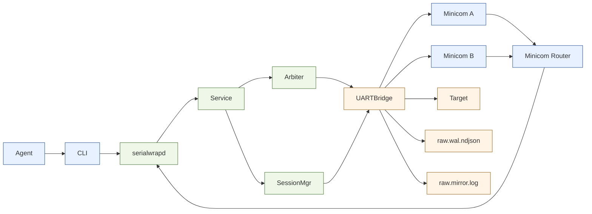
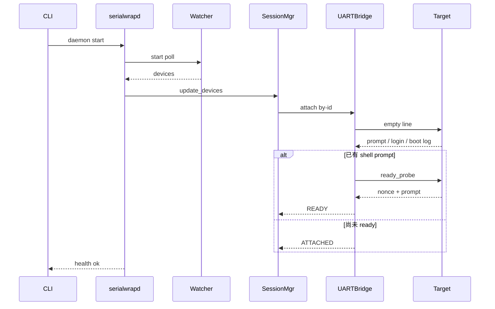
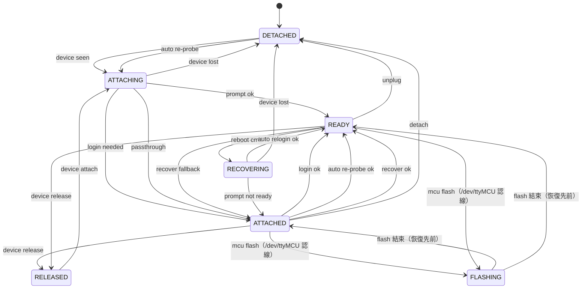
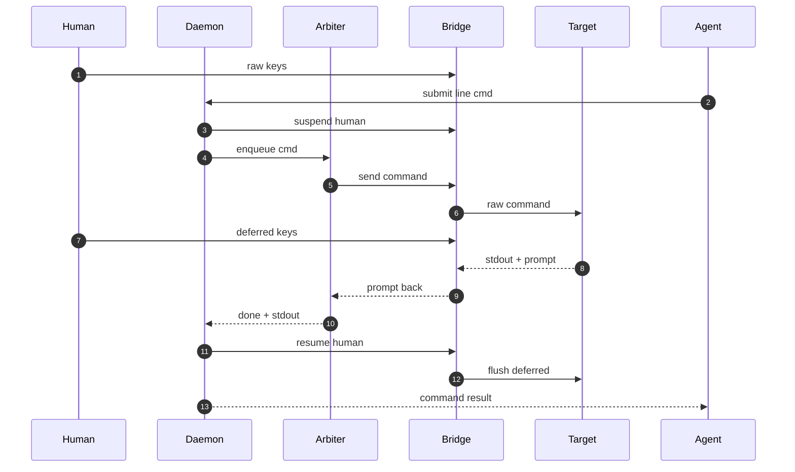
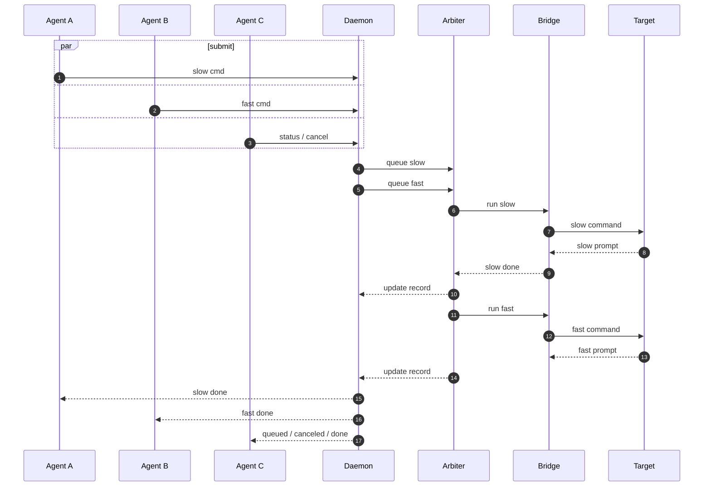
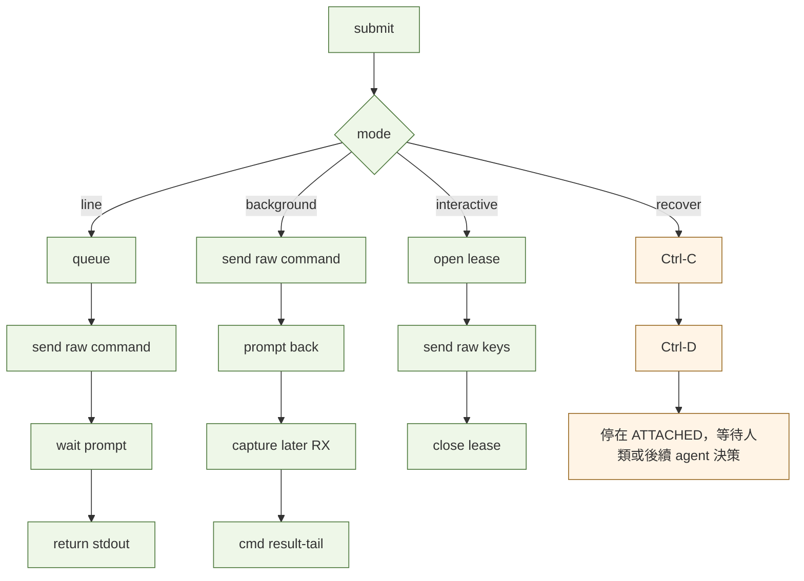
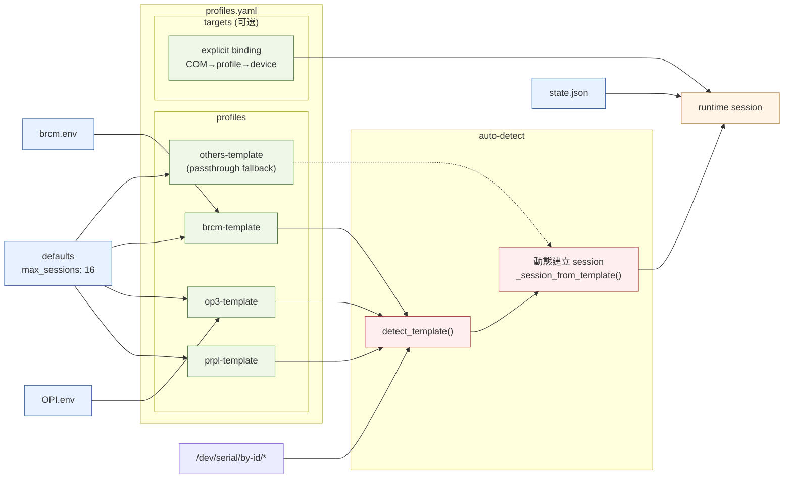

# serialwrap

`serialwrap` 是面向單一 UART、多 agent 與多人 console 共用的 broker。主線由 `serialwrapd`、`serialwrap` CLI 與 `minicom_router.sh` 組成，目標是在不污染 target UART 輸入的前提下，保留單寫入仲裁、透明 console 視圖、結果擷取與故障診斷能力。

## 核心特性

- target UART 只接收原始 command 或 raw keystrokes，不注入任何 begin/end marker。
- 同一個 COM 可同時 attach 多個 minicom；所有 console 都看到同樣的原始 RX 內容。
- 所有前景命令透過 arbiter 單寫入排隊，避免 agent/human 交錯寫入。
- 支援 `line`、`background`、`interactive` 三種執行模式。
- 內建 `session self-test`、`session recover`，可區分裝置遺失、TTY 重綁、bridge stale、target 無回應等狀態。
- 保留 `raw.wal.ndjson` 權威記錄，並提供人類可讀的 `raw.mirror.log` 與 `log tail-text`。

## 依賴

- Python 3.10+
- `pyyaml`：`pipx install` 會自動帶入，無需手動安裝
- `jq`：`minicom_router.sh` 需要（router/human console 路徑）
- `minicom`：human console 路徑需要

## 系統方塊圖


```mermaid
flowchart LR
    A["Agent"]
    C["CLI"]
    R["Minicom Router"]
    H1["Minicom A"]
    H2["Minicom B"]
    D["serialwrapd"]
    S["Service"]
    Q["Arbiter"]
    SM["SessionMgr"]
    U["UARTBridge"]
    T["Target"]
    W["raw.wal.ndjson"]
    X["raw.mirror.log"]

    A --> C
    C --> D
    R --> D
    H1 --> R
    H2 --> R
    D --> S
    S --> Q
    S --> SM
    Q --> U
    SM --> U
    U --> T
    U --> W
    U --> X
    U --> H1
    U --> H2

    classDef actor fill:#e8f1ff,stroke:#335c99,stroke-width:1px;
    classDef core fill:#eef7e8,stroke:#4f7a3f,stroke-width:1px;
    classDef io fill:#fff4e6,stroke:#9a6b25,stroke-width:1px;

    class A,C,R,H1,H2 actor
    class D,S,Q,SM core
    class U,T,W,X io
```

## 啟動流程圖


```mermaid
sequenceDiagram
    participant CLI as CLI
    participant D as serialwrapd
    participant W as Watcher
    participant SM as SessionMgr
    participant U as UARTBridge
    participant T as Target

    CLI->>D: daemon start
    D->>W: start poll
    W-->>D: devices
    D->>SM: update_devices
    SM->>U: attach by-id
    U->>T: empty line
    T-->>U: prompt / login / boot log
    alt 已有 shell prompt
        U->>T: ready_probe
        T-->>U: nonce + prompt
        U-->>SM: READY
    else 尚未 ready
        U-->>SM: ATTACHED
    end
    D-->>CLI: health ok
```

## Session 狀態機


```mermaid
stateDiagram-v2
    [*] --> DETACHED
    DETACHED --> ATTACHING: device seen
    ATTACHING --> READY: prompt ok
    ATTACHING --> ATTACHED: login needed
    ATTACHING --> ATTACHED: passthrough
    ATTACHING --> DETACHED: device lost
    ATTACHED --> READY: login ok
    ATTACHED --> READY: auto re-probe ok
    ATTACHED --> READY: recover ok
    ATTACHED --> DETACHED: detach
    DETACHED --> ATTACHING: auto re-probe
    READY --> ATTACHED: recover fallback
    READY --> DETACHED: unplug
    READY --> RECOVERING: reboot cmd
    RECOVERING --> READY: auto relogin ok
    RECOVERING --> ATTACHED: prompt not ready
    RECOVERING --> DETACHED: device lost
    ATTACHED --> RELEASED: device release
    READY --> RELEASED: device release
    RELEASED --> ATTACHING: device attach
    ATTACHED --> FLASHING: mcu flash（/dev/ttyMCU 認線）
    READY --> FLASHING: mcu flash（/dev/ttyMCU 認線）
    FLASHING --> ATTACHED: flash 結束（恢復先前）
    FLASHING --> READY: flash 結束（恢復先前）
```

### `ATTACHED` vs `READY`：可不可以下命令（command_capable）

`ATTACHED` 代表「裝置已連上、console 可用」，但**不保證能下 line 命令**；`READY` 才代表
broker 能框出命令的輸出（送出 → 看到 prompt → 取回 stdout）。一個 session 能不能進 `READY`
取決於它綁的 profile 是否 **command-capable**：

- **command_capable** = profile 的 `ready_probe` 非空（取代舊的「`platform == passthrough` 就不可用」寫死）。
- 無 `ready_probe`（如 `others-template` 這種純 console / passthrough profile）→ 維持 `ATTACHED`；
  對它 `cmd submit` 會回明確的 **`PROFILE_NOT_COMMAND_CAPABLE`**（附 hint），而非語意不清的 `SESSION_NOT_READY`。
- 有 `ready_probe`（+ 能匹配目標 prompt 的 `prompt_regex`）→ 走正常 probe 進 `READY`，`cmd submit` 可用。
- `READY` 與底層是 OS shell 或 bootloader **無關**：只要 profile 的 prompt/`ready_probe` 對得上即可。
  停在 U-Boot 的板子可綁 **`uboot-template`**（`prompt_regex` 匹配 `=>` / `u-boot>` / `CFE>`，
  `ready_probe: echo __READY__${nonce}`）進 `READY`，然後 `cmd submit --cmd 'printenv'` 下 U-Boot 命令。
- `self_test` / get-state 會在最外層回 `command_capable`，呼叫端可據此分辨「ATTACHED 但本就不可下命令」與「ATTACHED 應可進 READY」。

> 注意：OS profile（prpl/shell）若板子掉進 U-Boot，OS 的 `prompt_regex` 對不上 → **不會** READY（正確：避免把 Linux 命令送進 bootloader）。

### `RELEASED` / `FLASHING`

- `RELEASED`（#54）：`device release` 把 raw 裝置交給外部工具獨佔（如燒錄），broker 關閉 FD、**不自動搶回**、跨 daemon 重啟保留；`device attach` 收回。詳見 `openspec/specs/device-handoff/spec.md`。
- `FLASHING`（#55）：外部 flasher 經 `/dev/ttyMCU` 認線後 session 進入，期間 `cmd submit` 回 `FLASHING_BUSY`、其他 COM 不受影響、daemon 不死；flash 結束自動恢復先前狀態。詳見 `openspec/specs/mcu-flash-broker/spec.md`。

## Agent / Human Co-work 時序圖


```mermaid
sequenceDiagram
    autonumber
    participant H as Human
    participant D as Daemon
    participant A as Arbiter
    participant B as Bridge
    participant T as Target
    participant G as Agent

    H->>B: raw keys
    G->>D: submit line cmd
    D->>B: suspend human
    D->>A: enqueue cmd
    A->>B: send command
    B->>T: raw command
    H->>B: deferred keys
    T-->>B: stdout + prompt
    B-->>A: prompt back
    A-->>D: done + stdout
    D->>B: resume human
    B->>T: flush deferred
    D-->>G: command result
```

### Human lease 的閒置降級（soft preempt）與孤兒清理

human console（minicom）持有的 interactive lease 是**禮讓**機制、不是硬鎖：

- broker 記錄 human 的**真實鍵入時間**（`last_human_input_at`，只算真人鍵入，不含 broker 週期 probe），
  `self_test` 以此回報 `human_active`（最後鍵入在 `HUMAN_ACTIVE_WINDOW_S = 60s` 內才為 `True`）。
  `human_attached`（是否有 human lease）語意不變。
- agent `interactive-open` 遇到**閒置**（`human_active=False`）的 human lease 時，會 **soft preempt**：
  把 human **降級**（console 不中斷，其鍵入進 deferred buffer），agent 取得控制權；agent 關閉 lease 後
  自動還原 human 並回放暫存輸入。human 仍 active 時則維持 `SESSION_INTERACTIVE_BUSY`、不被打斷。
- **孤兒清理**：minicom 真的關閉（console peer 消失）→ `self_test` 時由 liveness 自動 detach、釋放 lease；
  活著但長時間 idle 的 console 只降級、不自動 detach。要徹底收掉殘留 console，仍用
  `session console-detach` 或 `session recover --force`。

> 這解決了「孤兒 minicom 長期假性佔用 console，導致 agent 取不到互動控制權而卡住」的問題。

## Multi-Agent 競爭時序圖


```mermaid
sequenceDiagram
    autonumber
    participant A1 as Agent A
    participant A2 as Agent B
    participant A3 as Agent C
    participant D as Daemon
    participant Q as Arbiter
    participant B as Bridge
    participant T as Target

    par submit
        A1->>D: slow cmd
    and
        A2->>D: fast cmd
    and
        A3->>D: status / cancel
    end

    D->>Q: queue slow
    D->>Q: queue fast
    Q->>B: run slow
    B->>T: slow command
    T-->>B: slow prompt
    B-->>Q: slow done
    Q-->>D: update record
    Q->>B: run fast
    B->>T: fast command
    T-->>B: fast prompt
    Q-->>D: update record
    D-->>A1: slow done
    D-->>A2: fast done
    D-->>A3: queued / canceled / done
```

## 呼叫流程圖


```mermaid
flowchart TD
    S1["submit"] --> M1{"mode"}
    M1 -->|line| L1["queue"]
    L1 --> L2["send raw command"]
    L2 --> L3["wait prompt"]
    L3 --> L4["return stdout"]
    M1 -->|background| B1["send raw command"]
    B1 --> B2["prompt back"]
    B2 --> B3["capture later RX"]
    B3 --> B4["cmd result-tail"]
    M1 -->|interactive| I1["open lease"]
    I1 --> I2["send raw keys"]
    I2 --> I3["close lease"]
    M1 -->|recover| R1["Ctrl-C"]
    R1 --> R2["Ctrl-D"]
    R2 --> R3["停在 ATTACHED，等待人類或後續 agent 決策"]

    classDef flow fill:#eef7e8,stroke:#4f7a3f,stroke-width:1px;
    classDef warn fill:#fff4e6,stroke:#9a6b25,stroke-width:1px;

    class S1,M1,L1,L2,L3,L4,B1,B2,B3,B4,I1,I2,I3 flow
    class R1,R2,R3 warn
```

## 快速開始

```bash
# 安裝（正式流程）
pipx install "git+https://github.com/hamanpaul/serialwrap@v0.2.2"
serialwrap setup     # 物化 profiles/skill/minicom、設定 daemon（systemd 或 on-demand fallback）
serialwrap doctor    # 驗證環境
```

- dialout：`sudo usermod -aG dialout $USER`（之後重新登入）。
- WSL 啟用 systemd：於 `/etc/wsl.conf` 設 `[boot]\nsystemd=true` 後 `wsl --shutdown`（否則 `serialwrap setup` 退回 on-demand）。
- 本機開發安裝：`./install.sh`（= `pipx install <repo>` + `serialwrap setup`）。
- minicom broker wrapper 現為 `serialwrap-minicom COMx`（取代舊的 `~/.paul_tools/minicom`）。

```bash
# 啟動 daemon 後快速驗證
serialwrap daemon status
serialwrap session list

# 首次綁定並 attach
serialwrap session bind --selector COM0 --device-by-id /dev/serial/by-id/<target-by-id>
serialwrap session attach --selector COM0

# 送前景命令
serialwrap cmd submit --selector COM0 --mode line --source agent:diag --cmd "ifconfig"
serialwrap cmd status --cmd-id <cmd_id>
```

## Profile 與目標綁定

`profiles/*.yaml` 以 template + targets 定義 platform、prompt、login、ready probe 與 UART 參數。

**targets 區段為可選**：若省略或留空，daemon 會在偵測到新 UART 裝置時，自動使用 `detect_template()` 比對各 template 的 `prompt_regex` / `login_regex`，匹配成功即動態建立 session；全不匹配則 fallback 到 passthrough。已有 explicit binding 的裝置仍走原本路徑，不受影響。

### session pin / unpin（動態裝置 profile 持久化，#95）

`serialwrap session pin --selector <COM|alias|by-id|by-path> --profile <name>` 把裝置釘到指定 profile（最高優先，繞過動態偵測，跨重啟保留）；`serialwrap session unpin --selector <...>` 解除 pin（保留自動 sticky）。

- **同款晶片（如 CH340）by-id 相同時，務必以 `/dev/serial/by-path/...` 當 selector**，避免 pin/sticky 張冠李戴（與既有 binding 規範一致）。
- profile 解析優先序：pin > sticky（偵測達 READY 後自動記住）> 動態偵測 > others-template fallback。
- `session list` 的 `profile_source` 欄位顯示來源：`pin` / `sticky` / `detected` / `fallback` / `yaml-target`。
- 錯誤碼：`UNKNOWN_PROFILE`（profile 名不存在）、`PROFILE_IS_EXPLICIT`（對 YAML explicit-target 裝置 pin/unpin）、`DEVICE_NOT_FOUND`（selector 解析不到裝置）、`INVALID_ARGS`（缺 selector/profile）。
- **生效時機**：pin/unpin 寫入後不主動重新 attach；對已存在的 session，**下次 daemon 重啟生效**（重啟時 session 重建走動態偵測路徑才重讀 pin/sticky）。執行期 `clear`/`attach` 沿用既有 session 的 profile、不重選。

### COM 編號確定性綁定 by-id（#100）

dynamic 自動偵測 session 的 COM 編號**依裝置 by-id 字典序確定性分配**：daemon startup 在 spawn 並發 attach threads 之前，先對「當下在線的 dynamic 裝置」一次排序配好 COM rank，因此 **restart 後 COM↔實體板的對應穩定不變**，不再隨並發 attach 完成順序對調。

- **rank 作用域只限 dynamic 自動偵測 session**。explicit YAML `targets` 指定的 COM、`session bind` / `_binding_overrides` 綁定、RELEASED 的裝置都是權威來源，排除在 rank pool 外、COM 不被覆寫。
- **runtime hotplug**：不同 by-id 的板插入時繼承空出的 DETACHED 槽（維持原 COM 名）；同 by-id 重接總是拿回自己原槽；active session 的 COM 名在 daemon 存活期間不變。
- **同款晶片（如 CH340）by-id 衝突的 by-path tiebreak**：排序鍵已預留 by-path 次序骨架，但 end-to-end 完整支援為 **TODO**（待 `DeviceInfo.by_path` 接上資料來源）；在此之前 rank 僅依 by-id。
- **on-demand `session renumber`（執行期把漂移的 COM snap 回排序）已 defer 至 follow-up（#103）**：強制重編 active session 牽動 bridge callback / flash state / lease reverse-link，須改以「拆 bridge → 改號 → 重 attach」另案重做。現階段如需重排，以 daemon restart 為暫時手段。

## Session Template 架構圖


```mermaid
flowchart LR
    DEF["defaults\nmax_sessions: 16"]
    ENV1["OPI.env"]
    ENV2["brcm.env"]
    OVR["state.json"]
    SES["runtime session"]
    DEV["/dev/serial/by-id/*"]

    subgraph CFG["profiles.yaml"]
        subgraph TPL["profiles"]
            P1["prpl-template"]
            P2["op3-template"]
            P3["brcm-template"]
            P4["others-template\n(passthrough fallback)"]
        end
        subgraph TGT["targets (可選)"]
            T0["explicit binding\nCOM→profile→device"]
        end
    end

    subgraph AUTO["auto-detect"]
        DT["detect_template()"]
        DYN["動態建立 session\n_session_from_template()"]
    end

    DEF --> P1
    DEF --> P2
    DEF --> P3
    DEF --> P4
    ENV1 --> P2
    ENV2 --> P3
    T0 --> SES
    OVR --> SES
    DEV --> DT
    P1 --> DT
    P2 --> DT
    P3 --> DT
    DT --> DYN
    P4 -.-> DYN
    DYN --> SES

    classDef cfg fill:#e8f1ff,stroke:#335c99,stroke-width:1px;
    classDef profile fill:#eef7e8,stroke:#4f7a3f,stroke-width:1px;
    classDef runtime fill:#fff4e6,stroke:#9a6b25,stroke-width:1px;
    classDef detect fill:#ffeef0,stroke:#993333,stroke-width:1px;

    class DEF,ENV1,ENV2,OVR cfg
    class P1,P2,P3,P4,T0 profile
    class SES runtime
    class DT,DYN detect
```

```yaml
defaults:
  log_dir: "~/b-log"           # 全域 agent log 預設目錄
  max_sessions: 16             # 動態 session 上限

profiles:
  prpl-template:
    platform: prpl
    prompt_regex: "(?m)^root@prplOS:.*# "
    ready_probe: "echo __READY__${nonce}"
    uart:
      baud: 115200
      data_bits: 8
      parity: N
      stop_bits: 1
      flow_control: none
      xonxoff: false
  op3-template:
    platform: shell
    prompt_regex: ".*[$#] $"
    login_regex: "(?mi)^.*login:\\s*$"
    password_regex: "(?mi)^password:\\s*$"
    user_env: "SW_OPI_U"
    pass_env: "SW_OPI_P"
    env_file: "OPI.env"
    ready_probe: "echo __READY__${nonce}"
    uart:
      baud: 115200
      data_bits: 8
      parity: N
      stop_bits: 1
      flow_control: none
      xonxoff: false
  brcm-template:
    platform: bcm
    prompt_regex: "(?m)[>#]\\s*$"
    login_regex: "(?mi)login:\\s*$"
    password_regex: "(?mi)password:\\s*$"
    post_login_cmd: "sh"         # 登入後自動執行，從 BCM shell (>) 切到 Linux shell (#)
    user_env: "BRCM_USER"
    pass_env: "BRCM_PASS"
    env_file: "brcm.env"
    timeout_s: 15
    ready_probe: "echo __READY__${nonce}"
    uart:
      baud: 115200
      data_bits: 8
      parity: N
      stop_bits: 1
      flow_control: none
      xonxoff: false
  others-template:
    platform: passthrough
    prompt_regex: ".*"
    login_regex: "$^"
    password_regex: "$^"
    ready_probe: ""
    uart:
      baud: 115200
      data_bits: 8
      parity: N
      stop_bits: 1
      flow_control: none
      xonxoff: false

# targets 區段為可選：省略 → 全走動態偵測
# 有 explicit 綁定的裝置可寫在這裡：
# targets:
#   - act_no: 1
#     com: COM0
#     alias: my-prpl
#     profile: prpl-template
#     device_by_id: /dev/serial/by-id/usb-FTDI_...
```

`prpl-template` 預設改成匹配 `root@prplOS:/#` 這種 prompt prefix，而不是要求 prompt 必須單獨佔一整行。這樣在 prompt 後面立刻接 driver / kernel log 的情況下，line mode 仍能正確收尾；`ready_probe` 也維持最小 `echo __READY__${nonce}`，避免在沒有 `whoami` 的 target 上增加噪音。

`op3-template` 沿用 generic shell login 模型，適合 Orange Pi / Debian shell。`user_env` / `pass_env` 是每個 profile 自己指定的登入帳密環境變數名稱。CLI / daemon 不會把密碼寫進 YAML 或 WAL。`env_file` 指向同目錄 env 檔，帳密在每次 session attach 時**per-session 解析**，不會污染 daemon 全域環境。不同 COM 可以用不同的 `env_file`，達到 per-session 帳密隔離。

`brcm-template` 用於 Broadcom 原生平台（如 BCM968575）。登入後 target 進入 BCM CLI shell（提示符 `>`），需要再執行 `sh` 才會進到 Linux shell（`#`）。`post_login_cmd: "sh"` 讓 daemon 在成功登入後自動送出此命令，完成兩階段切換。`timeout_s: 15` 因為 Broadcom 登入流程較慢而加長。

建議把 env 檔直接放在 profile 旁邊，例如：

```bash
# profile 目錄：pipx/XDG 安裝為 ~/.config/serialwrap/profiles；systemd-system 安裝為 /etc/serialwrap/profiles
cat > "$HOME/.config/serialwrap/profiles/OPI.env" <<'EOF'
SW_OPI_U='haman'
SW_OPI_P='your-password'
EOF

# systemd 模式用 service 重啟讓 daemon 重讀（`serialwrap daemon start` 在 systemd 模式已自動 route 到 `service start`，重啟仍用 `service restart` 最直接）
serialwrap service restart
```

`sw_core/assets/profiles/default.yaml` 的 `op3-template` 已內建 `env_file: "OPI.env"`，相對路徑會以該 YAML 所在目錄解析。daemon 啟動時，runtime env 會先保留目前 shell 的環境，再依序嘗試載入 `~/OPI.env` 與 `profile_dir/OPI.env`；因此像 `SERIALWRAP_WAL_DIR="$HOME/b-log"` 這類 runtime 設定，放在 `~/.config/serialwrap/profiles/OPI.env` 也會生效。若 profile 沒有宣告 `env_file`，`login_fsm` 仍會從 daemon 的 `os.environ` 讀取帳密（向後相容）。若要完全指定來源，也可以用 `SERIALWRAP_DAEMON_ENV_FILE` 指向包含 runtime 設定的 env 檔。

若 shell device 已經自動登入，`serialwrap` 會直接用 prompt + `ready_probe` 驗證；若先看到 `login:` / `password:`，則會依 `user_env` / `pass_env` 自動登入。像 Orange Pi 常見的 `orangepi3 login:`，建議 `login_regex` 用 `(?mi)^.*login:\\s*$`。

`others-template` 使用 `platform=passthrough`。attach 時不做 prompt/login/ready 限制，只建立 broker bridge，讓 `ttyUSB` 與 broker 建出的 `ttyPTS` 直接透傳；這類 session 會停在 `ATTACHED`，適合不認識的設備先用 minicom/human console 觀察。

### Auto-detect 流程

當 DeviceWatcher 偵測到新 UART 裝置且沒有任何 explicit binding 匹配時，daemon 會自動執行 template 偵測：

1. 用預設 UART 參數（115200/8N1）開啟臨時 bridge
2. 送 `\r` 到 UART，等待 3 秒收集輸出
3. 依 profiles YAML 定義順序（passthrough 排最後），依序嘗試各 template 的 `prompt_regex` → 匹配即選定
4. 若 prompt 不匹配但 `login_regex` 匹配 → 選為候選
5. 全不匹配 → fallback 到 passthrough
6. 動態分配 COM 編號（COM0, COM1, ...），建立新 session

偵測結果**不會持久化**：每次裝置出現都重新偵測。`max_sessions`（預設 16）限制同時存在的 session 數量。

`device_by_id` 支援 `/dev/serial/by-id/` 與 `/dev/serial/by-path/` 兩種穩定識別方式。若多張板使用同款 USB-Serial 晶片（如 CH340），`by-id` 無法區分，建議改用 `by-path`（基於物理 USB port 路徑，不隨列舉順序變）。

常用查看：

```bash
serialwrap device list
serialwrap session list
serialwrap session self-test --selector COM0
```

## 命令模式

### 1. `line`

適用 `ifconfig`、`wl assoc`、`cat /proc/...` 等會回 prompt 的命令。

```bash
serialwrap cmd submit --selector COM0 --mode line --source agent:diag --cmd "ifconfig"
serialwrap cmd status --cmd-id <cmd_id>
```

`command.get` 會直接帶 `stdout`。

**命令限制**：命令字串不得含有 `\n` 換行字元，否則回傳 `CMD_CONTAINS_NEWLINE`。命令長度 > 4 KB 回 warning，> 16 KB 拒絕（`CMD_TOO_LONG`）。

**長命令 keepalive**：對於 `apt upgrade`、`make`、`python -m unittest` 等長時間命令，可加 `--expected-duration` 提示 broker 延長等待：

```bash
serialwrap cmd submit --selector COM0 --mode line --source agent:ci \
  --cmd "python3 -m unittest discover -s tests -v" \
  --timeout 300 --expected-duration 120
```

broker 會在命令執行期間監控 UART RX 活動，有輸出時自動延長等待。詳見 [`docs/design-heartbeat-keepalive.md`](./docs/design-heartbeat-keepalive.md)。

### 2. `background`

適用 prompt 很快回來、後續內容會持續吐出的命令。

```bash
serialwrap cmd submit --selector COM0 --mode background --source agent:bg --cmd "wl assoc scan"
serialwrap cmd status --cmd-id <cmd_id>
serialwrap cmd result-tail --cmd-id <cmd_id> --from-chunk 0 --limit 200
```

`background` capture 會在 quiet window 到期，或新的前景/互動命令開始時封口。

若命令在 prompt timeout 路徑失敗，`cmd result-tail` 仍會保留 terminal `status` / `error_code`，並盡量回傳已緩衝的 partial chunk，不再直接掉成 `CMD_NOT_FOUND`。

### 3. `interactive`

適用 `menuconfig`、`top`、`vi` 等需要持續送按鍵的場景。

```bash
serialwrap session interactive-open --selector COM0 --owner agent:menu --command "menuconfig"
serialwrap session interactive-send --interactive-id <interactive_id> --data down --encoding key
serialwrap session interactive-send --interactive-id <interactive_id> --data enter --encoding key
serialwrap session interactive-status --interactive-id <interactive_id>
serialwrap session interactive-close --interactive-id <interactive_id>
```

`--encoding key` 目前支援：`enter`、`tab`、`escape`、`ctrl-c`、`ctrl-d`、`up`、`down`、`left`、`right`。

#### Bootloader Recovery Lease

當 target 卡在 bootloader（session 處於 `ATTACHED` 狀態，尚未完成 login/ready），agent 可使用 `--allow-attached` 開啟 recovery lease：

```bash
# 1. 確認 session 是否卡在 bootloader
serialwrap session self-test --selector COM0
# 若 result 為 BOOTLOADER 則繼續

# 2. 開啟 recovery lease（最長 120s，受 MAX_RECOVERY_LEASE_S clamp）
serialwrap session interactive-open --selector COM0 --owner agent:recovery \
  --allow-attached --timeout 120

# 3. 送 bootloader 命令（例如 U-Boot boot command）
serialwrap session interactive-send --interactive-id <iid> --data "boot"
serialwrap session interactive-send --interactive-id <iid> --data enter --encoding key

# 4. 觀察畫面
serialwrap session interactive-status --interactive-id <iid>

# 5. 完成後釋放（若 session 已有 human console，會自動恢復）
serialwrap session interactive-close --interactive-id <iid>
```

成功回傳 `recovery_mode: true`。若 session 已有 human interactive lease，daemon 會自動暫停並在 close 後恢復。

## 檔案傳輸

內建 `file push` / `file pull` 透過 UART base64 分段傳輸檔案，取代不可靠的 inline base64 / heredoc workaround。

```bash
# 推送本地檔案到 target
serialwrap file push --selector COM0 --local ./firmware.bin --remote /tmp/firmware.bin

# 從 target 拉取檔案到本地
serialwrap file pull --selector COM0 --remote /etc/config/wireless --local ./wireless.bak
```

傳輸完成後自動進行 md5 校驗。Session 必須處於 `READY` 狀態，target 需有 `base64` 與 `md5sum`。

詳見設計文件：[`docs/design-file-transfer.md`](./docs/design-file-transfer.md)。

## MCU 韌體升級：device handoff

serialwrap 持有 UART 時，外部 flasher（如 `ocp-mcu-upgrade`）無法獨佔 raw device。
先把裝置交出去、燒完再收回：

```bash
serialwrap device release --selector COM0 --source agent:flash --reason "flash CC2674"
# serialwrap 關閉該 UART、清空 console，且不會自動搶回
ocp-mcu-upgrade -d /dev/ttyUSB1 -b 115200 -t 8 -e -s -i fw.bin
serialwrap device attach --selector COM0   # 收回；外部仍持有時回 DEVICE_STILL_HELD，--force 可強制
```

`serialwrap session self-test --selector COM0` 在 RELEASED 下會回 `external_holder` /
`reclaimable` / `recommended_action`（`wait_external_flash` 或 `device_attach`）。

## MCU 韌體升級：flash 端點 `/dev/ttyMCU`（#55）

相對於 `device release`（把**整個** raw device 交給外部工具、燒完手動收回），flash 端點讓 daemon
**持續 maintain tty**：daemon 仍是 real device 唯一 reader（無 two-reader race），並提供一個
byte-transparent 端點 `/dev/ttyMCU`（預設 `${SERIALWRAP_RUN_DIR}/dev/ttyMCU`，可用
`SERIALWRAP_TTYMCU_PATH` 覆寫）。外部 flasher 開這個端點即可，全程 RAW WAL 留證。

不必記底層是哪個 `/dev/ttyUSBx`（會隨重插/換板漂移）：開端點後 serialwrap 以**非破壞性 sync-probe**
自動認出「BSL 中會回 SBL ACK」的那條線（排除 command_capable console，避免燒到 DUT），認到才把真
flasher 接上去，破壞性的 erase/program 只會到已確認的線。

```bash
# 查支援的 MCU 家族與目前候選（端點本身一律沉默，清單只走 CLI/RPC）
serialwrap mcu patterns
serialwrap mcu status

# 1) 先在 DUT console（serialwrap console session）把 MCU 帶進 BSL（GPIO reset，依板而定）
# 2) host 改用 serialwrap 端點取代原本的 raw /dev/ttyUSBx：
ocp-mcu-upgrade -d /tmp/serialwrap/dev/ttyMCU -b 115200 -t 8 -e -s -i fw.bin
# serialwrap 自動 sync-probe 認線 → bridge → 期望 Return error code : 0x0；燒完該 session 自動恢復 console
```

支援家族可擴充（pattern registry，預設 TI CC2674/CC2652：probe `55 55` → ACK `00 cc`）。
偵測不到 BSL 中的 MCU 時 serialwrap 保持沉默，由 flasher 自身 retry/timeout 處理；燒錄期間該 session
`cmd submit` 回 `FLASHING_BUSY`，其他 COM 不受影響。

> ⚠️ 二進位安全：`/dev/ttyMCU` 的 PTY slave 以 raw 模式建立（無 CR/LF 轉換）。請勿改走一般 console /
> passthrough session 傳 SBL binary——那條路徑會行處理、汙染協定。

## 多 minicom 使用

`minicom_router.sh` 會：

1. 視需要自動啟動 daemon
2. 視需要對 selector 執行 `session attach`
3. 透過 `session console-attach` 取得專屬 PTY
4. 預設用 minicom 內建 `-C` 記錄一份 `mini_<COM>_<timestamp>.log` 純序列 transcript（預設在 `~/b-log`，可用 `BLOG_DIR` 覆寫）；需要含完整終端畫面的 transcript 可設 `MINICOM_CAPTURE_MODE=script` 改用 `script -qef` 包裹
5. 啟動 `minicom`
6. 結束後自動 `session console-detach`

```bash
# 自動選第一個 READY，否則退而求其次選 ATTACHED session
minicom

# 指定 COM 或 alias
minicom COM1
minicom default+2

# 無 broker 時直接 fallback raw device
minicom -D /dev/ttyUSB0
```

重要限制：

- minicom 看到的是透明 RX 視圖。
- **`console-attach` 在 `ATTACHED` 或 `READY` 狀態下，會自動授予第一個 human console raw interactive ownership**，不需手動 `interactive-open`。所有按鍵（包含方向鍵、Tab、ESC 序列）即時透傳到 UART，操作體感與直接 minicom 一致。
- 若 agent 在 human interactive 期間提交命令，daemon 會暫時掛起（suspend）human raw mode → 執行 agent 命令 → 完成後自動恢復（resume）。Human 在 agent 執行期間的按鍵會累積在 deferred buffer，agent 完成後 flush 到 UART。
- 第二個以後的 minicom console 因為 interactive lease 已存在，仍走 line-buffer 模式（broker 提供本地回顯與 backspace 行編輯）。
- bridge rebuild / reattach 時，broker 會盡量保留既有 console PTY 與 human ownership，避免既有 minicom 掛到 stale `/dev/pts/*`。
- **孤兒 console 週期回收（#76）**：daemon 在每次 readiness tick（節流）主動回收「PTY slave 已無外部 reader」的孤兒 console（含死掉的非哨兵 primary；不碰當前 owner 與 agent 命令期間的 suspended owner、不碰內部哨兵 primary），避免 minicom 不乾淨關閉（SIGKILL/crash）後 console 累積拖慢 RX fan-out（卡頓/掉字）。
- **raw ownership 自癒**：若 human console 的 raw ownership 因故掉失但 console 仍連著，daemon 會在 tick 中自動重授（lease-backed、原子授予），不需重開 minicom 即恢復方向鍵/Tab；agent 命令進行中（含 flash）不自癒、不奪權。
- **peer-loss grace**：human lease 不因 `console_has_external_peer` 瞬時 flap 立即被拆——須持續無 peer 超過 grace 窗（預設 3s）才釋放，避免短暫探測競態誤把 raw ownership 拆掉而掉回 line-buffer。
- Broker minicom 的自動 transcript 可用 `MINICOM_CAPTURE_MODE=script|minicom|off` 控制：
  - `script`：使用 `script -qef` 包住 minicom（完整終端 transcript，會含 minicom 自身 UI/顏色），不傳 `-C` 給 minicom。
  - `minicom`（預設）：使用 minicom 內建 `-C`，產生不含 minicom UI 的乾淨序列 log。
  - `off`：關閉自動 transcript，不建立 log、不使用 `script` wrapper，也不自動傳 `-C`。
- Legacy `MINICOM_CAPTURE_WRAPPER=1` 仍等同 `MINICOM_CAPTURE_MODE=script`；若未設定 `MINICOM_CAPTURE_MODE` 且明確設定 `MINICOM_CAPTURE_WRAPPER=0`，仍保留舊版 minicom `-C` 行為。
- 常見 human/minicom 互動式命令（例如 `vi`、`vim`、`top`、`htop`、`less`、`menuconfig`）會自動升級成 human interactive ownership，不再因為等不到 shell prompt 而自動觸發 recover / reboot。
- broker minicom wrapper 現為 `serialwrap-minicom COMx`（取代舊的 `~/.paul_tools/minicom`）；`serialwrap setup` 會自動物化到 `~/.local/bin/serialwrap-minicom`。
- 若直接打 `minicom` 沒有走 broker，先用 `type -a minicom` 檢查目前 shell 是否先命中 `serialwrap-minicom`；若未命中，確認 `~/.local/bin` 已在 PATH（`pipx ensurepath`）。

手動 console 控制範例：

```bash
serialwrap session console-attach --selector COM0 --label human:lab
serialwrap session console-list --selector COM0
serialwrap session interactive-open --selector COM0 --owner human:<client_id>
serialwrap session interactive-close --interactive-id <interactive_id>
serialwrap session console-detach --selector COM0 --client-id <client_id>
```

## 診斷與恢復

### Self-test

```bash
serialwrap session self-test --selector COM0
```

常見 `classification`：

- `OK`
- `DEVICE_MISSING`
- `DEVICE_REBOUND_REQUIRED`
- `BRIDGE_DOWN`
- `VTTY_STALE`
- `TARGET_UNRESPONSIVE`
- `SESSION_RECOVERING`
- `LOGIN_REQUIRED`：bridge 已掛，看到 `login:` prompt，但無 `pending_auto_login`，等待 human 手動登入
- `ATTACHED_NOT_READY`：bridge 已掛，但 prompt probe 失敗（如 boot log 中、前景程式仍在跑）
- `REBOOTING`：agent 已送出 reboot 類指令，正在等待 target 重開機完畢後自動 relogin
- `HUMAN_INTERACTIVE_ACTIVE`：human console 目前握有 interactive ownership，不適合 agent 干預
- `PASSTHROUGH`：platform 設為 passthrough，session 已 ATTACHED，適合透明 bridge 模式

### FAQ：開機窗連不到、minicom 顯示 broker not ready

若 `session attach` 剛好撞上 DUT 開機窗，target 仍在噴 boot log 或 prompt 尚未出現，session 可能暫時停在非 `READY`：

> **`session attach` 回傳契約（#94）**：command-capable session 未能自動達 `READY` 時，`session attach` 會回**非零 exit（`2`）+ 頂層 `error_code`**（如 `PROMPT_UNAVAILABLE`），CLI 並在 stderr 印一行具體錯誤（早期版本一律回 `ok:true`、錯誤只埋在 `session.last_error`，上層因而拿到空 error）。這是「尚未達 READY」的**誠實回報、可重試**——daemon 會有界自動重探、通常數秒內回 `READY`——**非致命**；自動化上層應據此 retry/wait，勿當永久失敗。（仍回 `ok:true` 的例外：`READY`、`ATTACHING`（attach 進行中）、`RELEASED`（裝置已 release、回 `recommended_action=device_attach`、需 `device attach` 重取）、`platform=passthrough`（停 `ATTACHED` 即成功）。）

```bash
serialwrap session self-test --selector COM0
serialwrap session list
```

判讀方式：

1. `ATTACHED_NOT_READY` 且 `last_error=PROMPT_UNAVAILABLE` / `PROMPT_TIMEOUT`：bridge 還在，通常是 prompt 尚未可用；daemon 會在 RX 閒置後依 `reprobe_attempts` / `next_reprobe_at` 做有界自動重探，成功後回 `READY`。
2. `BRIDGE_DOWN` 且 session 為 `DETACHED`、`last_error` 為 `*_PROMPT_TIMEOUT`：裝置仍在位時 daemon 會重新走 attach/probe 路徑。
3. `reprobe_exhausted=true` 或等待過久仍未 READY：手動執行 `serialwrap session recover --selector COM0`（必要時加 `--force`）。

`minicom_router.sh` 在偵測到這類狀態時會提示「DUT 可能仍在開機、serialwrap 正在自動重探」；若希望它阻塞等待 READY 後再開 minicom，可設 `MINICOM_WAIT_READY=1`。

### 同機多開（two-reader）偵測（#101）

同機同時跑多個 `serialwrapd`（不同 socket / 監管模式，例如 systemd-user 與 systemd-system 並存）會造成 two-reader——兩個 daemon 同時讀同一條 UART、靜默掉字。`SingletonLock` 是 per-`(lock_path, socket_path)` 的 flock，擋不到不同 socket 的第二個 daemon。serialwrap 以**純被動、on-demand 偵測 + 回報**（不終止任何 daemon、不退讓、無背景週期掃描）暴露此情況，兩個 surface：

```bash
serialwrap doctor          # single_daemon 檢查項
serialwrap daemon status   # multi_open / foreign_holders 欄位
```

- **`serialwrap doctor`**：新增 `single_daemon` 檢查項，掃 `/proc` 找 `serialwrapd` 程序；多開時 `ok=false`、`detail` 列出在跑的 daemon 數、`fix` 指引「停掉多餘 daemon（`serialwrap service stop`；並檢查 systemd-user 與 system 是否同時在跑）」。doctor 為獨立程序、不碰 socket。
- **`serialwrap daemon status`**：回應加三個欄位：
  - `multi_open`（bool）：是否偵測到一個以上 `serialwrapd`。
  - `foreign_holders`（`{tty_real_path: pid}`）：哪個 pid 持有目前 attach 中的 tty。
  - `multi_open_detail`：`{"daemons": [{"pid": N}, ...], "holders_status": "ok" | "permission" | "unknown"}`。`holders_status` 在跨 uid 讀不到 `/proc/<pid>/fd` 時降級為 `permission`（仍確認另有 daemon 存在，但無法判定持有哪條 tty）；procfs 不可用時為 `unknown`。

### Recover

```bash
serialwrap session recover --selector COM0
```

recover 行為分成三種：

1. `ATTACHED` 且 bridge 仍存活：先直接 re-probe 現有 bridge，成功就回 `READY`
2. `READY`：走 `Ctrl-C` → `Ctrl-D`
3. bridge 已不存在但裝置還在：直接 reattach

若 `READY` 路徑中的 `Ctrl-C` / `Ctrl-D` 都救不回 prompt，session 會降級成 `ATTACHED`，保留 bridge 與 console，交由 human/minicom 接手。

只有 **agent 明確送出 reboot 類指令** 時，daemon 才會進入 `RECOVERING`，並在 target 回來後自動重新 login / 回到 `READY`。

## 日誌與輸出

| 檔案 | 說明 |
|------|------|
| 預設 `~/.local/state/serialwrap/wal/raw.wal.ndjson`（XDG state home，可由 `SERIALWRAP_WAL_DIR` 覆寫；舊版為 `/tmp/serialwrap/wal/`） | 權威事件記錄，保留 `seq/cmd_id/source/crc32/...` |
| 預設 `~/.local/state/serialwrap/wal/raw.mirror.log` | 可讀文字鏡像，接近 console payload |
| 預設 `~/.local/state/serialwrap/state.json`（可由 `SERIALWRAP_STATE_DIR` 覆寫；舊版為 `/tmp/serialwrap/state.json`） | alias 與 binding 持久化 |
| Agent log `~/b-log/{COM}_{YYMMDD}-{HHMMSS}.log` | Agent 觸發式 per-session 日誌，純文字 RX 內容 |

### Agent 日誌 (log start/stop)

Agent 可對特定 COM port 啟停日誌：

```bash
serialwrap session log-start --selector COM0
# → {"ok":true,"capture_id":"...","log_path":"~/b-log/COM0_250117-143021.log",...}

serialwrap session log-stop --selector COM0
# → {"ok":true,"log_path":"...","line_count":42,"byte_count":1024,...}

serialwrap session log-status --selector COM0
# → {"ok":true,"active":true,"capture_id":"...",...}
```

特性：

- WAL（always-on）不受影響，agent log 是額外的 focused capture
- 每個 session 同一時間最多一個 active capture
- session detach 時自動停止 capture
- 預設路徑 `~/b-log`，可透過 YAML `defaults.log_dir`、profile `log_dir` 或 target `log_dir` 覆寫

### log_dir 組態

優先序：per-target `log_dir` > per-profile `log_dir` > YAML `defaults.log_dir` > `SERIALWRAP_LOG_DIR` env > `~/b-log`

```yaml
defaults:
  log_dir: "~/b-log"         # 全域預設
profiles:
  op3-template:
    log_dir: "/var/log/opi"   # per-profile 覆寫
targets:
  - com: COM1
    log_dir: "/tmp/com1-log"  # per-target 最高優先
```

### WAL 查詢

CLI 查詢：

```bash
serialwrap log tail-text --selector COM0 --from-seq 0 --limit 200
serialwrap log tail-raw  --selector COM0 --from-seq 0 --limit 200
serialwrap wal export --from-seq 0 --limit 500
```

### WAL 管理

```bash
# 輪替現有 WAL 並重設 seq（daemon 不重啟，console 不斷線）
serialwrap wal reset

# 查詢目前 WAL seq（不需讀檔，無 race condition）
serialwrap wal current-seq
```

`wal.reset` 會將現有 `raw.wal.ndjson` 與 `raw.mirror.log` 改名為 `*.{timestamp}` 歸檔，然後重新從 seq 0 開始寫入。此操作**不影響任何已連線的 console PTY**。

### session.bind 冪等行為

當 session 已綁定同一 `device_by_id` 且狀態為 `READY` 或 `ATTACHED` 時，重複呼叫 `session.bind` 不會 detach 現有 bridge 或銷毀 console PTY。回傳值包含 `"already_bound": true`。

這使得外部 orchestrator（如 testpilot）可以安全地呼叫 `session bind` 而不必擔心打斷 human console。

說明：

- `log tail-text` 偏向人類閱讀，不輸出 metadata header。
- `log tail-raw` / `wal export` 仍保留完整權威欄位。
- 可用 `SERIALWRAP_WAL_DIR` 覆寫 WAL / mirror log 目錄，例如放到 `~/b-log`；這不會改動 daemon socket / lock 的 `RUN_DIR`。
- `stream tail` 為 legacy alias；新設計優先使用 `cmd result-tail`。

## 跨平台序列埠與 Windows human console（#84 PORT-1/PORT-2）

序列埠 I/O 已抽象為可替換的 `SerialPort` port（`sw_core/serial_port.py`），human console 亦支援 PTY / TCP 兩種 transport，使核心收發不再寫死 POSIX `termios`/PTY：

- **序列埠（PORT-1）**
  - **Linux/WSL（預設）**：`_PosixSerialPort`（termios 後端），與既往**逐位元組等價**；`select()` 多工序列埠 fd 與 console PTY 不變。
  - **Windows**：`_PySerialPort`（pyserial 後端）。`import sw_core.uart_io` 不再因 `termios`/`fcntl` 而 `ImportError`；`UARTBridge` 序列埠 RX/TX 對 `COMx` 運作。
  - 後端自動依平台選擇，`SERIALWRAP_SERIAL_BACKEND`（`auto`／`posix`／`pyserial`）可覆寫；`pyserial` 為 Windows 後端執行期依賴（`pyproject` `sys_platform=='win32'`）。
- **human console（PORT-2）**
  - **Linux/WSL**：PTY（minicom 開 `/dev/pts/N`），行為不變。
  - **Windows**：無 PTY → `UARTBridge` 開 `127.0.0.1` TCP listener；**TeraTerm（TCP/IP, Service=Other）或 PuTTY（Raw）**連入即一個 console，沿用 raw ownership / suspend-resume coexistence / RX fan-out（agent 下命令期間連線不中斷）。連線端點見 `console_endpoint()` / `session console-attach` 回傳的 `host:port`。
- 真機驗證：Windows 對 CH340（`COM8`，TxRx 短接 loopback）實測序列埠 start/RX/TX/WAL/clean-stop 與 TCP console raw/雙向/agent coexistence/斷線偵測全數通過。

### Windows Daemon（PORT-4）

Windows daemon 以 **TCP loopback** 取代 AF_UNIX 做 RPC 控制通道，使 serialwrap CLI/agent 在 Windows 擁有完整指令路徑：

- **RPC endpoint**：預設 `tcp://127.0.0.1:48700`，可以 `--socket` 參數或環境變數 `SERIALWRAP_ENDPOINT`（覆寫整個 endpoint，如 `tcp://127.0.0.1:50000`）、`SERIALWRAP_TCP_PORT`（僅覆寫 port 部分）覆寫。daemon 啟動後會把有效 endpoint 寫入 `config.yaml::socket_path`，CLI `_resolve_endpoint` 自動讀取。
- **Singleton 鎖**：`msvcrt.locking`（`LK_NBLCK`）+ TCP connect 探測（`WindowsSingletonLock`，`sw_core/lock_win.py`）。語意與 POSIX `SingletonLock`（flock + Unix socket probe）對齊：endpoint 可連 → `DAEMON_ALREADY_RUNNING`；stale → 取得 msvcrt 檔鎖。
- **COM 列舉與藍牙排除**：從 Windows registry `HKLM\HARDWARE\DEVICEMAP\SERIALCOMM` 列舉所有 COM port（`WindowsDeviceSource`，`sw_core/device_source.py`）；雙重排除藍牙——BTHENUM PortName 掃描（主判據）+ `bthmodem` device path 啟發式（兜底），確保藍牙裝置**永不被接管**。額外手動排除清單：`config.yaml::windows.exclude_coms`（如 `["COM3"]`）。
- **閒置非藍牙 COM 自動接管**：偵測到不在排除清單的 COM 時，daemon 以 `passthrough` profile 自動建立 session（可觀察 UART 輸出；需要下命令請先 pin 適當 profile 並 attach）。已持續被外部程序佔用的 COM **不會每輪自動輪詢重試**（與 POSIX dynamic-session 同語意；需拔插或手動 `session bind`/`session clear` 觸發）。
- **平台 seam 分檔**：三個後端由 `sw_core/platform_backends.py` 的 `select_rpc_backend()` / `select_lock_backend()` / `select_device_backend()` 依 `os.name` 自動選擇，環境變數 `SERIALWRAP_{RPC,LOCK,DEVICE}_BACKEND`（`auto`/`posix`/`win`）可覆寫：
  - RPC：`sw_core/rpc_posix.py`（Unix socket）↔ `sw_core/rpc_win.py`（TCP loopback `TcpRpcServer`）
  - Lock：`sw_core/lock_posix.py`（`SingletonLock` flock）↔ `sw_core/lock_win.py`（`WindowsSingletonLock` msvcrt）
  - Device：`PosixDeviceSource`（`/dev/serial/by-id`）↔ `WindowsDeviceSource`（SERIALCOMM registry）
- POSIX 路徑全程 byte-identical（shim 維持相容）。

#### 建置 Windows 可執行檔（PyInstaller）

`serialwrapd.exe` / `serialwrap.exe` 以 PyInstaller one-file 打包（`serialwrap.spec`）。

正式 release（push `v*` tag）會由 `release.yml` 的 `publish-windows-exe` job 在 `windows-latest` 自動建置並把兩個 exe 附到該 tag 的 GitHub Release assets（與 wheel 並列），一般使用直接下載即可。需在本機自行建置時：

```powershell
# 建置（自動安裝 PyInstaller，-Clean 旗標清除 build/ dist/ 後重建）
.\scripts\build_windows.ps1 -Clean

# 煙霧測試（--help 即驗收）
dist\serialwrapd.exe --help
dist\serialwrap.exe --help
```

- `serialwrap.spec` 已設定 `hiddenimports = ["winreg", "msvcrt", "serial", "yaml"]` 與內嵌 `sw_core/assets/`。
- `dist/` 與 `build/` 已在 `.gitignore`，不入版控；實機整合驗收於 Task 14 進行。

#### 啟動 Windows Daemon

```powershell
# 開發 / 臨時使用（前景模式）
serialwrapd.exe --socket tcp://127.0.0.1:48700

# 或直接 python 執行
python -m sw_core.daemon

# CLI 操作（自動讀 config.yaml 或指定 endpoint）
serialwrap.exe daemon status
serialwrap.exe session list
serialwrap.exe cmd submit --selector COM0 --cmd "ver"
```

> ⚠️ Windows 尚無 systemd 監管（PORT-8）。長期使用建議以 Windows Task Scheduler 或 NSSM 管理 `serialwrapd.exe` 生命週期；`device release` / `device attach` 編排已可用（底層 COM release/reclaim primitive 可用）。

> ⚠️ **安全提醒（Windows TCP RPC）**：Windows daemon 的 RPC 控制通道走 `127.0.0.1` TCP，**本機任意行程與使用者均可連線並下任何 RPC 指令**（不同於 POSIX AF_UNIX 依賴檔案權限與 `dialout` 群組保護）。單人開發機可接受；多人共用 Windows 機請注意此風險，token 驗證機制為後續 follow-up。

> **COM namespace 說明**：serialwrap 給 session 的內部 selector 標籤（COM0／COM1…）與 Windows 實體埠名（COM3／COM8…）是兩個獨立 namespace；`session list` 會同時顯示（如 `device_by_id=COM8`、session `com=COM0`），屬正常行為。

### Windows MCU flash（設計決策）

Linux 的 `/dev/ttyMCU`（PTY-bridge + sync-probe + baud 鏡射，#55）在 Windows **不適用也不需要**：Windows 的韌體升級工具直接獨佔開啟該 UART `COMx` 自行燒錄。serialwrap 在 Windows flash 流程唯一要做的是 **detach（release）該 COM port**——關閉自身 handle 讓外部工具獨佔開啟、燒完再 reclaim，對應 **#54 device release/handoff** 語意（**非** #55）。底層 stop/close / start/re-open primitive 已可用；完整的 `device release`/`device attach` 使用者編排透過 Windows daemon（PORT-4，已完成）即可操作。

> ⚠️ 範圍：本 Windows 支援涵蓋 **PORT-1（序列埠）**、**PORT-2（TCP human console）** 與 **PORT-4（Windows daemon：TCP RPC、msvcrt singleton、SERIALCOMM 列舉）**。其餘 OS 邊界——`/proc` peer 偵測（PORT-5）、`/dev` 裝置列舉（PORT-6）、WAL 目錄 fsync（PORT-7）、systemd/dialout 監管（PORT-8）——仍為 Linux-only。

## 測試

```bash
python3 -m unittest discover -s tests -v
```

常用單測：

```bash
python3 -m unittest tests.test_multiagent_e2e -v
python3 -m unittest tests.test_session_bind -v
```

### 32h 長時間穩定度測試摘要

最近對 `COM1` 做了一輪 **32 小時** 長時間穩定度測試，負載模型是：

- 4 個 agent source 持續送 `serialwrap cmd submit`
- 1 個 human console 透過 `tmux + minicom + tmux send-keys`
- controller 會持續監控 daemon / session 狀態；若 session 長時間不健康，會自動重啟 serialwrap，並把每段 run 納入統計

關鍵結果如下：

| 指標 | 結果 |
|---|---|
| 總時長 | `32:00:01` |
| 最長單次執行 | `01:15:17` |
| run segments | `31` |
| daemon restart | `30` |
| health failure | `30` |
| bridge rebuild | `0` |
| vtty change | `0` |
| human launch / stale / send | `29 / 1 / 5696` |

Agent 總量：

- submitted：`49,899`
- accepted：`48,396`
- done：`48,288`
- error：`27`
- status_timeout：`81`
- submit_fail：`1,503`

這輪長跑最重要的發現是：**主要不穩定模式不是 bridge rebuild 或 vtty 換號，而是 session 週期性卡在 `ATTACHED`、沒有回到 `READY`。**

run end reason 分布如下：

- `session_not_ready:ATTACHED`：`27`
- `session_not_ready:DETACHED`：`2`
- `daemon_health_fail`：`1`
- `completed`：`1`

也就是說，這次長跑真正暴露的主問題是 `ATTACHED -> READY` gating / recover 流程，而不是單純的 stale PTY。相關追蹤 issue：[#12](https://github.com/hamanpaul/serialwrap/issues/12)。stale PTY / primary PTY 變更問題仍另列於 [#11](https://github.com/hamanpaul/serialwrap/issues/11)。

### 下一步根因分析計畫

針對 issue #12，接下來建議優先做這幾件事：

1. 在 `ATTACHING -> ATTACHED -> READY` 路徑補更細的 event / log，包含 `login_fsm` probe、`ready_probe` nonce 與關鍵 session snapshot。
2. 把這次 32h controller 的負載縮成可在 1~2 小時內重現的 stress case，優先重現「卡在 `ATTACHED`」而不是只觀察 daemon restart。
3. 補 attach / recover gating 的 regression test，避免 session 無限停在 `ATTACHED`。
4. 修完後重新跑 long-run，驗收標準至少要把 `session_not_ready:ATTACHED` 造成的 restart 降到 `0`，且不能讓 human / multi-agent 協作退化。

## 真機驗證手法

### Bootloader（U-Boot）command profile 真機驗證

驗證 `uboot-template` 之類 bootloader command profile 能在真機進 `READY` 並下 line 命令時，
核心原則是**把驗證關進沙箱、完全不動 production daemon 設定**，失敗可隨時丟棄、零殘留。

**為何不直接在 production 上改**：profile 綁定是 detection-based，而 `uboot-template` 是
`passthrough`（auto-detect 不會自動選它，只能明確綁定）；且沒有乾淨的 runtime 改 profile 的
CLI（`bind` 只改 device、`recover`/`clear` 沿用舊 profile）。在 production 改要重設定 + 重啟，
會殺掉其他 COM、動到持久化狀態。

**隔離驗證步驟（dogfood `device release`/`device attach`）**：

1. **釋放 raw device**：`serialwrap device release --selector COMx --source agent:verify`
   —— production daemon 關閉該 UART FD、進 `RELEASED`，但**繼續運作、其他 COM 不受影響**。
2. **起受限的 throwaway daemon**：用獨立 socket/lock；關鍵是把
   `SERIALWRAP_BY_ID_DIR` 指到一個**只含目標裝置一條 by-id symlink** 的暫存目錄，避免它掃到
   其他裝置與 production 形成 two-reader 衝突。該 daemon 的 profile 加一段 `targets:` 把目標
   by-id **明確綁到 `uboot-template`**（繞過 auto-detect）。
3. **把板子弄進 U-Boot**：開 interactive lease → 送 `reboot` → 接著以 ~0.3s 間隔持續送鍵
   （space）約 30 秒，攔截「Hit any key to stop autoboot」視窗；若是 boot menu，送對應鍵
   （例如 `0` = Exit）掉到 U-Boot console（prompt 例如 `U-Boot> `）。
4. **走完整 serialwrap 路徑驗證**：`session self-test`（期望 `OK`/`probe_ok=True`/`READY`）→
   `cmd submit --cmd 'printenv' --mode line`（期望框出 env dump）。
5. **還原**：送 `boot` 回正常 OS → 停 throwaway daemon → `device attach --selector COMx` 收回
   → 等板子開機穩定後（早期 PCIe/kernel 噪音會干擾偵測）重啟 production daemon，讓 detection
   重新綁回原 profile。

> 真機才抓得到的陷阱：(1) 多個 `passthrough` template 會搶 auto-detect 的通用 fallback，通用
> fallback 必須限定為非 command-capable 的 passthrough；(2) 實機 U-Boot prompt 可能是大寫
> `U-Boot> `，`prompt_regex` 要用 `(?mi)` 大小寫不敏感。

### Co-work 競爭/對抗測試（human + 多 agent 共用同一 COM）

驗證 human console 與多個 agent 同時存取同一 COM 時，single-writer 仲裁、輸出框定、
`human_active` 時間窗、soft preempt 與孤兒 liveness 等行為（對應 #51/#53）。在一顆有 shell 的
真機板（command-capable session，例如 op3-template）上跑：

**建置與步驟**

1. **tmux 開 minicom 模擬 human**：`tmux new-session -d -s cowork`，於 pane 內執行
   `serialwrap-minicom COMx`（broker minicom：自動 `console-attach` 並在 broker vtty 上開
   minicom）。`session console-list` 應出現第二個 console、`self-test` 回 `human_attached=true`。
2. **多 agent 並行存取**：開 2 個 subagent（或 2 條並行 CLI loop），各以不同 `--source` 連續
   `cmd submit --mode line`（送帶唯一 marker 的 `echo`），驗證每筆 `cmd status` 的 stdout 只含
   自己的 marker（無 cross-talk / 錯接）。
3. **tmux send-keys 模擬 human 操作**：`tmux send-keys -t cowork -l -- "echo HUMAN_MARK"` +
   `Enter`。真人鍵入後 `self-test` 應回 `human_active=true`；此時 agent `interactive-open` 應回
   `SESSION_INTERACTIVE_BUSY`（active human 不被搶）；human 命令在 minicom 畫面上各自獨立成行、
   不與 agent 輸出位元組交錯（deferral 生效）。
4. **kill minicom 再重接（退出再進入）**：以 PID `kill -9` 突然殺掉 minicom（不走 clean
   `console-detach`）→ `self-test` 應由 liveness 偵測 peer 消失、自動 detach 該 console、
   `human_attached=false`、`console_count` 回 1；重新 `serialwrap-minicom COMx` 即重新 attach、
   `human_attached=true`、可再次輸入。
5. **（選用）長時間壓力測試**：延長步驟 2~3 的並行回合數與時間，觀察 TX/RX 框定與 fairness。

> 額外驗證 soft preempt：human 閒置超過 `HUMAN_ACTIVE_WINDOW_S`（60s）後 `human_active=false`，
> 此時 agent `interactive-open` 會回 `soft_preempted=true`，且 human console **只降級不中斷**
> （`console-list` 仍在、owner 轉為 agent），agent close lease 後 human owner 還原。
>
> 注意事項：(1) **不要用 `pkill -f "minicom -D ..."`**——pattern 會 self-match 你自己的 shell
> cmdline；改用 `pgrep -x minicom` 取 PID 再 `kill`。(2) minicom 在 broker pts 上常顯示
> `Offline`（DCD 未拉起），不影響輸入轉送。(3) `log tail-raw` 預設 `from-seq=0`（最舊起算），
> 驗證最新輸出要看 minicom 畫面或帶較大 `--limit`/`--from-seq`。

## Remote Support（ssh-tunnel 遠端連線）

當 FAE 在海外（美國 / 歐洲電信客戶端）用 serialwrap 連接 DUT，台灣 RD 可透過 **ssh-tunnel** 讓 agent 對遠端 daemon 下命令，無需修改 daemon 端程式。

### 架構概覽

```
[台灣 RD]                              [FAE 現場]
 agent (CLI)                           serialwrapd
   |                                        |
   | tcp://127.0.0.1:7777                   |
   +--> ssh tunnel (ssh -L) -->--> socat <--> Unix socket
```

### FAE 端設定（一次性）

**步驟 1**：以 `socat` 將 Unix socket 暴露成 TCP（**只 bind loopback，不可對外**）：

```bash
socat TCP-LISTEN:7777,bind=127.0.0.1,reuseaddr,fork \
      UNIX-CONNECT:/tmp/serialwrap/serialwrapd.sock &
```

> ⚠️ **安全注意**：
> - 必須 `bind=127.0.0.1`，絕對不能省略，否則 port 會暴露在 0.0.0.0
> - serialwrap RPC 包含 `command.submit`、`file.push`、`daemon.stop`，**任何可連到此 port 的機器都能完全遠端操控 DUT**
> - 永遠只透過 ssh-tunnel 使用，不可直接對網路開放

**步驟 2**：在 FAE 的 sshd 確認允許 `AllowTcpForwarding yes`（預設通常已開）。

### 台灣 RD 端設定

**建立 ssh-tunnel**：

```bash
ssh -N -L 127.0.0.1:7777:127.0.0.1:7777 fae_user@fae_host
```

| 參數 | 說明 |
|---|---|
| `-N` | 不開 shell，只轉發 port |
| `-L 127.0.0.1:7777:127.0.0.1:7777` | 本機 7777 → FAE host 127.0.0.1:7777 |

若要保持常駐，可加 `-f` 或用 autossh：

```bash
autossh -M 0 -N -L 127.0.0.1:7777:127.0.0.1:7777 fae_user@fae_host
```

**確認 tunnel 通**：

```bash
serialwrap --endpoint tcp://127.0.0.1:7777 daemon status
```

### `--endpoint` 參數

CLI 支援 `--endpoint`，優先於 `--socket`：

```bash
# CLI 遠端查詢 session 列表
serialwrap --endpoint tcp://127.0.0.1:7777 session list

# CLI 遠端提交命令
serialwrap --endpoint tcp://127.0.0.1:7777 cmd submit \
    --selector COM0 --cmd "uname -a"
```

支援的 endpoint 格式：

| 格式 | 用途 |
|---|---|
| `/tmp/serialwrap/serialwrapd.sock` | 本機 Unix socket（預設，向後相容） |
| `unix:///tmp/serialwrap/serialwrapd.sock` | 本機 Unix socket（顯式指定） |
| `tcp://127.0.0.1:7777` | 透過 ssh-tunnel 連接遠端 daemon |

### 限制與注意事項

- `daemon start` **不支援** `--endpoint`（daemon 只能在本機啟動，會回 `REMOTE_NOT_SUPPORTED`）
- **`file.push / file.pull` 的 `local_path` 是 FAE host（daemon 端）的路徑**，不是 RD 本機路徑。若 RD 要傳輸本機檔案，需先透過 scp/rsync 傳到 FAE host，再由 daemon 執行 file transfer
- WAL 路徑、mirror log 路徑等回傳值也都是 FAE host 上的路徑
- 認證完全委由 ssh 本身，daemon 不加 token 驗證
- 若要做隔離式雙 container 驗證，可直接執行 `./tools/docker/remote_smoke.sh`；完整流程說明在 [`func-test/README.md`](./func-test/README.md) 的 **Remote Support Docker test flow**

### Docker smoke test

若要快速驗證目前 repo 的 remote-support 能否跨 container 工作，可直接執行：

```bash
./tools/docker/remote_smoke.sh
```

這個腳本會：

1. build `serialwrap:remote-smoke`
2. 建立隔離 bridge network（不固定 IP、不指定 MAC）
3. 起一個 remote daemon container（內含 fake target + `serialwrapd` + `socat`）
4. 再起一個 client container，驗證 `daemon status` / `session list` / `cmd submit` / `cmd status`

## Event Trigger Engine（Issue #37）

Event Trigger Engine 讓 daemon 持續監聽每個 COM 的 UART RX 行，當輸出符合指定 pattern 時自動 spawn 一個 handler process。

### 規則格式

規則為 JSON/YAML 檔，儲存在 `~/.serialwrap/events.d/`：

```json
{
  "schema_version": 1,
  "owner": "ops",
  "name": "kernel-panic",
  "kind": "tool",
  "selectors": ["COM0"],
  "pattern": {"kind": "contains", "value": "Kernel panic"},
  "handler": {"exec": ["/usr/local/bin/notify-on-panic", "--selector", "COM0"]},
  "auto_enable_com_on_load": true,
  "max_fires": 3,
  "cooldown_ms": 5000,
  "timeout_ms": 10000
}
```

`rule_id` = `{owner}.{name}`（例：`ops.kernel-panic`）。

### CLI 子命令

```bash
serialwrap event add --file rule.json        # 載入或更新規則
serialwrap event rm ops.kernel-panic         # 刪除規則
serialwrap event list [--selector COM0]      # 列舉規則
serialwrap event show ops.kernel-panic       # 查看單一規則 + counter
serialwrap event enable --selector COM0      # 啟用 COM0 的 matcher
serialwrap event disable --selector COM0     # 停用並清除 counter
serialwrap event status [--selector COM0]    # 查詢 COM matcher 狀態
serialwrap event reset --rule-id ops.kernel-panic   # 清除指定規則 counter
serialwrap event reload                      # 重新掃描 events.d/ 目錄
serialwrap event tail --rule-id ops.kernel-panic -n 20  # 查看最近 fire 記錄
```

> ⚠️ **安全規則**：在 `serialwrap event enable` / `event disable` 之前，**必須先 `serialwrap event status`** 確認當下狀態。若規則設定了 `auto_enable_com_on_load: true`，daemon 重啟後 COM 會自動回到啟用狀態。

### Handler 撰寫守則

由 event engine 觸發的 handler script **必須**：
- 在 `timeout_ms`（預設 10s）內結束；超時會依序收到 SIGTERM（pgid）→ SIGKILL（pgid）
- **不可呼叫 `setsid()`** 或主動 daemonize，否則子進程會脫離 process group，timeout 無法強制終止
- 從 stdin 讀取 JSON payload（含 `com`、`rule_id`、`matched_text`、`trigger_ts` 等欄位）
- 以 exit code 0 代表成功，非 0 代表失敗（均記入 events.ndjson）

Handler **建議**：
- 保持冪等性（同一 pattern 可能觸發多次）
- 輸出寫到 syslog 或獨立 log 檔（stdout/stderr 僅保留最後 4 KB）
- 響應 SIGTERM 做 graceful shutdown

詳細設計請見 [`docs/plan-event-trigger.md`](./docs/plan-event-trigger.md)。

## 延伸閱讀

- 詳細決策與 API 契約：[`docs/serialwrap-spec.md`](./docs/serialwrap-spec.md)

## Install

```bash
pipx install "git+https://github.com/hamanpaul/serialwrap@v0.2.2"
serialwrap setup     # 物化 profiles/skill/minicom、設定 daemon（systemd 或 on-demand fallback）
serialwrap doctor    # 驗證環境
```

- dialout：`sudo usermod -aG dialout $USER`（之後重新登入）。
- WSL 啟用 systemd：於 `/etc/wsl.conf` 設 `[boot]\nsystemd=true` 後 `wsl --shutdown`（否則 `serialwrap setup` 退回 on-demand）。
- 本機開發安裝：`./install.sh`（= `pipx install <repo>` + `serialwrap setup`）。
- minicom broker wrapper 現為 `serialwrap-minicom COMx`（取代舊的 `~/.paul_tools/minicom`）。

依賴：Python 3.10+（`pipx install` 自動帶入 `pyyaml`）；human console 路徑另需 `jq` 與 `minicom`。

## Usage

<!-- BEGIN: cli-help marker="serialwrap-help" -->
usage: serialwrap [-h] [--socket SOCKET] [--endpoint ENDPOINT]
                  [--timeout TIMEOUT_S]
                  <group> ...

serialwrap client（支援本機 Unix socket 與遠端 endpoint）

options:
  -h, --help           show this help message and exit
  --socket SOCKET      本機 daemon 的 Unix socket 路徑（預設依 XDG 執行期目錄解析，可用 SERIALWRAP_RUN_DIR 覆寫）
  --endpoint ENDPOINT  遠端 daemon endpoint，例如 tcp://127.0.0.1:7777（優先於 --socket）
  --timeout TIMEOUT_S  RPC timeout 秒數（預設: 5.0）

command groups:
  <group>
    daemon             管理 serialwrap daemon（啟動／停止／狀態）
    device             實體 UART 裝置列舉與 handoff（release／attach）
    session            session 生命週期、探測、recover、console 與 interactive 操作
    alias              session 別名與 by-id 綁定管理
    cmd                提交命令並讀取結果（line／background）
    stream             即時 tail 解析後的文字事件串流
    log                raw／text 日誌 tail（含 timestamp／seq／crc）
    file               透過 UART 推送／拉取檔案
    wal                write-ahead log 匯出／重設／seq 查詢
    mcu                MCU flash pattern 查詢與 flash 端點狀態
    event              event-trigger 規則註冊與 matcher 控制
    supervision-mode   顯示有效的監管模式（on-demand、systemd-user 或 systemd-system）
    service            透過 systemctl 管理 serialwrap systemd service（systemd 監管模式適用）
    setup              安裝資產並設定監管模式（systemd-user／systemd-system／on-demand）
    doctor             診斷安裝與執行環境（Python／PyYAML／PATH／dialout／systemd／裝置）

examples:
  serialwrap session list
  serialwrap --endpoint tcp://127.0.0.1:7777 session list
  serialwrap --endpoint tcp://127.0.0.1:7777 cmd submit --selector COM0 --cmd 'uname -a'
<!-- END: cli-help marker="serialwrap-help" -->

### 子命令 help（R-16 同步管控）

`serialwrap daemon --help`：

<!-- BEGIN: cli-help marker="serialwrap-daemon-help" -->
usage: serialwrap daemon [-h] <command> ...

管理 serialwrap daemon 行程：啟動、停止與查詢執行狀態。

positional arguments:
  <command>
    start     啟動 daemon（--foreground 可前景執行；systemd 模式重導 service start）
    stop      停止執行中的 daemon
    status    顯示 daemon 狀態（pid／sessions／devices／log 路徑／多開偵測 multi_open）

options:
  -h, --help  show this help message and exit
<!-- END: cli-help marker="serialwrap-daemon-help" -->

`serialwrap session --help`：

<!-- BEGIN: cli-help marker="serialwrap-session-help" -->
usage: serialwrap session [-h] <command> ...

管理 session：列舉與綁定、健康探測（self-test）、recover、console 與 interactive lease、capture
log。

positional arguments:
  <command>
    list              列出所有 session 及其狀態
    clear             清除 session（detach 後會自動 re-attach；交接外部請改用 device release）
    bind              把 session 綁定到指定裝置 by-id
    pin               把 device 釘到指定 profile（最高優先，繞過偵測）
    unpin             解除 device 的 profile pin（保留 sticky）
    attach            將 session attach 到裝置並建立 bridge
    self-test         探測 session 健康度，回報 classification 與 recommended_action
    activity          顯示 session 的 RX／TX／state 活動
    recover           重建 bridge 修復不健康的 session（TARGET_UNRESPONSIVE 時用這個，非
                      device attach）
    console-attach    附加一個 console reader 到 session
    console-detach    卸除指定的 console reader
    console-list      列出 session 上的 console readers
    interactive-open  開啟 interactive lease（給全螢幕互動程式用）
    interactive-send  送出按鍵／資料到 interactive lease
    interactive-status
                      讀取 interactive lease 目前畫面與狀態
    interactive-close
                      關閉 interactive lease
    log-start         開始該 session 的 capture log
    log-stop          停止該 session 的 capture log
    log-status        查詢該 session 的 capture log 狀態

options:
  -h, --help          show this help message and exit
<!-- END: cli-help marker="serialwrap-session-help" -->

`serialwrap device --help`：

<!-- BEGIN: cli-help marker="serialwrap-device-help" -->
usage: serialwrap device [-h] <command> ...

管理實體 UART 裝置：列舉裝置，以及把 raw device 暫時交給外部工具獨佔再收回。

positional arguments:
  <command>
    list      列出實體 UART 裝置（real_path 與 by-id）
    release   釋放 raw 裝置給外部工具獨佔（如 MCU 燒錄），進入 RELEASED 不自動搶回
    attach    收回先前 release 的裝置並重建 console（外部仍持有時回 DEVICE_STILL_HELD，--force
              略過）

options:
  -h, --help  show this help message and exit
<!-- END: cli-help marker="serialwrap-device-help" -->


```bash
# 啟動 daemon（on-demand 模式手動啟動；systemd 模式下此命令會自動 route 到 service start）
# 經 serialwrap setup 後 profiles 已在 XDG 設定目錄，daemon 預設即可讀取，無需 --profile-dir
# on-demand 模式重複執行為冪等：已有健康 daemon 時回 already_running、不另起行程
serialwrap daemon start

# 查看 session 列表
serialwrap session list

# 綁定裝置
serialwrap session bind --selector COM0 --device-by-id /dev/serial/by-id/<target-by-id>

# 附加 console
serialwrap session attach --selector COM0
```

## Version

目前版本請見 [`VERSION`](./VERSION) 檔案。版本歷程請見 [`CHANGELOG.md`](./CHANGELOG.md)。
