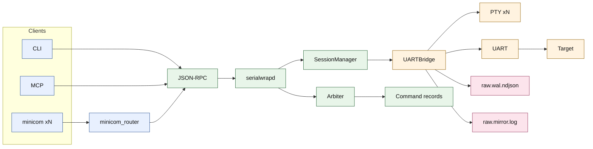
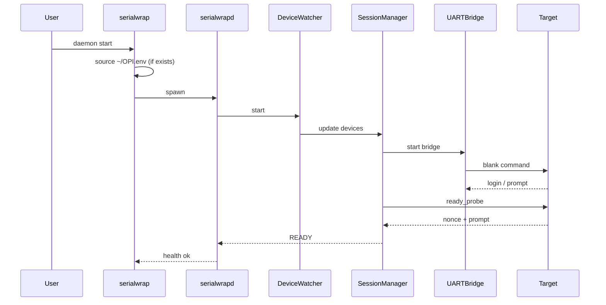
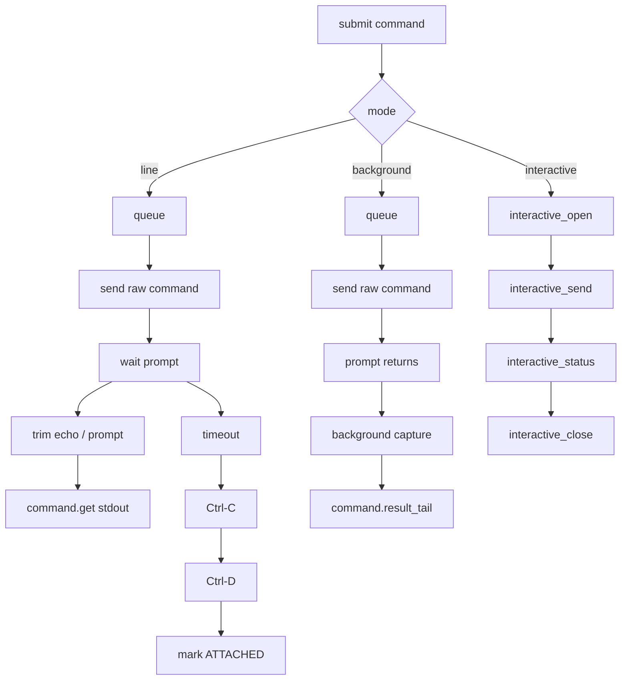

# serialwrap 規格書

## 1. 文件目的

本文件定義目前主線 `serialwrap` 的決策完整規格。目標是讓單一 UART 可以安全地被多 Agent 與多個 minicom 共享，同時保留可追溯性、可診斷性與可恢復性。

本版重點：

- 完全移除 legacy `serialwrap_lib.py`
- 不再使用 tmux / shell marker
- target UART 只接收原始 command 或 raw keystrokes
- human console 改為 multi-console fan-out
- MCP / CLI / RPC 對齊新主線

## 2. 核心目標與不變量

### 2.1 目標

- 單 UART 單寫入仲裁
- 多 Agent / 多 minicom 可共享同一 COM
- command 可回傳結構化結果
- background / interactive / recover 有明確模型
- 裝置換 tty、bridge stale、target 無回應可被分類
- 只有 agent 明確 reboot 時才自動重新 login / READY

### 2.2 核心不變量

- 任一時刻只有一個真正的 UART writer
- 所有自動化寫入都經 broker
- RAW WAL 是權威證據
- human-visible 文字輸出不得污染 target
- target UART 上不得插入 broker marker

## 3. 系統元件

### 3.1 元件清單

- `serialwrapd.py`
- `sw_core/service.py`
- `sw_core/arbiter.py`
- `sw_core/session_manager.py`
- `sw_core/uart_io.py`
- `sw_core/login_fsm.py`
- `sw_core/device_watcher.py`
- `sw_core/wal.py`
- `sw_mcp/server.py`
- `tools/minicom_router.sh`

### 3.2 系統架構圖

## 4. 啟動流程

### 4.1 啟動步驟

1. `serialwrap daemon start`
2. CLI 若發現 `~/OPI.env`，先以 shell 載入帳密相關環境變數
3. 建立 runtime dirs / lock / socket
4. 載入 `profiles/*.yaml`
5. 建立 `SerialwrapService`
6. 啟動 `DeviceWatcher`
7. 首次掃描 by-id
8. 依裝置嘗試 attach
9. `UARTBridge.start()`
10. `ensure_ready()`
11. session 進 `READY`
12. CLI / MCP 可正式提交命令

### 4.2 啟動時序圖

## 5. Session / Console / Command 狀態

### 5.1 Session 狀態

- `DETACHED`
- `ATTACHING`
- `ATTACHED`
- `READY`
- `RECOVERING`

### 5.2 Console 模型

- 每個已掛上 bridge 的 session 都至少有一個 primary console PTY
- `session.console_attach` 會再建立一個專屬 PTY
- 所有 console 都收到同一份 RX fan-out
- 非 interactive owner 的 human input 只會緩衝成 line，經 broker queue 執行
- line-buffered human input 由 broker 提供本地回顯與基本 backspace 行編輯，避免 minicom 看不到鍵入內容
- 常見 human/minicom 互動式命令（如 `vim`、`top`、`less`、`menuconfig`）可自動升級為 human interactive ownership，避免被誤判為 prompt timeout 故障
- 若 session 僅為 `ATTACHED`，`session.console_attach` 仍可使用，且該 console 會自動拿到 raw human ownership，方便手動登入或觀察 boot/log

### 5.3 Command record

每筆 command 至少包含：

- `cmd_id`
- `session_id`
- `command`
- `source`
- `mode`
- `execution_mode`
- `status`
- `stdout`
- `partial`
- `background_capture_id`
- `interactive_session_id`
- `recovery_action`
- `started_at`
- `done_at`

## 6. Execution Modes

### 6.1 line

適用：

- `ifconfig`
- `iw dev wl0 link`
- `cat /proc/...`

流程：

1. queue 出隊
2. 送出原始 command + newline
3. 記錄 RX 起點 offset
4. 等 prompt regex 再次出現
5. 清除 echo / prompt
6. `stdout` 寫回 `command.get`

### 6.2 background

適用：

- `wl assoc scan`
- `cmd &`

流程：

1. queue 出隊
2. 送出原始 command
3. 等 prompt 回來
4. 開啟 background capture
5. 後續 chunk 由 `command.result_tail` 讀取

背景結果不是由 agent 直接 parse raw WAL，而是由 daemon 維護 capture 狀態與 chunk 邊界。

### 6.3 interactive

適用：

- `menuconfig`
- `vi`
- `top`

流程：

1. `session.interactive_open`
2. 建立 interactive lease
3. 設定 `UARTBridge.interactive_owner`
4. 透過 `session.interactive_send` 送 key / bytes
5. `session.interactive_status` 讀畫面
6. `session.interactive_close` 釋放 lease

若 `source=human:*` 的 line command 已送出但後續未回 prompt，daemon 會優先把該 console 升級成 human interactive，而不是直接觸發 recover。這條保護僅套用 human/minicom；agent foreground command 仍保留既有 prompt timeout / recover 路徑。

### 6.4 recover

適用：

- prompt timeout
- unmatched quote / continuation prompt
- interactive timeout
- target shell 卡住

升級順序固定：

1. `Ctrl-C`
2. `Ctrl-D`
3. 若仍無 prompt，session 降級為 `ATTACHED`

## 7. 呼叫流程圖

## 8. Device 變更與 reattach

### 8.1 掃描來源

- 來源：`/dev/serial/by-id`
- key：`device_by_id`
- 值：`real_path`

### 8.2 重新 attach 條件

以下任一條件成立都視為需要重建 bridge：

- `device_by_id` 消失
- `device_by_id` 重新出現
- `device_by_id` 不變但 `real_path` 改變

### 8.3 預期行為

- bridge 停止
- session 先進 `DETACHED`
- 重新 `_attach_by_id`
- 若看到 shell prompt，送 `ready_probe` 後回 `READY`
- 若沒看到 prompt，保留 bridge 並停在 `ATTACHED`

## 9. self_test 與 recover

### 9.1 `session.self_test`

輸出分類：

- `OK`
- `SESSION_RECOVERING`
- `DEVICE_MISSING`
- `DEVICE_REBOUND_REQUIRED`
- `BRIDGE_DOWN`
- `VTTY_STALE`
- `TARGET_UNRESPONSIVE`
- `LOGIN_REQUIRED`
- `ATTACHED_NOT_READY`
- `REBOOTING`

判斷順序：

1. session 是否存在
2. 是否處於 recovering
3. by-id 是否仍存在
4. `attached_real_path` 是否與目前 `real_path` 一致
5. bridge / vtty 是否存活
6. 執行安全 probe

安全 probe 目前使用 profile 的 `ready_probe`。

### 9.2 `session.recover`

若 session 仍有可用 bridge：

1. 送 `Ctrl-C`
2. 等 prompt
3. 失敗則送 `Ctrl-D`
4. 再失敗則把 session 降級成 `ATTACHED`

若 session 已無 bridge 但裝置還在：

- 直接走 reattach
- attach 流程只做被動 prompt probe，不自動 login

## 10. Logging 與輸出層

### 10.1 RAW WAL

檔案：

- `raw.wal.ndjson`

內容：

- `seq`
- `mono_ts_ns`
- `wall_ts`
- `com`
- `dir`
- `source`
- `cmd_id`
- `len`
- `crc32`
- `payload_b64`
- `loss_flag`
- `meta`

### 10.2 Mirror

檔案：

- `raw.mirror.log`

內容：

- printable stream
- 接近透明 console 視角
- 不附帶每行 metadata prefix

### 10.3 Command result

來源：

- line mode：`command.get.stdout`
- background mode：`command.result_tail`
- interactive mode：`interactive_status.screen`

## 11. Public Interface

### 11.1 CLI

- `serialwrap daemon start|stop|status`
- `serialwrap device list`
- `serialwrap session list|bind|attach|clear`
- `serialwrap session self-test|recover`
- `serialwrap session console-attach|console-detach|console-list`
- `serialwrap session interactive-open|interactive-send|interactive-status|interactive-close`
- `serialwrap alias list|set|assign|unassign`
- `serialwrap cmd submit|status|result-tail|cancel`
- `serialwrap log tail-raw|tail-text`
- `serialwrap wal export`

### 11.2 RPC

- `health.ping`
- `health.status`
- `device.list`
- `session.list`
- `session.get_state`
- `session.clear`
- `session.bind`
- `session.attach`
- `session.self_test`
- `session.recover`
- `session.console_attach`
- `session.console_detach`
- `session.console_list`
- `session.interactive_open`
- `session.interactive_send`
- `session.interactive_status`
- `session.interactive_close`
- `alias.list`
- `alias.set`
- `alias.assign`
- `alias.unassign`
- `command.submit`
- `command.get`
- `command.cancel`
- `command.result_tail`
- `log.tail_raw`
- `log.tail_text`
- `wal.range`

### 11.3 MCP Tool 對應

- `serialwrap_get_health` -> `health.status`
- `serialwrap_list_devices` -> `device.list`
- `serialwrap_list_sessions` -> `session.list`
- `serialwrap_get_session_state` -> `session.get_state`
- `serialwrap_bind_session` -> `session.bind`
- `serialwrap_attach_session` -> `session.attach`
- `serialwrap_self_test` -> `session.self_test`
- `serialwrap_recover_session` -> `session.recover`
- `serialwrap_submit_command` -> `command.submit`
- `serialwrap_get_command` -> `command.get`
- `serialwrap_tail_command_result` -> `command.result_tail`
- `serialwrap_attach_console` -> `session.console_attach`
- `serialwrap_detach_console` -> `session.console_detach`
- `serialwrap_list_consoles` -> `session.console_list`
- `serialwrap_open_interactive` -> `session.interactive_open`
- `serialwrap_send_interactive_keys` -> `session.interactive_send`
- `serialwrap_get_interactive_status` -> `session.interactive_status`
- `serialwrap_close_interactive` -> `session.interactive_close`

相容 alias：

- `serialwrap_tail_results` -> `result.tail`
  - 帶 `cmd_id` 時，回到 `command.result_tail` 語義
  - 帶 `selector/from_seq` 時，維持 legacy raw result tail

## 12. `minicom_router.sh` 行為

1. 確認 daemon 存活，必要時自動啟動
2. 找到 selector 對應 session
3. session 既非 `READY` 也非 `ATTACHED`，且允許自動 attach 時，先 `session attach`
4. `session console-attach`
5. 以回傳的 PTY 啟動 `minicom`
6. minicom 結束後 `session console-detach`

`minicom_router.sh` 不再依賴 session 單一 `vtty` 當唯一入口。

## 13. Profile 規格

關鍵欄位：

- `platform`
- `prompt_regex`
- `login_regex`
- `password_regex`
- `username`
- `user_env`
- `pass_env`
- `post_login_cmd`
- `ready_probe`
- `timeout_s`
- `quiet_window_s`
- `hard_timeout_s`
- `uart.*`

`quiet_window_s` 目前用於 background capture idle finalize。

`platform=shell` 可使用 `user_env` / `pass_env` 做 generic shell login。`serialwrap daemon start` 會先嘗試載入 `~/OPI.env`，因此可將 `SW_OPI_U` / `SW_OPI_P` 放在該檔。若裝置 login prompt 會帶 hostname（例如 `orangepi3 login:`），建議 `login_regex` 使用 `(?mi)^.*login:\\s*$`。若裝置已自動登入並直接出現 prompt，daemon 會略過 login 流程，直接做 `ready_probe`。

## 14. 驗收標準

- line mode 命令完成後 `stdout` 正確回填
- background mode 可用 `result-tail` 取得後續 chunk
- interactive lease 可建立、送 key、關閉
- 多 console attach 可同時收到 RX
- human line input 不會繞過 broker
- 裝置 real_path 變更時會 reattach
- `self_test` 可區分主要故障類型
- `recover` 僅會走 `Ctrl-C -> Ctrl-D`
- agent 明確 reboot 後可重新回 `READY`
- README / spec / CLI / MCP 命名一致

## 15. 使用建議

- human / operator：
  - `session self-test`
  - `session recover`
  - `minicom`
- agent：
  - `command.submit`
  - `command.get`
  - `command.result_tail`
  - interactive 類走 `session.interactive_*`
- 稽核：
  - `log tail-raw`
  - `wal export`

## 16. 非目標

以下不屬於本版：

- 再次引入 tmux / pane marker
- 允許 broker 外部直接寫 `/dev/ttyUSB*`
- 將 raw WAL 降格為非權威資料
