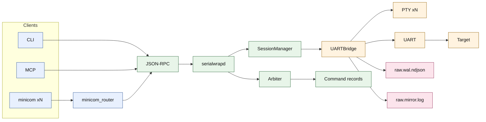
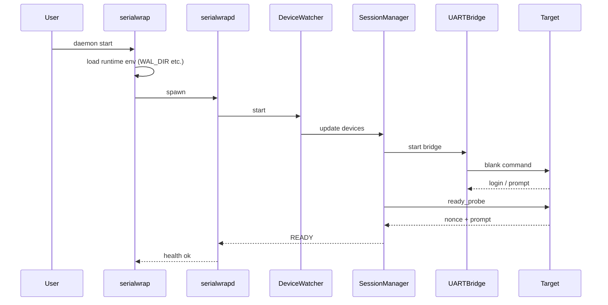
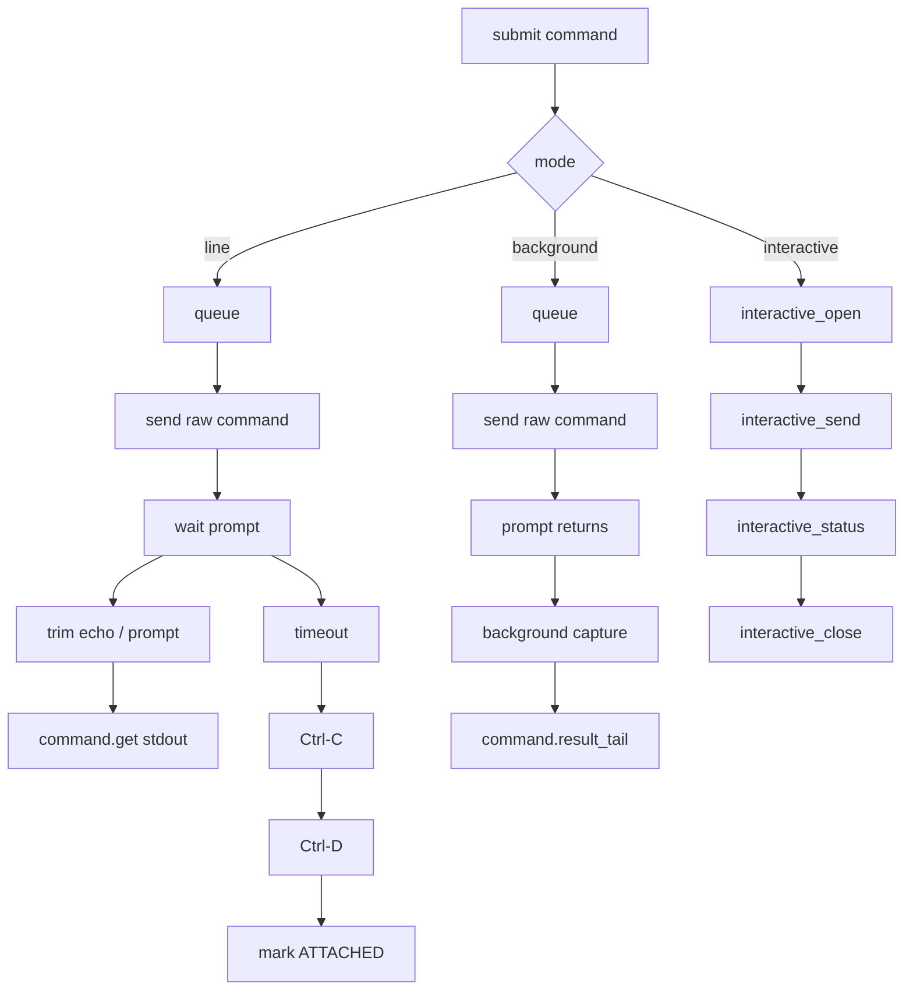

# serialwrap 規格書

## 1. 文件目的

本文件定義目前主線 `serialwrap` 的決策完整規格。目標是讓單一 UART 可以安全地被多 Agent 與多個 minicom 共享，同時保留可追溯性、可診斷性與可恢復性。

本版重點：

- 完全移除 legacy `serialwrap_lib.py`
- 不再使用 tmux / shell marker
- target UART 只接收原始 command 或 raw keystrokes
- human console 改為 multi-console fan-out
- MCP / CLI / RPC 對齊新主線

## 2. 核心目標與不變量

### 2.1 目標

- 單 UART 單寫入仲裁
- 多 Agent / 多 minicom 可共享同一 COM
- command 可回傳結構化結果
- background / interactive / recover 有明確模型
- 裝置換 tty、bridge stale、target 無回應可被分類
- 只有 agent 明確 reboot 時才自動重新 login / READY

### 2.2 核心不變量

- 任一時刻只有一個真正的 UART writer
- 所有自動化寫入都經 broker
- RAW WAL 是權威證據
- human-visible 文字輸出不得污染 target
- target UART 上不得插入 broker marker

## 3. 系統元件

### 3.1 元件清單

- `serialwrapd.py`
- `sw_core/service.py`
- `sw_core/arbiter.py`
- `sw_core/session_manager.py`
- `sw_core/uart_io.py`
- `sw_core/login_fsm.py`
- `sw_core/device_watcher.py`
- `sw_core/wal.py`
- `sw_mcp/server.py`
- `tools/minicom_router.sh`

### 3.2 系統架構圖


```mermaid
flowchart LR
    subgraph C["Clients"]
        CLI["CLI"]
        MCP["MCP"]
        MINI["minicom xN"]
    end

    CLI --> RPC["JSON-RPC"]
    MCP --> RPC
    MINI --> ROUTER["minicom_router"]
    ROUTER --> RPC
    RPC --> D["serialwrapd"]
    D --> A["Arbiter"]
    D --> S["SessionManager"]
    S --> B["UARTBridge"]
    B --> P["PTY xN"]
    B --> U["UART"]
    U --> T["Target"]
    B --> W["raw.wal.ndjson"]
    B --> M["raw.mirror.log"]
    A --> R["Command records"]

    classDef client fill:#e8f0fe,stroke:#355c9a,stroke-width:1px,color:#111;
    classDef core fill:#e8f5e9,stroke:#2f6b3f,stroke-width:1px,color:#111;
    classDef io fill:#fff3e0,stroke:#9a6b16,stroke-width:1px,color:#111;
    classDef log fill:#fce4ec,stroke:#9a3f64,stroke-width:1px,color:#111;

    class CLI,MCP,MINI,ROUTER client;
    class RPC,D,A,S,R core;
    class B,P,U,T io;
    class W,M log;
```

## 4. 啟動流程

### 4.1 啟動步驟

1. `serialwrap daemon start`
2. CLI 載入 runtime env（`SERIALWRAP_DAEMON_ENV_FILE` 或 legacy `~/OPI.env`）
3. 建立 runtime dirs / lock / socket
4. 載入 `profiles/*.yaml`
5. 建立 `SerialwrapService`
6. 啟動 `DeviceWatcher`
7. 首次掃描 by-id
8. 依裝置嘗試 attach
9. `UARTBridge.start()`
10. `ensure_ready()`
11. session 進 `READY`
12. CLI / MCP 可正式提交命令

### 4.2 啟動時序圖


```mermaid
sequenceDiagram
    participant User as User
    participant CLI as serialwrap
    participant D as serialwrapd
    participant W as DeviceWatcher
    participant S as SessionManager
    participant B as UARTBridge
    participant T as Target

    User->>CLI: daemon start
    CLI->>CLI: load runtime env (WAL_DIR etc.)
    CLI->>D: spawn
    D->>W: start
    W->>S: update devices
    S->>B: start bridge
    B->>T: blank command
    T-->>B: login / prompt
    S->>T: ready_probe
    T-->>S: nonce + prompt
    S-->>D: READY
    D-->>CLI: health ok
```

### 4.3 Client ↔ Daemon transport

- daemon 本體仍只 listen **Unix socket**
- CLI / MCP client 端可接受：
  - `--socket /tmp/serialwrap/serialwrapd.sock`
  - `--endpoint unix:///tmp/serialwrap/serialwrapd.sock`
  - `--endpoint tcp://host:port`
- `tcp://...` 的用途是讓 client 經由 **ssh-tunnel / socat / 隔離測試網路** 連到遠端 daemon；**不是**讓 daemon 直接 listen TCP
- `daemon start` 只支援本機 socket，不支援 `--endpoint`

## 5. Session / Console / Command 狀態

### 5.1 Session 狀態

- `DETACHED`
- `ATTACHING`
- `ATTACHED`
- `READY`
- `RECOVERING`

### 5.2 Console 模型

- 每個已掛上 bridge 的 session 都至少有一個 primary console PTY
- `session.console_attach` 會再建立一個專屬 PTY
- 所有 console 都收到同一份 RX fan-out

#### Raw Interactive（預設行為）

- **`console-attach` 在 `ATTACHED` 或 `READY` 狀態下，會自動授予第一個 human console raw interactive ownership**。minicom 連上即可使用方向鍵、Tab、ESC 序列等特殊按鍵，不需手動 `interactive-open`。
- Raw interactive 期間，所有 console bytes 透過 `UARTBridge.send_bytes()` 即時透傳到 UART，不做 line buffering 或 local echo。
- 第二個以後的 console 因為 interactive lease 已存在，仍走 line-buffer 模式。

#### Agent 命令搶佔（Suspend / Resume）

- Agent 提交 foreground 或 background 命令時，若 human 持有 interactive ownership，daemon 會 **暫時掛起（suspend）** human 的 raw mode：
  1. `bridge.suspend_interactive()` → 保存 owner、切到 deferred mode
  2. 執行 agent 命令
  3. `bridge.resume_interactive()` → 恢復 owner、flush deferred buffer 到 UART
- Human 在 agent 執行期間的按鍵輸入會累積在 deferred buffer（不做 local echo），agent 完成後一次性 flush 到 UART，由 target 自然回顯。
- Agent 命令**不再需要等待 human 關閉 minicom**；超時回 `SESSION_INTERACTIVE_BUSY` 的情境僅保留給 agent-vs-agent interactive lease 衝突。

#### Line-Buffer 模式

- 非 interactive owner 的 human console（第二個以後的 minicom）仍走 line-buffer 路徑。
- line-buffered human input 由 broker 提供本地回顯與基本 backspace 行編輯。
- 常見 human/minicom 互動式命令（如 `vim`、`top`、`less`、`menuconfig`）可自動升級為 human interactive ownership，避免被誤判為 prompt timeout 故障。

#### 其他

- 若 session 僅為 `ATTACHED`，`session.console_attach` 仍可使用，且該 console 會自動拿到 raw human ownership，方便手動登入或觀察 boot/log
- `platform=passthrough` 的 session attach 後不做 prompt/login/ready 探測，直接停在 `ATTACHED`，供未知設備走純 bridge/passthrough 路徑

### 5.3 Command record

每筆 command 至少包含：

- `cmd_id`
- `session_id`
- `command`
- `source`
- `mode`
- `execution_mode`
- `status`
- `stdout`
- `partial`
- `background_capture_id`
- `interactive_session_id`
- `recovery_action`
- `error_code`
- `started_at`
- `done_at`

## 6. Execution Modes

### 6.1 line

適用：

- `ifconfig`
- `iw dev wl0 link`
- `cat /proc/...`

流程：

1. queue 出隊
2. 送出原始 command + newline
3. 記錄 RX 起點 offset
4. 等 prompt regex 再次出現
5. 清除 echo / prompt
6. `stdout` 寫回 `command.get`

#### 命令限制

- 命令字串不得含有 `\n` 換行字元。`arbiter.submit()` 會在入口檢查，若偵測到換行則拒絕並回傳 `error_code: CMD_CONTAINS_NEWLINE`。
- 命令長度 > 4 KB 回 warning，> 16 KB 拒絕（`CMD_TOO_LONG`）。
- 長命令建議拆分為多步驟或使用 `file.push` 傳輸 script 後在 target 執行。

### 6.2 background

適用：

- `wl assoc scan`
- `cmd &`

流程：

1. queue 出隊
2. 送出原始 command
3. 等 prompt 回來
4. 開啟 background capture
5. 後續 chunk 由 `command.result_tail` 讀取

背景結果不是由 agent 直接 parse raw WAL，而是由 daemon 維護 capture 狀態與 chunk 邊界。

#### Background capture 建立前的 fallback

background 命令送出後，prompt 回來之前（capture 尚未建立），若 agent 立即呼叫 `command.result_tail` 或 `result.tail`，daemon 會走 `_bg_fallback_from_arbiter()` 路徑，回傳 pre-capture sentinel：

```json
{"ok":true,"from_seq":0,"last_seq":0,"chunks":[],"status":"pending","note":"capture not yet created"}
```

Agent 收到 sentinel 後應短暫 sleep 後重試，而非視為錯誤。

### 6.3 interactive

適用：

- `menuconfig`
- `vi`
- `top`

流程：

1. `session.interactive_open`
2. 建立 interactive lease
3. 設定 `UARTBridge.interactive_owner`
4. 透過 `session.interactive_send` 送 key / bytes
5. `session.interactive_status` 讀畫面
6. `session.interactive_close` 釋放 lease

若 `source=human:*` 的 line command 已送出但後續未回 prompt，daemon 會優先把該 console 升級成 human interactive，而不是直接觸發 recover。這條保護僅套用 human/minicom；agent foreground command 仍保留既有 prompt timeout / recover 路徑。

> **注意**：在 raw interactive 預設行為下，human console 的按鍵不會走 `_on_console_line()` 路徑，因此上述 line command 升級機制僅在 **非 interactive owner** 的 console 或 suspend 期間的 line-buffer 路徑中生效。

### 6.4 recover

適用：

- prompt timeout
- unmatched quote / continuation prompt
- interactive timeout
- target shell 卡住

升級順序固定：

1. `Ctrl-C`
2. `Ctrl-D`
3. 若仍無 prompt，session 降級為 `ATTACHED`

#### `_recover_after_failure` 語義

當前景命令因 `PROMPT_TIMEOUT` 失敗後，`_recover_after_failure()` 會嘗試透過 `Ctrl-C` / `Ctrl-D` 恢復 prompt。若成功恢復：

- 回傳 `ok: true`（表示 session 已回到可用狀態）
- 保留 `error_code: PROMPT_TIMEOUT_RECOVERED`
- 保留 `partial: true`（原始命令的輸出可能不完整）

這讓 caller 可以區分「命令失敗但 session 仍可用」與「session 完全失聯」。

### 6.5 長命令 keepalive hint

`command.submit` 支援選填的 `expected_duration_s` 參數，用於提示 broker 該命令預期的執行時間。機制包含：

1. **Foreground busy 保護**：前景命令執行期間，prompt timeout 暫停，避免誤判為 session 失聯。
2. **Expected duration hint**：在 `expected_duration_s` 期間內不觸發 prompt 超時警告。
3. **Output-based keepalive**：監控 UART RX 活動，若有任何輸出（如測試進度、編譯訊息），自動重置靜默計時器，延長等待。

範例：

```json
{"method":"command.submit","params":{
  "selector":"COM0",
  "cmd":"python3 -m unittest discover -s tests -v",
  "source":"agent:ci",
  "mode":"line",
  "timeout_s":300,
  "expected_duration_s":120
}}
```

適用場景：`apt upgrade`、`make`、`python -m unittest`、`opkg install` 等長時間但有間歇輸出的命令。

詳見設計文件：[`docs/design-heartbeat-keepalive.md`](./design-heartbeat-keepalive.md)。

## 7. 呼叫流程圖


```mermaid
flowchart TD
    SUBMIT["submit command"] --> MODE{"mode"}

    MODE -->|line| LQ["queue"]
    LQ --> LS["send raw command"]
    LS --> LP["wait prompt"]
    LP --> LO["trim echo / prompt"]
    LO --> LR["command.get stdout"]

    MODE -->|background| BQ["queue"]
    BQ --> BS["send raw command"]
    BS --> BP["prompt returns"]
    BP --> BC["background capture"]
    BC --> BR["command.result_tail"]

    MODE -->|interactive| IO["interactive_open"]
    IO --> IK["interactive_send"]
    IK --> IS["interactive_status"]
    IS --> IC["interactive_close"]

    LP --> TO["timeout"]
    TO --> RC["Ctrl-C"]
    RC --> RD["Ctrl-D"]
    RD --> RA["mark ATTACHED"]
```

## 8. Device 變更與 reattach

### 8.1 掃描來源

- 來源：`/dev/serial/by-id`
- key：`device_by_id`
- 值：`real_path`

### 8.2 重新 attach 條件

以下任一條件成立都視為需要重建 bridge：

- `device_by_id` 消失
- `device_by_id` 重新出現
- `device_by_id` 不變但 `real_path` 改變

### 8.3 預期行為

- bridge 停止
- session 先進 `DETACHED`
- 重新 `_attach_by_id`
- 若看到 shell prompt，送 `ready_probe` 後回 `READY`
- 若沒看到 prompt，保留 bridge 並停在 `ATTACHED`

## 9. self_test 與 recover

### 9.1 `session.self_test`

輸入：

- `selector`
- `timeout_s`
- `strict_human_lock`：預設 `false`。預設 collaborative 模式下，即使 human console 正持有 interactive lease，仍繼續執行完整 readiness + probe；只有設成 `true` 時，才會把 human interactive 視為鎖定條件。

輸出分類：

- `OK`
- `SESSION_RECOVERING`
- `HUMAN_INTERACTIVE_ACTIVE`（僅 `strict_human_lock=true` 且目前 interactive owner 為 `human:*` 時）
- `DEVICE_MISSING`
- `DEVICE_REBOUND_REQUIRED`
- `BRIDGE_DOWN`
- `VTTY_STALE`
- `TARGET_UNRESPONSIVE`
- `LOGIN_REQUIRED`
- `ATTACHED_NOT_READY`
- `REBOOTING`
- `PASSTHROUGH`

輸出欄位：

- `interactive_owner`：目前 interactive lease owner；若沒有 lease 則為 `null`
- `human_attached`：以目前 active interactive lease 的 owner 是否為 `human:*` 為準；不等同於僅有 human console attach、`console_count > 0`，或任何 human console 已連上但未持有 active interactive lease
- 以上 lease context 欄位會跟著所有 `session.self_test` 回應一起回傳，便於 caller 判斷是純裝置問題還是 collaborative 使用中的狀態

判斷順序：

1. session 是否存在
2. 是否處於 recovering
3. 是否觸發 strict human lock（`strict_human_lock=true` 且 human interactive lease 存在）
4. by-id 是否仍存在
5. `attached_real_path` 是否與目前 `real_path` 一致
6. bridge / vtty 是否存活
7. 若 `session.state == ATTACHED`，先依 substate 回 `PASSTHROUGH` / `LOGIN_REQUIRED` / `REBOOTING` / `ATTACHED_NOT_READY`
8. 其餘情況才執行安全 probe

安全 probe 目前使用 profile 的 `ready_probe`。

#### Collaborative monitoring

- 預設 `strict_human_lock=false` 時，若 active interactive lease owner 為 `human:*`，不會直接回 `HUMAN_INTERACTIVE_ACTIVE`；`session.self_test` 仍會走完整 readiness + probe。
- 若 probe 階段偵測到 active interactive lease owner 為 `human:*`，daemon 會先暫時 suspend human interactive lease，待 probe 完成後再 resume。
- 此行為與 command path 的 human interactive 搶佔策略一致；可一併參考 §5.2「Agent 命令搶佔（Suspend / Resume）」。

### 9.2 `session.recover`

若 session 狀態為 `ATTACHED` 且 bridge 仍在：

- 直接對現有 bridge 做 re-probe
- 成功則回到 `READY`
- 失敗則保留 `ATTACHED`，並把失敗原因留在 `last_error`

若 session 狀態為 `READY` 且 bridge 仍有可用：

1. 送 `Ctrl-C`
2. 等 prompt
3. 失敗則送 `Ctrl-D`
4. 再失敗則把 session 降級成 `ATTACHED`

若 session 已無 bridge 但裝置還在：

- 直接走 reattach
- attach 流程只做被動 prompt probe，不自動 login

## 10. Logging 與輸出層

### 10.1 RAW WAL

檔案：

- `raw.wal.ndjson`

內容：

- `seq`
- `mono_ts_ns`
- `wall_ts`
- `com`
- `dir`
- `source`
- `cmd_id`
- `len`
- `crc32`
- `payload_b64`
- `loss_flag`
- `meta`

### 10.2 Mirror

檔案：

- `raw.mirror.log`

內容：

- printable stream
- 接近透明 console 視角
- 不附帶每行 metadata prefix

預設目錄是 `/tmp/serialwrap/wal/`。若只想改 WAL / mirror log 的位置，可設定 `SERIALWRAP_WAL_DIR`（例如 `~/b-log`）；這不會改動 daemon socket / lock 的 runtime 目錄。

### 10.4 Agent per-session capture

Agent 可透過 `session.log_start` / `session.log_stop` 對特定 session 啟停純文字 RX capture：

- 日誌寫入 `{log_dir}/{COM}_{YYMMDD}-{HHMMSS}.log`
- `log_dir` 優先序：per-target `log_dir` > per-profile `log_dir` > YAML `defaults.log_dir` > `SERIALWRAP_LOG_DIR` env > `~/b-log`
- 同一 session 同時最多一個 active capture
- session detach 時自動停止 capture
- WAL 是 always-on 審計記錄，agent log 是 on-demand focused capture，兩者互補

### 10.3 Command result

來源：

- line mode：`command.get.stdout`
- background mode：`command.result_tail`（含 `from_chunk` / `next_chunk` 分頁）
- interactive mode：`interactive_status.screen`

background mode 的 `command.result_tail` 在 capture 尚未建立時，會回傳 `from_seq=0, last_seq=0` sentinel（詳見 6.2 fallback 說明）。

## 10.5 檔案傳輸（file.push / file.pull）

內建的 UART 檔案傳輸 primitive，透過 base64 分段傳輸與 md5 校驗，取代不可靠的 inline base64 / heredoc workaround。

### file.push（host → target）

1. 讀取本地檔案，分割為 chunk（預設 2KB）
2. 每個 chunk：base64 編碼後送出 `echo '<b64>' | base64 -d >> /tmp/.sw_upload_<id>`
3. 所有 chunk 送完後：校驗 checksum（`md5sum`）
4. 將暫存檔 rename 到最終路徑

### file.pull（target → host）

1. 在 target 執行 `base64 < /path/to/file`
2. 透過 UART 分段擷取輸出
3. 解碼並寫入本地
4. 校驗 checksum

### Remote endpoint 模式下的語意

- `file.push` / `file.pull` 中的「host」是 **daemon 所在主機**
- 若 agent 透過 `--endpoint tcp://...` 連到遠端 daemon，`local_path` 也是 **遠端 host/container** 的路徑，不是 agent 自己機器上的路徑
- 若需要傳輸 agent 本機檔案到遠端 host，應先透過 ssh/scp/rsync 把檔案送到 daemon host，再呼叫 `file.push`

### 前置條件

- Session 必須處於 `READY` 狀態
- Target 必須有 `base64`、`md5sum` 或 `sha256sum`

詳見設計文件：[`docs/design-file-transfer.md`](./design-file-transfer.md)。

## 11. Public Interface

### 11.1 CLI

- 全域 transport 參數：
  - `--socket <path>`（預設，本機 Unix socket）
  - `--endpoint <endpoint>`（優先於 `--socket`，支援 `unix://` / `tcp://`）
- `serialwrap daemon start|stop|status`
- `serialwrap device list`
- `serialwrap session list|bind|attach|clear`
- `serialwrap session self-test|recover`
- `serialwrap session console-attach|console-detach|console-list`
- `serialwrap session interactive-open|interactive-send|interactive-status|interactive-close`
- `serialwrap session log-start|log-stop|log-status`
- `serialwrap alias list|set|assign|unassign`
- `serialwrap cmd submit|status|result-tail|cancel`
- `serialwrap file push|pull`
- `serialwrap log tail-raw|tail-text`
- `serialwrap stream tail` (legacy alias，對應 `result.tail`)
- `serialwrap wal export`

### 11.2 RPC

- `health.ping`
- `health.status`
- `device.list`
- `session.list`
- `session.get_state`
- `session.clear`
- `session.bind`
- `session.attach`
- `session.self_test`
- `session.recover`
- `session.console_attach`
- `session.console_detach`
- `session.console_list`
- `session.interactive_open`
- `session.interactive_send`
- `session.interactive_status`
- `session.interactive_close`
- `session.log_start`
- `session.log_stop`
- `session.log_status`
- `alias.list`
- `alias.set`
- `alias.assign`
- `alias.unassign`
- `command.submit`
- `command.get`
- `command.cancel`
- `command.result_tail`
- `file.push`
- `file.pull`
- `log.tail_raw`
- `log.tail_text`
- `wal.range`

### 11.3 MCP Tool 對應

- `serialwrap-mcp` 與 CLI 相同，也支援全域 `--endpoint <endpoint>`

- `serialwrap_get_health` -> `health.status`
- `serialwrap_list_devices` -> `device.list`
- `serialwrap_list_sessions` -> `session.list`
- `serialwrap_get_session_state` -> `session.get_state`
- `serialwrap_bind_session` -> `session.bind`
- `serialwrap_attach_session` -> `session.attach`
- `serialwrap_self_test` -> `session.self_test`
- `serialwrap_recover_session` -> `session.recover`
- `serialwrap_submit_command` -> `command.submit`
- `serialwrap_get_command` -> `command.get`
- `serialwrap_tail_command_result` -> `command.result_tail`
- `serialwrap_attach_console` -> `session.console_attach`
- `serialwrap_detach_console` -> `session.console_detach`
- `serialwrap_list_consoles` -> `session.console_list`
- `serialwrap_open_interactive` -> `session.interactive_open`
- `serialwrap_send_interactive_keys` -> `session.interactive_send`
- `serialwrap_get_interactive_status` -> `session.interactive_status`
- `serialwrap_close_interactive` -> `session.interactive_close`
- `serialwrap_log_start` -> `session.log_start`
- `serialwrap_log_stop` -> `session.log_stop`
- `serialwrap_log_status` -> `session.log_status`
- `serialwrap_wal_reset` -> `wal.reset`
- `serialwrap_wal_current_seq` -> `wal.current_seq`
- `serialwrap_clear_session` -> `session.clear`
- `serialwrap_file_push` -> `file.push`
- `serialwrap_file_pull` -> `file.pull`

相容 alias：

- `serialwrap_tail_results` -> `result.tail`
  - 固定維持 legacy raw result tail
  - 若要讀 `background` capture，請改用 `serialwrap_tail_command_result`

## 12. `minicom_router.sh` 行為

1. 確認 daemon 存活，必要時自動啟動
2. 找到 selector 對應 session
3. session 既非 `READY` 也非 `ATTACHED`，且允許自動 attach 時，先 `session attach`
4. `session console-attach`
5. 以回傳的 PTY 啟動 `minicom`
6. minicom 結束後 `session console-detach`

`minicom_router.sh` 不再依賴 session 單一 `vtty` 當唯一入口。

預設 transcript 走 minicom 內建 `-C` capturefile；只有在明確設定 `MINICOM_CAPTURE_WRAPPER=1` 時，才改用 `script -qef` 包一層 PTY 來保留完整 terminal transcript。後者可能增加 human 體感延遲。

## 13. Profile 規格

### 13.1 YAML 結構

Profile YAML 由三個頂層區段組成（`targets` 為可選）：

```yaml
defaults:
  log_dir: "~/b-log"       # 全域 agent log 預設目錄
  max_sessions: 16         # 動態 session 上限（預設 16）

profiles:
  <template-name>:
    platform: ...
    prompt_regex: ...
    # ... 其餘 template 欄位

# targets 區段為可選：省略 → 全部走動態偵測
targets:
  - act_no: 1
    com: COM1
    alias: <alias>
    profile: <template-name>
    device_by_id: /dev/serial/by-path/...  # 或 /dev/serial/by-id/...
```

`defaults` 區段支援：
- `log_dir`：agent log 寫入目錄，若未設定則 fallback 到 `SERIALWRAP_LOG_DIR` env 或 `~/b-log`
- `max_sessions`：動態 session 上限，預設 16，超過時忽略新裝置

### 13.2 Template 欄位

關鍵欄位：

- `platform`：`shell` / `prpl` / `bcm` / `passthrough`
- `prompt_regex`
- `login_regex`
- `password_regex`
- `username`
- `user_env`
- `pass_env`
- `env_file`
- `post_login_cmd`：登入後自動送出的命令（用於 `bcm` 平台兩階段切換）
- `ready_probe`
- `timeout_s`：登入等待超時（預設 10s）
- `quiet_window_s`：background capture idle finalize 安靜等待時間
- `hard_timeout_s`：命令硬超時
- `log_dir`：per-profile agent log 目錄，覆寫 `defaults.log_dir`
- `uart.*`：序列埠參數（baud、data_bits、parity、stop_bits、flow_control、xonxoff）
- `bootloader_prompts`：bootloader prompt 的 regex 清單（list[str]，預設 `[]`）。當 `self_test` 在 `ATTACHED` 狀態偵測到 UART RX tail 符合其中任何一個 pattern 時，結果分類為 `BOOTLOADER`。支援 Python `re` 語法。範例：
  ```yaml
  bootloader_prompts:
    - "^CFE> $"       # Broadcom CFE bootloader
    - "^=> $"         # U-Boot 標準 prompt
    - "^BCM\\d+>> $"  # Broadcom BCM 系列 bootloader
  ```

### 13.3 Platform 行為

**`platform=shell`**：generic Linux login。可使用 `user_env` / `pass_env` 做帳密。帳密解析採用 **per-session 隔離**：在每次 session attach 時，`sw_core/auth.py` 的 `resolve_session_auth()` 會從 `env_file` 解析帳密（純 Python 解析，不 fork shell），不同 COM / template 可用不同的 `env_file` 指向不同帳密。查找順序為：`env_file` 內的 key → `os.environ` fallback → `username` 欄位。相對路徑會以該 YAML 所在目錄解析。若 profile 沒有宣告 `env_file`，帳密仍從 daemon 的 `os.environ` 讀取（向後相容）。若裝置 login prompt 會帶 hostname（例如 `orangepi3 login:`），建議 `login_regex` 使用 `(?mi)^.*login:\\s*$`。若裝置已自動登入並直接出現 prompt，daemon 會略過 login 流程，直接做 `ready_probe`。

**`platform=bcm`**：Broadcom 原生平台（如 BCM968575）。登入後 target 進入 BCM CLI shell（`>`），需再執行 `post_login_cmd`（通常是 `sh`）才進到 Linux shell（`#`）。`timeout_s` 建議加大（15s+），因 Broadcom 登入流程較慢。

**`platform=prpl`**：prplOS 平台。`prompt_regex` 應匹配 prompt prefix，例如 `(?m)^root@prplOS:.*# `。不依賴行尾錨點，以適應 prompt 後接 driver / kernel log 的情境。`ready_probe` 保持最小 `echo __READY__${nonce}`。

**`platform=passthrough`**：不做 `ready_probe` / login 流程。daemon 只建立 UART bridge 與 console PTY，session 停在 `ATTACHED`，由 human console 或後續人工判斷設備型態。

### 13.4 裝置識別

`device_by_id` 支援兩種穩定路徑：

- `/dev/serial/by-id/...`：基於 USB descriptor，但若多張板使用同款晶片（如 CH340）會完全相同
- `/dev/serial/by-path/...`：基於物理 USB port 路徑，不隨列舉順序變動，同款晶片也能區分

若遇到同晶片無法區分的情境，建議改用 `by-path`。

### 13.5 Auto-detect Template（自動偵測）

當 DeviceWatcher 偵測到新 UART 裝置且無任何 explicit target 綁定匹配時，daemon 進入自動偵測流程。

**觸發條件**：
- 裝置的 `by_id` 路徑不在任何已建立 session 的 `device_by_id` 中
- 也沒有 DETACHED session 可重新綁定
- `templates` 列表非空（由 `load_profiles()` 從 YAML `profiles` 區段載入）
- 現有 session 總數未達 `max_sessions`

**偵測流程**（`login_fsm.detect_template()`）：

1. 用預設 UART 參數（115200/8N1）開啟臨時 probe bridge
2. `bridge.clear_rx_buffer()` + `bridge.send_command("")`（送 `\r`）
3. 等待 `probe_timeout_s`（預設 3 秒）收集 UART 輸出
4. 取得 `bridge.rx_tail()` snapshot
5. 依序嘗試各 template（passthrough 排最後）：
   - **prompt_regex 匹配** → 立即選定此 template
   - **login_regex 匹配** → 記錄為候選
6. 若有 login_regex 候選 → 選定第一個匹配的 template
7. 全不匹配 → 回傳 `None`（caller 使用 passthrough fallback）

**動態 session 建立**（`session_manager._attach_by_id_dynamic()`）：

1. 偵測成功或 fallback 後，呼叫 `_session_from_template()` 建立新 session
2. `_next_dynamic_com()` 分配 COM 編號（COM0, COM1, ...，跳過已用的）
3. session_id 格式為 `{profile_name}:{COM}`
4. 關閉 probe bridge，用偵測到的 template 的 UART 參數重新開啟正式 bridge
5. 繼續 login/ready 流程

**設計決策**：
- 偵測結果不持久化：每次裝置出現都重新偵測
- passthrough 永遠是最後 fallback，不會被 `prompt_regex: ".*"` 搶先匹配
- profiles 定義順序決定偵測優先級 → 把 specific（prpl/bcm）排在 generic（shell）前面
- `max_sessions` 預設 16，超過則 log warning 並忽略新裝置

## 14. 驗收標準

- line mode 命令完成後 `stdout` 正確回填
- 含 `\n` 的命令被 `arbiter.submit()` 拒絕，回傳 `CMD_CONTAINS_NEWLINE`
- background mode 可用 `result-tail` 取得後續 chunk
- background capture 建立前的 `result-tail` 回傳 `from_seq=0, last_seq=0` sentinel
- prompt timeout 後 `result-tail` 仍可查 terminal status / error_code 與已緩衝 chunk
- `_recover_after_failure` 成功恢復 prompt 時回 `ok: true`（含 `PROMPT_TIMEOUT_RECOVERED`）
- `expected_duration_s` 可延長前景命令 keepalive 等待
- interactive lease 可建立、送 key、關閉
- 多 console attach 可同時收到 RX
- human input 在 line-buffer 模式下經 broker 排隊；raw interactive 模式直接透傳 UART
- 裝置 real_path 變更時會 reattach
- `self_test` 可區分主要故障類型
- `recover` 會先對 `ATTACHED` bridge 做 re-probe；`READY` 才走 `Ctrl-C -> Ctrl-D`
- agent 明確 reboot 後可重新回 `READY`
- `file.push` / `file.pull` 可完成 base64 分段傳輸與 md5 校驗
- README / spec / CLI / MCP 命名一致
- Docker smoke flow 可用同一個 image 起兩個 container，並透過 `--endpoint tcp://<container-name>:7777` 成功完成 `daemon status` / `session list` / `cmd submit`

## 15. 使用建議

- human / operator：
  - `session self-test`
  - `session recover`
  - `minicom`
- agent：
  - `command.submit`（長命令加 `expected_duration_s`）
  - `command.get`
  - `command.result_tail`
  - `file.push` / `file.pull`（取代 inline base64 / heredoc workaround）
  - interactive 類走 `session.interactive_*`
- 稽核：
  - `log tail-raw`
  - `wal export`

## 16. 非目標

以下不屬於本版：

- 再次引入 tmux / pane marker
- 允許 broker 外部直接寫 `/dev/ttyUSB*`
- 將 raw WAL 降格為非權威資料
